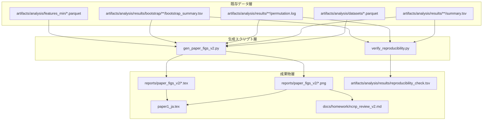

# 設計ドキュメント: 論文化（paper-authoring）

## 概要（Overview）

本設計は、CEJC home2 HQ1コーパス（N=120）から抽出した18の相互行為特徴量を用いて、4つのLLM教師が推定したBig Five性格スコア（特にConscientiousness）を予測するRidge回帰モデルの論文化に必要な成果物群を定義する。

主要成果物は以下の4つである:

1. **論文LaTeX（`paper1_ja.tex`）**: 既存v1の全面書き直し。uplatex+dvipdfmx対応、Introduction〜Appendixの6セクション構成
2. **図表生成スクリプト（`scripts/paper_figs/gen_paper_figs_v2.py`）**: 既存TSV/parquetから論文用PNG・LaTeXテーブルを生成
3. **NCNPレビュー資料（`docs/homework/ncnp_review_v2.md`）**: 共同研究者向けMarkdown資料
4. **再現性検証スクリプト（`scripts/analysis/verify_reproducibility.py`）**: 論文記載値と既存結果の一致確認

設計方針:
- 図表生成は既存の分析結果（`artifacts/analysis/results/`配下のTSV・parquet）を読み込んで可視化するのみ。再計算は行わない
- LaTeX論文は`paper1_ja.tex`を同一パスに上書き（v1→v2）
- 18特徴量の定義は`extract_interaction_features_min.py`のコードから導出し、2段階（概要テーブル＋アルゴリズム詳細）で記述

## アーキテクチャ（Architecture）



### データフロー

1. **入力**: `artifacts/analysis/` 配下の既存parquet・TSVファイル（分析済み結果）
2. **図表生成**: `gen_paper_figs_v2.py` が入力を読み込み、PNG画像とLaTeXテーブルを `reports/paper_figs_v2/` に出力
3. **論文組版**: `paper1_ja.tex` が `reports/paper_figs_v2/` の画像・テーブルを `\input{}` / `\includegraphics{}` で参照
4. **再現性検証**: `verify_reproducibility.py` が既存結果ファイルを読み込み、論文記載値との一致をTSVで報告

## コンポーネントとインターフェース（Components and Interfaces）

### コンポーネント1: 図表生成スクリプト（`scripts/paper_figs/gen_paper_figs_v2.py`）

**責務**: 既存分析結果から論文用図表を生成する

**入力インターフェース**:

```python
# CLI引数
--results_dir: str  # artifacts/analysis/results/ のパス
--bootstrap_dir: str  # artifacts/analysis/results/bootstrap/ のパス
--features_parquet: str  # artifacts/analysis/features_min/features_cejc_home2_hq1.parquet
--out_dir: str  # reports/paper_figs_v2/
```

**出力**:
| ファイル名 | 形式 | 内容 |
|---|---|---|
| `fig_permutation_C_bar.png` | PNG | Cの4教師permutation結果バーチャート（r_obs + p値） |
| `fig_bootstrap_C_radar.png` | PNG | CのBootstrap Top10特徴量レーダー（topk_rate + sign_agree_rate） |
| `fig_teacher_heatmap.png` | PNG | Teacher間一致度ヒートマップ（5 trait × 4 teacher） |
| `tab_descriptive_stats.tex` | LaTeX | 18特徴量の記述統計テーブル（N, mean, SD, p50, p90） |
| `tab_permutation_all.tex` | LaTeX | 全trait×全teacher permutation結果テーブル |
| `tab_feature_definitions.tex` | LaTeX | 18特徴量定義テーブル（名称、カテゴリ、概要、計算式） |

**依存ライブラリ**: `pandas`, `matplotlib`, `numpy`

### コンポーネント2: 論文LaTeX（`paper1_ja.tex`）

**責務**: uplatex+dvipdfmxでコンパイル可能な論文本体

**セクション構成**:
1. **Introduction**: 談話×LLM×性格推定の先行研究ギャップ（`asd_paper.md`ベース）
2. **Method**:
   - 2.1 データ（CEJC home2 HQ1, N=120）
   - 2.2 特徴量（18変数の2段階説明: 概要テーブル + アルゴリズム詳細）
   - 2.3 仮想教師プロトコル（IPIP-NEO-120, 4モデル）
   - 2.4 回帰モデル（Ridge + 5-fold CV）
   - 2.5 信頼性検証（permutation test 5000回, bootstrap 500回）
3. **Results**:
   - 3.1 Cの頑健性（主結果: 4教師permutation）
   - 3.2 Teacher間一致度（補助結果）
   - 3.3 Bootstrap Top Drivers（補助結果）
4. **Discussion**: 相互行為特徴量の解釈、差別化、限界
5. **Conclusion**
6. **Appendix**: A/E/N/O探索的結果、感度分析

**外部参照**:
- `\graphicspath{{reports/paper_figs_v2/}}`
- `\input{reports/paper_figs_v2/tab_*.tex}` でテーブルを取り込み
- 画像が存在しない場合はプレースホルダーコメントを挿入

**コンパイルコマンド**: `uplatex paper1_ja.tex && dvipdfmx paper1_ja.dvi`

### コンポーネント3: 再現性検証スクリプト（`scripts/analysis/verify_reproducibility.py`）

**責務**: 論文記載値と既存結果ファイルの数値一致を検証

**入力**: 既存の `permutation.log`, `summary.tsv`, `bootstrap_summary.tsv`

**検証項目**:
| 検証対象 | 期待値ソース | 比較対象 |
|---|---|---|
| Permutation r_obs / p値 | 論文記載値（ハードコード） | `permutation.log` |
| Teacher間一致度 mean r | 論文記載値 | `teacher_corr_*.tsv` |
| Bootstrap Top3特徴量 | 論文記載値 | `bootstrap_summary.tsv` |

**出力**: `artifacts/analysis/results/reproducibility_check.tsv`（項目、期待値、実測値、一致/乖離、差分）

### コンポーネント4: NCNPレビュー資料（`docs/homework/ncnp_review_v2.md`）

**責務**: 山下先生・宗田さん向けの方法＋結果サマリー

**構成**:
1. 研究の位置づけ（差別化ポイント）
2. 方法: 18特徴量の2段階説明
3. 結果: Permutation / Teacher一致度 / Bootstrap（図表参照付き）
4. 議論ポイント（NCNPミーティング用）

**図表参照**: `reports/paper_figs_v2/` 配下のPNGへの相対パス

## データモデル（Data Models）

### 入力データ

#### XYデータセット（parquet）
パス: `artifacts/analysis/datasets/cejc_home2_hq1_XY_{trait}only_{teacher}.parquet`

| カラム | 型 | 説明 |
|---|---|---|
| `conversation_id` | str | 会話ID |
| `speaker_id` | str | 話者ID |
| `Y_{trait}` | float | LLM教師が推定したBig Fiveスコア（目的変数） |
| `PG_speech_ratio` | float | 発話率 |
| `PG_pause_mean` | float | 沈黙平均長（秒） |
| `PG_pause_p50` | float | 沈黙中央値（秒） |
| `PG_pause_p90` | float | 沈黙90%点（秒） |
| `PG_resp_gap_mean` | float | 応答遅れ平均（秒） |
| `PG_resp_gap_p50` | float | 応答遅れ中央値（秒） |
| `PG_resp_gap_p90` | float | 応答遅れ90%点（秒） |
| `FILL_has_any` | float | フィラー出現発話率 |
| `FILL_rate_per_100chars` | float | 100文字あたりフィラー率 |
| `IX_oirmarker_rate` | float | 修復開始（OIR）率 |
| `IX_oirmarker_after_question_rate` | float | 質問直後OIR率 |
| `IX_yesno_rate` | float | YES/NO応答率 |
| `IX_yesno_after_question_rate` | float | 質問直後YES/NO率 |
| `IX_lex_overlap_mean` | float | 語彙重なり（Jaccard） |
| `IX_topic_drift_mean` | float | 話題逸脱度（1 - Jaccard） |
| `RESP_NE_AIZUCHI_RATE` | float | 「ね」直後相槌率 |
| `RESP_NE_ENTROPY` | float | 「ね」直後応答エントロピー |
| `RESP_YO_ENTROPY` | float | 「よ」直後応答エントロピー |

**controls除外列（EXCL3）**: `n_pairs_total`, `n_pairs_after_NE`, `n_pairs_after_YO`, `IX_n_pairs`, `IX_n_pairs_after_question`, `PG_total_time`, `PG_overlap_rate`, `PG_resp_overlap_rate`, `FILL_text_len`, `FILL_cnt_total`, `FILL_cnt_eto`, `FILL_cnt_e`, `FILL_cnt_ano`

#### Permutation結果（テキスト）
パス: `artifacts/analysis/results/cejc_home2_hq1_{trait}only_{teacher}_controls_excluded/permutation.log`

```
alpha=100.0
r_obs=0.434
p(|r|)=0.0008  (n_perm=5000)
```

#### Bootstrap結果（TSV）
パス: `artifacts/analysis/results/bootstrap/cejc_home2_hq1_{trait}only_{teacher}_controls_excluded/bootstrap_summary.tsv`

| カラム | 型 | 説明 |
|---|---|---|
| `feature` | str | 特徴量名 |
| `coef_mean` | float | 係数平均 |
| `coef_std` | float | 係数標準偏差 |
| `coef_q05` | float | 係数5%点 |
| `coef_q95` | float | 係数95%点 |
| `sign_mean` | float | 符号平均 |
| `sign_agree_rate` | float | 符号一致率 |
| `topk_rate` | float | Top-K inclusion rate |

### 出力データ

#### 再現性検証結果（TSV）
パス: `artifacts/analysis/results/reproducibility_check.tsv`

| カラム | 型 | 説明 |
|---|---|---|
| `check_item` | str | 検証項目名 |
| `expected` | str | 論文記載の期待値 |
| `actual` | str | 既存結果ファイルからの実測値 |
| `match` | bool | 一致判定 |
| `diff` | str | 乖離がある場合の差分 |

### 18特徴量定義（`extract_interaction_features_min.py`から導出）

| # | 名称 | カテゴリ | 概要 | 計算アルゴリズム |
|---|---|---|---|---|
| 1 | PG_speech_ratio | PG | 発話率 | 話者の発話時間合計 / 会話全体時間 |
| 2 | PG_pause_mean | PG | 沈黙平均長 | 同一話者の連続発話間ギャップ（≥gap_tol秒）の平均 |
| 3 | PG_pause_p50 | PG | 沈黙中央値 | 同上の50%点 |
| 4 | PG_pause_p90 | PG | 沈黙90%点 | 同上の90%点 |
| 5 | PG_resp_gap_mean | PG | 応答遅れ平均 | 話者交替時の前発話end→応答startギャップ（≥gap_tol秒）の平均 |
| 6 | PG_resp_gap_p50 | PG | 応答遅れ中央値 | 同上の50%点 |
| 7 | PG_resp_gap_p90 | PG | 応答遅れ90%点 | 同上の90%点 |
| 8 | FILL_has_any | FILL | フィラー出現発話率 | フィラー（えっと/えー/あの）を1つ以上含む発話の割合 |
| 9 | FILL_rate_per_100chars | FILL | 100文字あたりフィラー率 | フィラー総数 / (テキスト文字数/100) |
| 10 | IX_oirmarker_rate | IX | 修復開始率 | OIRマーカー（え？/えっ/なに？等）で始まる応答の割合 |
| 11 | IX_oirmarker_after_question_rate | IX | 質問直後OIR率 | 前発話が質問の場合のOIRマーカー応答率 |
| 12 | IX_yesno_rate | IX | YES/NO応答率 | YES/NOプレフィックス（はい/うん/いいえ等）で始まる応答の割合 |
| 13 | IX_yesno_after_question_rate | IX | 質問直後YES/NO率 | 前発話が質問の場合のYES/NO応答率 |
| 14 | IX_lex_overlap_mean | IX | 語彙重なり | 前発話と応答の文字バイグラムJaccard係数の平均 |
| 15 | IX_topic_drift_mean | IX | 話題逸脱度 | 1 - IX_lex_overlap_mean（共線性注意） |
| 16 | RESP_NE_AIZUCHI_RATE | RESP | 「ね」直後相槌率 | 「ね」終助詞直後の応答が相槌プレフィックスで始まる割合 |
| 17 | RESP_NE_ENTROPY | RESP | 「ね」直後応答多様性 | 「ね」終助詞直後の応答先頭トークンのShannon entropy |
| 18 | RESP_YO_ENTROPY | RESP | 「よ」直後応答多様性 | 「よ」終助詞直後の応答先頭トークンのShannon entropy |

**欠損値の扱い**:
- 分母がゼロの場合（例: 質問直後ペアが0件）→ `NaN`
- Ridge回帰パイプラインで `SimpleImputer(strategy="median")` により中央値補完
- タイミング情報が欠落している発話 → PG系特徴量が `NaN`


## 正当性プロパティ（Correctness Properties）

*プロパティとは、システムのすべての有効な実行において成り立つべき特性や振る舞いのことである。人間が読める仕様と機械的に検証可能な正当性保証の橋渡しとなる形式的な記述である。*

### Property 1: 図表生成の完全性

*任意の*有効な分析結果ディレクトリ（permutation.log、bootstrap_summary.tsv、features parquetを含む）に対して、図表生成スクリプトを実行した場合、出力ディレクトリには少なくとも以下のファイルが生成される: permutationバーチャート（PNG）、bootstrapレーダー（PNG）、teacher一致度ヒートマップ（PNG）。

**Validates: Requirements 2.1, 2.2, 2.3**

### Property 2: 記述統計テーブルの完全性

*任意の*有効な特徴量parquetファイル（18特徴量カラムを含む）に対して、記述統計テーブル生成を実行した場合、出力されたLaTeXテーブルは18行を含み、各行にN、mean、SD、p50、p90の5つの統計量が含まれる。

**Validates: Requirements 2.4**

### Property 3: 欠損入力時のエラーメッセージの情報性

*任意の*存在しないファイルパスを図表生成スクリプトに与えた場合、発生するエラーメッセージには当該ファイルパスの文字列が含まれる。

**Validates: Requirements 2.7**

### Property 4: Markdown内画像参照の解決可能性

*任意の*生成されたレビュー資料（Markdown）内の画像参照パスに対して、そのパスをMarkdownファイルの位置から相対解決した場合、対応するファイルが存在する。

**Validates: Requirements 4.6**

### Property 5: 特徴量定義の4項目完全性

*任意の*特徴量定義エントリに対して、名称（name）、カテゴリ（PG/FILL/IX/RESP）、概要説明（1行）、計算アルゴリズムの4項目がすべて非空で含まれる。

**Validates: Requirements 6.1**

### Property 6: 有意結果への一般因子混入注記

*任意の*Appendix内のteacher×trait permutation結果において、p値が有意水準（0.05）未満である場合、当該結果の近傍に一般因子混入の可能性に関する注記テキストが存在する。

**Validates: Requirements 7.5**

## エラーハンドリング（Error Handling）

### 図表生成スクリプト

| エラー条件 | 対処 | 出力 |
|---|---|---|
| 入力parquetファイルが存在しない | `FileNotFoundError` を捕捉し、ファイルパスと期待スキーマを含むエラーメッセージを出力 | stderr + 非ゼロ終了コード |
| parquetファイルに期待カラムが不足 | `KeyError` を捕捉し、不足カラム名を列挙 | stderr + 非ゼロ終了コード |
| permutation.logのパースに失敗 | 正規表現マッチ失敗時にファイルパスとフォーマット例を出力 | stderr + 非ゼロ終了コード |
| 出力ディレクトリが書き込み不可 | `PermissionError` を捕捉し、パスを出力 | stderr + 非ゼロ終了コード |
| matplotlib描画エラー（データ不正） | `ValueError` を捕捉し、該当図表をスキップして他の図表生成を継続 | stderr（警告）+ 部分的出力 |

### 再現性検証スクリプト

| エラー条件 | 対処 | 出力 |
|---|---|---|
| 結果ファイルが存在しない | 該当項目を `match=False`, `actual="FILE_NOT_FOUND"` として記録し、他の検証を継続 | TSVに記録 |
| 数値パースに失敗 | 該当項目を `match=False`, `actual="PARSE_ERROR"` として記録 | TSVに記録 |
| 期待値と実測値の乖離 | `diff` カラムに差分を記録（数値の場合は絶対差、文字列の場合は "MISMATCH"） | TSVに記録 |

### LaTeX論文

| エラー条件 | 対処 |
|---|---|
| 参照画像ファイルが存在しない | `\includegraphics` の代わりにプレースホルダーコメント `% TODO: 画像ファイル未生成 — {path}` を挿入 |
| `\input` 対象のテーブルファイルが存在しない | `\input` の代わりにプレースホルダーコメントを挿入 |
| 参考文献の未解決参照 | `??` 表示を許容し、コメントで注記 |

## テスト戦略（Testing Strategy）

### テストの二重構造

本プロジェクトでは、ユニットテストとプロパティベーステストの両方を用いて正当性を検証する。

- **ユニットテスト**: 具体的な入力値に対する期待出力の検証、エッジケース、エラー条件
- **プロパティベーステスト**: 任意の有効な入力に対して普遍的に成り立つべき性質の検証

両者は補完的であり、ユニットテストが具体的なバグを捕捉し、プロパティテストが入力空間全体にわたる一般的な正当性を保証する。

### プロパティベーステスト

**ライブラリ**: `hypothesis`（Python）

**設定**:
- 各プロパティテストは最低100イテレーション（`@settings(max_examples=100)`）
- 各テストにはデザインドキュメントのプロパティ番号をタグとしてコメント

**タグ形式**: `# Feature: paper-authoring, Property {number}: {property_text}`

**各プロパティは単一のプロパティベーステストで実装する。**

### テスト対象と方針

#### 図表生成スクリプト（`gen_paper_figs_v2.py`）

**プロパティテスト**:
- Property 1: ランダムに生成した有効な分析結果データ（permutation結果、bootstrap結果、特徴量データ）を入力として、全期待ファイルが出力されることを検証
- Property 2: ランダムに生成した18カラムの特徴量DataFrameを入力として、記述統計テーブルの行数・列数を検証
- Property 3: ランダムに生成した存在しないファイルパスを入力として、エラーメッセージにパス文字列が含まれることを検証

**ユニットテスト**:
- 既知の分析結果（Sonnet4 C: r=0.434, p=0.0008）を入力として、バーチャートのタイトル・ラベルが正しいことを検証
- 空のDataFrameを入力とした場合のエラーハンドリング
- 特徴量parquetにNaN列がある場合の記述統計テーブル出力

#### 再現性検証スクリプト（`verify_reproducibility.py`）

**ユニットテスト**:
- 既知の結果ファイル群を入力として、全項目が `match=True` となることを検証（要件3.1〜3.3）
- 意図的に乖離させた結果ファイルを入力として、`match=False` と差分が正しく記録されることを検証（要件3.5）
- 結果ファイルが存在しない場合の `FILE_NOT_FOUND` 記録を検証

#### NCNPレビュー資料

**プロパティテスト**:
- Property 4: 生成されたMarkdown内の全画像参照パスが実在するファイルを指すことを検証

**ユニットテスト**:
- 生成されたMarkdownに「方法」「結果」セクションが含まれることを検証（要件4.1）
- 18特徴量の概要とアルゴリズムの両方が記載されていることを検証（要件4.2）

#### 特徴量定義

**プロパティテスト**:
- Property 5: 特徴量定義データ構造の各エントリに4項目が非空で含まれることを検証

**ユニットテスト**:
- 18特徴量すべてが定義に含まれることを検証
- EXCL3列が「除外変数」として明示されていることを検証（要件6.3）
- 分母ゼロ時のNaN処理が記述されていることを検証（要件6.4）

#### LaTeX論文構造

**ユニットテスト**:
- 6セクション（Introduction〜Appendix）の存在を検証（要件1.1）
- Methodセクション内の4サブセクションの存在を検証（要件1.4）
- Appendix内のA/E/N/O permutationテーブルの存在を検証（要件7.1）
- 「探索的結果」注記の存在を検証（要件7.4）
- 限界記述（N=120、外部検証未了）の存在を検証（要件5.5）

**プロパティテスト**:
- Property 6: Appendix内の有意結果に一般因子混入注記が付されていることを検証
