# ASD Pragmatics MVP — README

## 概要
公開英語コーパス（ASDBank / CHILDES）で **ASD/TDの語用論指標**（談話標識・不流暢・代名詞・心的状態語 など）を検証する **MVP**。  
入力は CHAT（`.cha`）、出力は特徴CSV・分類レポート・上位特徴図。

- 推奨環境：Python 3.12
- 先生の方針：①レビュー整理 → ②英語MVP → ③日本語化（終助詞・談話標識の後編集）

---

## ダウンロード（このドキュメントからの参照）
- 図（最新）: reports/figures/top_features.png
- レポートJSON: reports/baseline_report.json
- コーパスQC: reports/corpus_manifest.csv
- 発話CSV: data/interim/utterances.csv
- 語用論特徴: data/interim/pragmatics_features.csv
- マージ特徴: data/processed/features_merged.csv

> このREADMEはローカル用です。GitHubへpushすれば上記の相対パスリンクがそのまま使えます。

---

## ディレクトリ構成（要点）
```
data/
  raw/          # フル生データ（ASD/TDをサブフォルダで）
  raw_mvp/      # QC後の代表サブセット（ASD/TD 各N件）
  interim/      # 中間成果物（utterances.csv, pragmatics_features.csv, metadata.csv）
  processed/    # 学習用マージ特徴（features_merged.csv）
  audio/        # 任意（同名 .wav 置き場）
reports/
  figures/      # top_features.png
  corpus_manifest.csv  # QC用マニフェスト（全ファイル一覧）
src/
  ingest/ chat_to_csv.py
  features/ pragmatics.py, prosody.py
  pipeline/ run_all.py
  models/ baseline.py        # NaN耐性＆CV自動調整版
templates/
  postedit/ ja_pragmatics_rules.py  # 日本語後編集の雛形
```

---

## セットアップ
```bash
python -m pip install --upgrade pip setuptools wheel
pip install "spacy<3.8" pandas numpy scikit-learn matplotlib textacy
python -m spacy download en_core_web_sm
# （任意：音声特徴）
# pip install praat-parselmouth librosa soundfile
```

---

## データ配置
- **ASD**：ASDBank（Nadig / Rollins / Flusberg など）  
- **TD** ：CHILDES English（Brown / Sachs / Providence など）  
- 解析対象は **`.cha`**（`.cha.gz` は解凍）。`.txt` は不要。

推奨：`data/raw/asd/<Corpus>/` と `data/raw/td/<Corpus>/` に分け、**ベース名重複回避のリネーム**（例：`asd_Nadig_***.cha`）を実施。

---

## 実作業ログ（再現手順）

### 1) 全体QC（マニフェスト作成）
```bash
python - <<'PY'
import pathlib, csv, os
root = pathlib.Path("data/raw")
rows=[]
for p in root.rglob("*.cha"):
    try: txt=p.read_text(encoding="utf-8", errors="ignore")
    except: txt=""
    n_utt = sum(1 for line in txt.splitlines() if line.startswith("*"))
    size_kb = os.path.getsize(p)/1024
    path = str(p)
    label = "ASD" if "/asd/" in path.lower() else ("TD" if "/td/" in path.lower() else "")
    parts = p.parts
    corp = "/".join(parts[parts.index("raw")+1:parts.index("raw")+3]) if "raw" in parts else ""
    rows.append([p.stem,label,corp,n_utt,round(size_kb,1),path])
rows.sort(key=lambda x:(x[1],x[2],-x[3]))
pathlib.Path("reports").mkdir(exist_ok=True)
with open("reports/corpus_manifest.csv","w",newline="",encoding="utf-8") as f:
    w=csv.writer(f); w.writerow(["file_id","label","corpus","n_utterances","size_kb","path"]); w.writerows(rows)
print("wrote reports/corpus_manifest.csv with", len(rows), "files")
PY
```
例：今回の実績 **729ファイル**（`ASD=117 / TD=612`）。

### 2) 代表サブセット作成（発話数≥50、label×corpus均等抽出）
```bash
python - <<'PY'
import pandas as pd, pathlib, shutil
m = pd.read_csv("reports/corpus_manifest.csv")
m = m[(m["n_utterances"]>=50) & (m["label"].isin(["ASD","TD"]))].copy()
N = 10  # label×corpusあたり上限
sel = (m.sort_values(["label","corpus","n_utterances"], ascending=[True,True,False])
         .groupby(["label","corpus"]).head(N))
out = pathlib.Path("data/raw_mvp"); shutil.rmtree(out, ignore_errors=True)
for _, r in sel.iterrows():
    src = pathlib.Path(r["path"])
    dst = out/r["label"]/pathlib.Path(r["corpus"]).name
    dst.mkdir(parents=True, exist_ok=True)
    base = f'{r["label"]}_{pathlib.Path(r["corpus"]).name}_{src.stem}.cha'
    (dst/base).write_bytes(src.read_bytes())
print("subset ->", out)
print("counts:
", sel.groupby(["label"]).size())
PY
```

### 3) メタデータ雛形（ageは初回未使用）
```bash
python - <<'PY'
import pathlib, csv
rows=[]
for p in pathlib.Path("data/raw_mvp").rglob("*.cha"):
    fid=p.stem; lab="ASD" if "/ASD/" in str(p) else "TD"
    task="conversation" if any(k in str(p) for k in ("Nadig","Rollins","Sachs","Brown")) else "naturalistic"
    rows.append([fid,lab,"",task])
rows=sorted(rows)
pathlib.Path("data/interim").mkdir(parents=True, exist_ok=True)
with open("data/interim/metadata.csv","w",newline="",encoding="utf-8") as f:
    w=csv.writer(f); w.writerow(["file_id","label","age","task_type"]); w.writerows(rows)
print("wrote data/interim/metadata.csv with", len(rows), "rows")
PY
```

### 4) パイプライン
```bash
# 取り込み：.cha → 発話CSV
python -m src.ingest.chat_to_csv --in_dir data/raw_mvp --out_csv data/interim/utterances.csv

# 語用論特徴
python -m src.features.pragmatics --in_csv data/interim/utterances.csv --out_csv data/interim/pragmatics_features.csv

# 結合
python -m src.pipeline.run_all   --prag_csv data/interim/pragmatics_features.csv   --pros_csv data/interim/prosody_features.csv   --meta_csv data/interim/metadata.csv   --out_csv data/processed/features_merged.csv

# ベースライン（NaN耐性＆CV自動調整）
python -m src.models.baseline   --feat_csv data/processed/features_merged.csv   --report_json reports/baseline_report.json   --exclude_cols "age,len_tokens"
```

---

## 特徴量（テキスト）
- `discourse_marker_rate`：well/you know/i mean/so/… の密度  
- `repair_rate_umuh`：um/uh の密度  
- `pronoun_ratio / propernoun_ratio / noun_ratio / verb_ratio`：POS比率  
- `mental_state_rate`：think/know/believe/want/feel/hope/remember/forget/understand の比率  
- `len_tokens`：発話長（初回図では除外可）

---

## 結果（代表サブセット例：ASD=30 / TD=30）
- **CV性能**：AUC ≈ 0.94、F1 ≈ 0.86  
- **上位寄与（係数）**：
  - `mental_state_rate`：低いほどASD側
  - `pronoun_ratio`：低いほどASD側
  - `discourse_marker_rate`：高いほどASD側（話法差の交絡に留意）
  - `repair_rate_umuh`：本サブセットではTD側で上昇
  - `propernoun_ratio`：TD側で上昇傾向

> 図：`reports/figures/top_features.png`  
> JSON：`reports/baseline_report.json`

---

## 先生向け200字テンプレ
英語ASD/TDコーパス全体（729本）をQCし、発話数≥50の代表サブセット（ASD=30、TD=30）でMVP解析を実施しました。5-fold CVでAUC≈0.94、F1≈0.86。心的状態語・代名詞比の低下がASD側、談話標識はASD側で上昇傾向。不流暢(um/uh)は本サブセットではTD側で上昇。年齢・発話長は交絡回避のため初回は除外しています。次段でコーパス外検証（LoCO）、アブレーション、参照表現の精緻化、日本語後編集（終助詞・談話標識）の適用に進みます。

---

## 次のステップ
1. **LoCO（Leave-One-Corpus-Out）検証**  
2. **特徴アブレーション**（例：discourse_marker_rate を外す）  
3. **参照表現の強化**（導入/維持/再導入、曖昧参照近似）  
4. **日本語化の試行**（終助詞・談話標識の後編集ルール適用）

---

## トラブルシュート
- `No module named spacy` → `pip install "spacy<3.8"` → `python -m spacy download en_core_web_sm`  
- `NaNで落ちる` → baselineはImputer内蔵。必要なら `--exclude_cols "age,len_tokens"`  
- 重い → まず `data/raw_mvp/` で検証、問題なければ `data/raw/` 全体解析へ

### 意思決定の理由と有効性（Q&A）

**Q1. どうして今回の研究テーマに決定したのか？**  
- レビューが示すのは、ASDの言語は**構造（語彙・文法）／語用論（使い方）／韻律（抑揚・話速）**などで凸凹が大きく、“一括りに測れない”という事実です。本研究はこの凸凹を**最小構成の指標セット**で縦断的に捉える設計（例：構造と言語運用、韻律）にしており、レビューの示唆と実務上のギャップを同時に埋めます。
- **「話さない＝理解していない」ではない**という示唆に対応し、積極的応答を求めない理解課題（選択・マッチング等）を評価系に含められるよう設計します。これにより**MV（最小限発話）**の当事者を取りこぼさない評価が可能になります。  
- プロファイル（ASD-LN / ASD-LI / MV ほか）ごとの差を分けて評価できる構成とし、**個別化支援や介入デザイン**に直接つながる指標を優先します。

**Q2. ASD当事者としてこの研究をする目的や社会的意味は？**  
- **誤った判断の抑制**：発話量だけで理解を過小評価するバイアスを減らし、当事者の潜在的理解を**可視化**することで教育・就労場面の誤解（過小支援／過大負荷）を防ぎます。 
- **個別最適化の基盤**：構造・語用論・韻律・ToM/EFなどを分けて測ることで、学校／家庭／臨床が**同じ地図**で話せるようになり、支援設計の再現性が上がります。
- **アクセシブルな評価**：MVや口腔運動の困難がある人でも取り組める、**低負荷・非言語的**な理解課題の普及に寄与します。日本語環境でのエビデンス整備を進め、**当事者中心の標準**づくりに接続します。

> 参考リンク（ローカル /docs）  
> - `/docs/1.html`：ASDことばの凸凹・評価観点の総覧（構造／語用論／韻律／非言語）
> - `/docs/2.html`：主要プロファイルと実践への示唆（個別化・環境調整・ロールプレイ等）
> - `/docs/3.html`：言語・音声（韻律/流暢性/運動）まで拡張した枠組みと介入指針


---

## ハンズオン（次にやること・履歴つき）

**再現可能**かつ**自動で履歴を残す**評価手順。出力は `reports/` 配下、履歴は `CHANGELOG.md` に追記されます。

### 0) 依存パッケージ
```bash
python -m pip install --upgrade pip setuptools wheel
pip install pandas numpy scikit-learn matplotlib
```
1) LoCO（Leave-One-Corpus-Out）
```bash
python scripts/loco_eval.py \
  --feat_csv data/processed/features_merged.csv \
  --out_json reports/loco_report.json \
  --out_png reports/figures/loco_auc.png
```
2) 特徴アブレーション（1特徴ずつ外す）
```bash
python scripts/ablation_eval.py \
  --feat_csv data/processed/features_merged.csv \
  --out_json reports/ablation_report.json \
  --out_png reports/figures/ablation_delta.png
```
3) 履歴（CHANGELOG）
各スクリプト完了時に自動追記（日時／AUC・F1／設定）。

---

## まとめ（2024-09-20）
- **採用設定**: SGKF(k=2) + Platt calibration + threshold=0.55  
- **特徴サブセット (top5)**: `propernoun_ratio`, `pronoun_ratio`, `verb_ratio`, `discourse_marker_rate`, `mental_state_rate`
- **再現コマンド**:  
  - 評価: `make eval_best`  
  - アブレーション: `make ablate_best`  
  - 推論: `make infer_best`
- **最近のサニティチェック（全件推論の混同行列）**: TP=26, FP=3, FN=4, TN=27 → **BA=0.883**

成果物:
- レポート: `reports/loco_report.json`, `reports/ablation_report.json`
- 図: `reports/figures/loco_auc.png`, `reports/figures/loco_ba.png`, `reports/figures/ablation_delta.png`
- 予測: `reports/pred_top5.csv`

## 処理フロー

```mermaid
flowchart TD
  %% ===== データ入力 =====
  subgraph DATA[データ入力]
    A1[Raw .cha files
       役割 収集済みのCHAT形式
       内容 *CHI *INV 行と各種注釈を含む]
    A2[data/processed/features_merged.csv
       役割 既存の特徴量CSV
       内容 学習入力として直接利用可能]
  end

  %% ===== 特徴量生成（任意 実装済み） =====
  subgraph BUILD[特徴量生成 任意]
    direction LR
    B1[src/ingest/chat_to_csv.py
       役割 .chaから発話抽出
       内容 *行のテキストのみを取り出す 話者やfile_idを付与]
    B2[data/interim/utterances.csv
       役割 中間CSV
       内容 file_id speaker utt の縦長テーブル]
    B3[src/features/pragmatics.py
       役割 発話ごとの語用論特徴計算
       内容 pronoun propernoun verb 談話標識 心的状態 um uh 等を比率化]
    B4[data/processed/features_merged.csv
       役割 学習用最終特徴
       内容 file_id単位で平均集約 ラベル corpus含む]
    A1 --> B1 --> B2 --> B3 --> B4
  end

  %% ===== 設定保存 =====
  subgraph CFG[設定保存]
    C1[scripts/save_preset.py
       役割 評価プリセット作成
       内容 cv_mode splits calibrate しきい値をJSON化]
    C2[config/eval_preset.json
       役割 再現設定
       内容 実行時の既定パラメータを保持]
    C1 --> C2
  end

  %% ===== 交差検証とレポート =====
  subgraph EVAL[交差検証とレポート]
    direction LR
    E0[data/processed/features_merged.csv
       役割 学習入力
       内容 数値特徴とメタ列]
    E1[scripts/loco_eval.py
       役割 CV評価
       内容 SGKF k=2 Platt校正 しきい値0.55 図とJSON出力]
    E2[reports/loco_report.json
       役割 指標ログ
       内容 AUC BA F1 MCC fold別結果]
    E3[reports/figures/loco_auc.png
       役割 図
       内容 fold別AUCバー]
    E4[reports/figures/loco_ba.png
       役割 図
       内容 fold別BAバー]
    E5[scripts/runlog_util.py
       役割 履歴追記
       内容 CHANGELOGに実行記録を追加]
    E6[CHANGELOG.md
       役割 実行履歴
       内容 いつ 何を どの設定で実施したか]
    E0 --> E1 --> E2
    E1 --> E3
    E1 --> E4
    E1 --> E5 --> E6
  end

  %% ===== アブレーション =====
  subgraph ABL[アブレーション]
    ABL1[scripts/ablation_eval.py
         役割 1特徴ずつ除外再CV
         内容 ΔAUC等で寄与を定量化]
    ABL2[reports/ablation_report.json
         役割 結果JSON
         内容 特徴ごとの性能低下量]
    ABL3[reports/figures/ablation_delta.png
         役割 図
         内容 ΔAUCランキング表示]
    E0 --> ABL1 --> ABL2
    ABL1 --> ABL3
    ABL1 --> E6
  end

  %% ===== しきい値探索 =====
  subgraph THR[しきい値探索]
    TH1[scripts/threshold_search.py
         役割 しきい値スイープ
         内容 BA F1の曲線と推奨点]
    TH2[reports/threshold_report.json
         役割 結果JSON
         内容 閾値別の指標一覧]
    TH3[reports/figures/threshold_curve.png
         役割 図
         内容 指標のしきい値曲線]
    E0 --> TH1 --> TH2
    TH1 --> TH3
    TH1 --> E6
  end

  %% ===== 特徴サブセット評価 =====
  subgraph SUB[特徴サブセット評価]
    SUB1[scripts/feature_subset_eval.py
         役割 任意特徴でCV
         内容 --features --C --threshold 指定可能]
    SUB2[reports/feature_subset_report.json
         役割 結果JSON
         内容 サブセットと指標の対応]
    E0 --> SUB1 --> SUB2
    SUB1 --> E6
  end

  %% ===== 推論 =====
  subgraph INF[推論]
    I1[scripts/inference_cli.py
       役割 確率と判定の出力
       内容 features指定可 しきい値0.55 C 1.0 preset読み込み可]
    I2[reports/predictions.csv
       役割 既定特徴の予測
       内容 prob_asd pred_asd]
    I3[reports/pred_top5.csv
       役割 Top5特徴の予測
       内容 prob_asd pred_asd]
    E0 --> I1 --> I2
    I1 --> I3
    I1 --> E6
  end

  %% ===== フォールド点検 =====
  subgraph INS[フォールド点検]
    INS1[scripts/inspect_folds.py
         役割 分割の健全性確認
         内容 fold別混同行列 メンバー表を作成]
    INS2[reports/confusion_by_fold.csv
         役割 混同行列
         内容 TN FP FN TPのfold別一覧]
    INS3[reports/fold_membership.csv
         役割 メンバー表
         内容 各foldに含まれるfile_id]
    INS4[reports/inspection_summary.md
         役割 サマリ
         内容 表と要点の簡易まとめ]
    E0 --> INS1 --> INS2
    INS1 --> INS3 --> INS4
    INS1 --> E6
  end

  %% ===== Make ターゲット =====
  subgraph MK[Make ターゲット]
    M1[make eval_best
       役割 再現評価
       内容 loco_eval.pyを既定設定で実行]
    M2[make ablate_best
       役割 アブレーション実行
       内容 ablation_eval.pyの既定実行]
    M3[make infer_best
       役割 推論CSV出力
       内容 inference_cli.pyでpred_top5を作成]
    M1 --> E2
    M2 --> ABL2
    M3 --> I3
  end

  %% ===== 既存CSVからの分岐 =====
  A2 --> E1
  A2 --> ABL1
  A2 --> TH1
  A2 --> SUB1
  A2 --> I1
  A2 --> INS1

  classDef code fill:#eef,stroke:#446;
  classDef file fill:#efe,stroke:#484;
  classDef img fill:#ffe,stroke:#aa6;
  classDef make fill:#eef7ff,stroke:#268bd2;

  class B1,B3,C1,E1,E5,ABL1,TH1,SUB1,I1,INS1,M1,M2,M3 code
  class A1,A2,B2,B4,E0,E2,E6,ABL2,TH2,SUB2,I2,I3,INS2,INS3,INS4 file
  class E3,E4,ABL3,TH3 img
```
