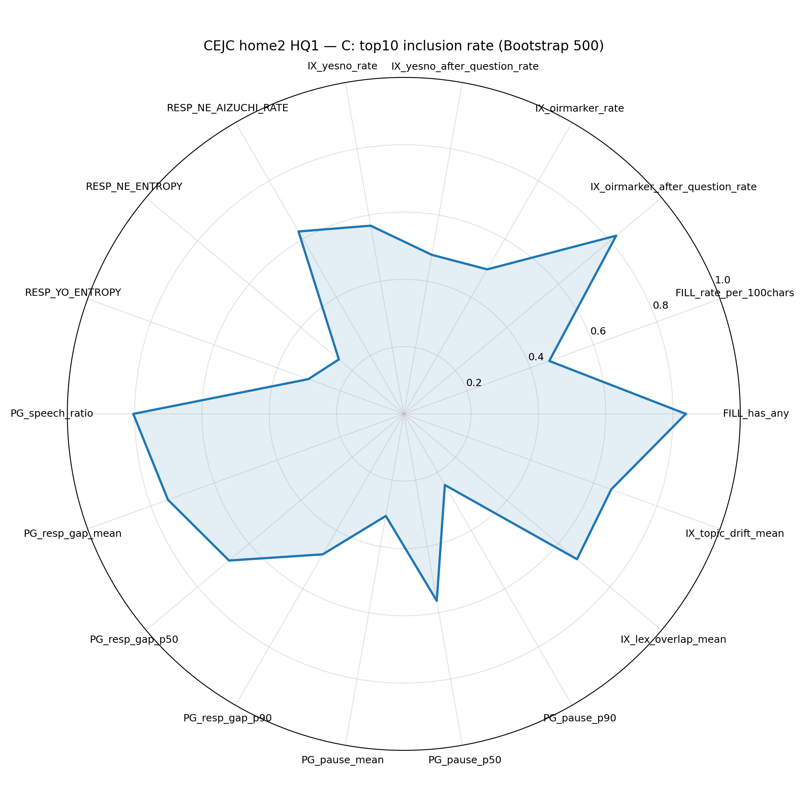
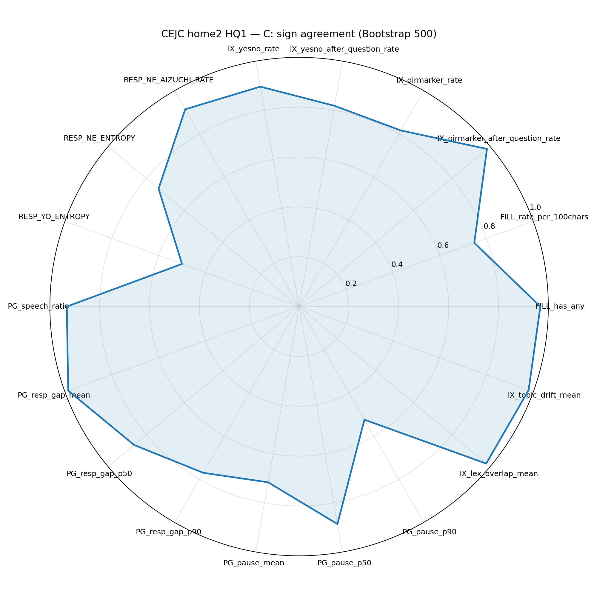
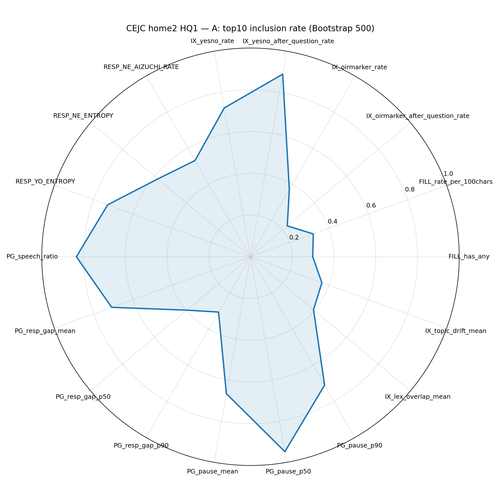
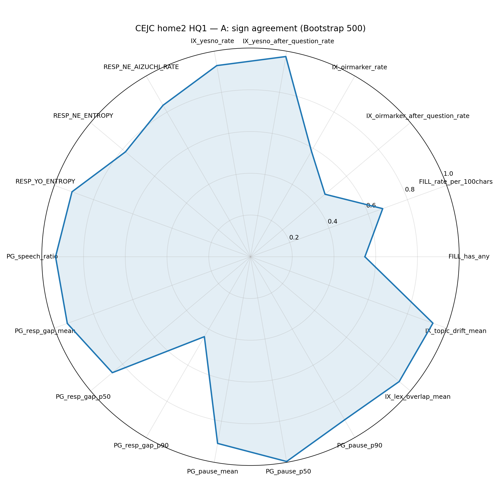
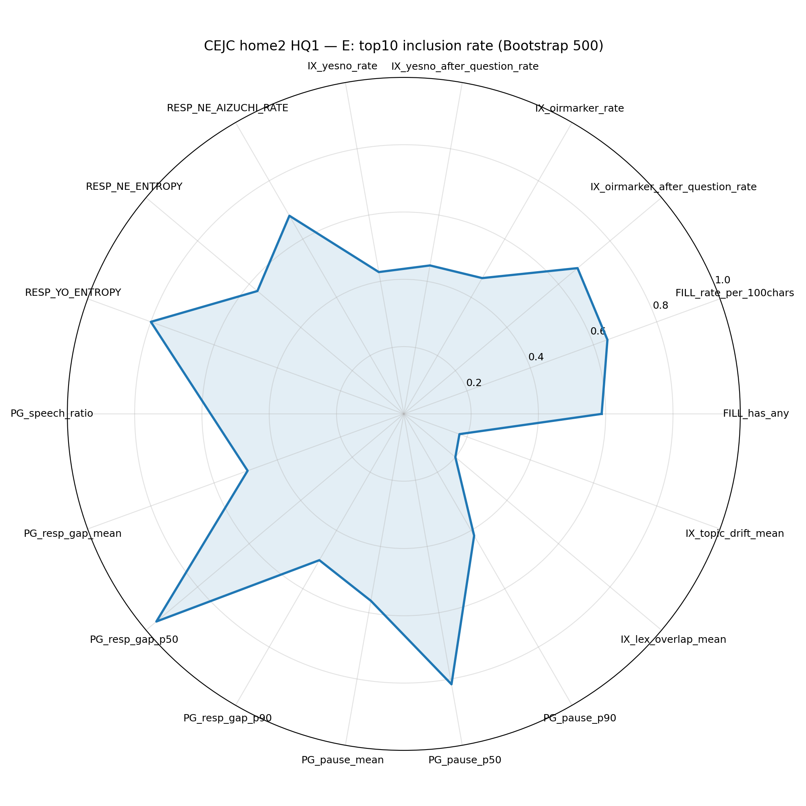
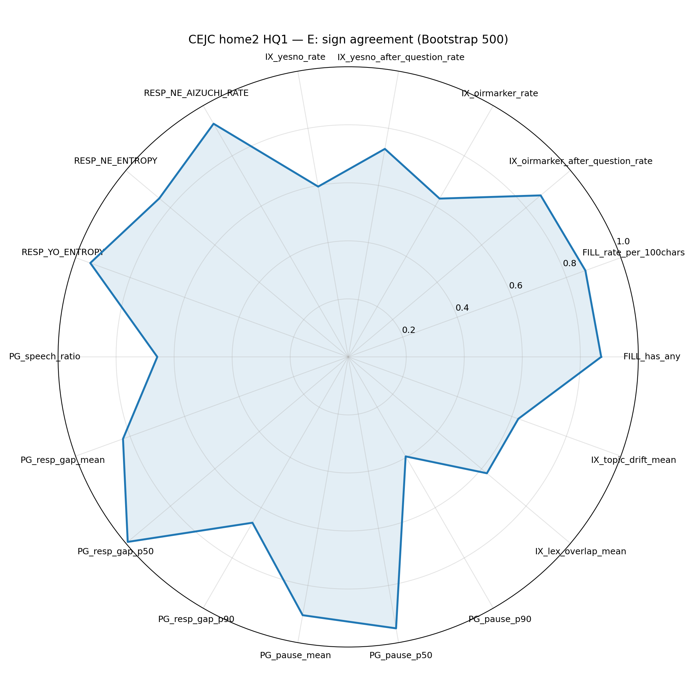
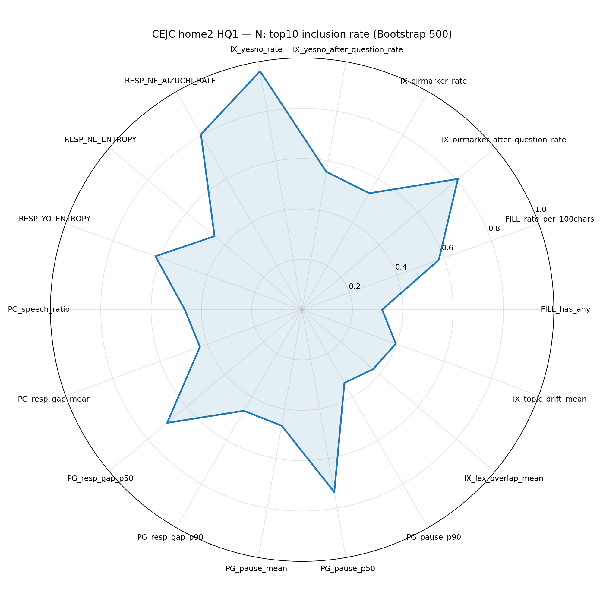
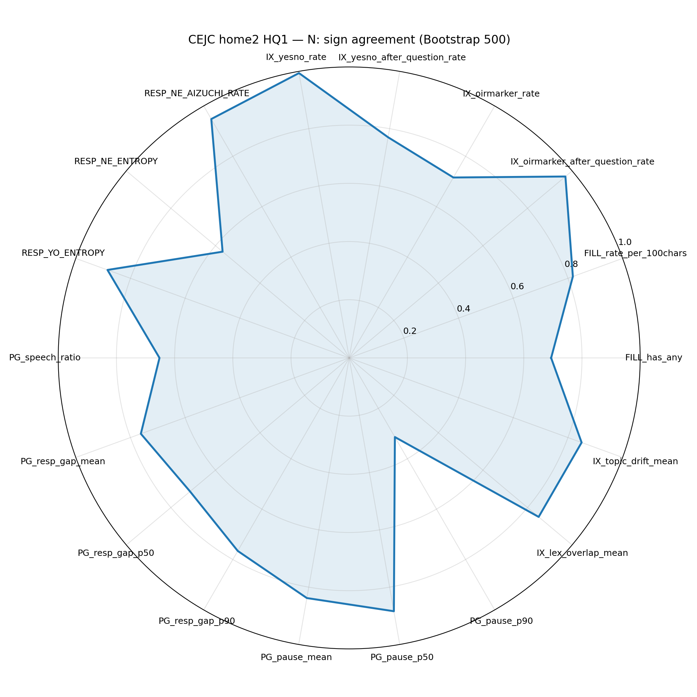
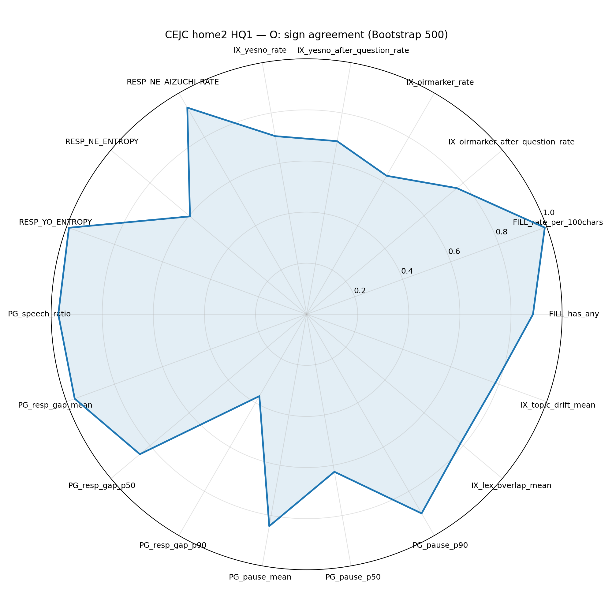

# CEJC home2 HQ1: Interaction features → LLM teacher (C vs A/E/N/O) 比較メモ
Date: 2026-02-23  
Owner: 福原玄

## Setup（全trait共通）
- Dataset: CEJC home2 + HQ1（N=120 conversation×speaker）
- X: Interaction features only（PG/FILL/IX/RESP, 18 vars）, controls excluded（EXCL3）
- Model: Ridge + 5-fold CV
- Reliability check:
  - Permutation test: fixed α（summary.tsv由来）, 5000 permutations, p(|r|)
  - Bootstrap: 500 resamples, top10-inclusion rate（topk_rate）, sign agreement（sign_agree_rate）

---

## 1) Permutation test（fixed α / 5000）

| Trait | alpha | r_obs | p(|r|) | Note |
|:-----:|------:|------:|-------:|:-----|
| C | 100 | 0.434 | 0.0008 | **有意（強）** |
| A | 316.23 | 0.234 | 0.0714 | 傾向 |
| E | 562.34 | 0.226 | 0.0804 | 傾向 |
| N | 562.34 | 0.112 | 0.3975 | 非有意 |
| O | 100 | 0.119 | 0.3587 | 非有意 |

**読み**  
- Cのみ強く有意 → 「相互行為特徴が全traitをトリビアルに説明」よりも **C特異的に強い関係**の可能性が高い。  
- A/Eは弱い傾向、N/Oは非有意。

---

## 2) Bootstrap stability（Top drivers）

<table>
<tr>
<td valign="top" width="62%">

### C（Conscientiousness）Top10（安定）
| Feature | Dir | topk_rate | sign_agree |
|---|:---:|---:|---:|
| FILL_has_any | + | 0.838 | 0.968 |
| IX_oirmarker_after_question_rate | + | 0.824 | 0.984 |
| PG_speech_ratio | + | 0.804 | 0.932 |
| PG_resp_gap_mean | − | 0.746 | 0.986 |
| PG_resp_gap_p50 | − | 0.678 | 0.864 |
| IX_lex_overlap_mean | − | 0.672 | 0.980 |
| IX_topic_drift_mean | + | 0.656 | 0.980 |
| RESP_NE_AIZUCHI_RATE | + | 0.626 | 0.914 |
| IX_yesno_rate | + | 0.568 | 0.896 |
| PG_pause_p50 | − | 0.564 | 0.886 |

</td>
<td valign="top" width="38%" align="center">

 
<b>topk_rate</b>（クリックで拡大）
  
 
<b>sign_agree_rate</b>（クリックで拡大）

</td>
</tr>
</table>

<table>
<tr>
<td valign="top" width="62%">

### A（Agreeableness）Top10
| Feature | Dir | topk_rate | sign_agree |
|---|:---:|---:|---:|
| PG_pause_p50 | − | 0.948 | 0.996 |
| IX_yesno_after_question_rate | + | 0.888 | 0.974 |
| PG_speech_ratio | + | 0.834 | 0.934 |
| RESP_YO_ENTROPY | − | 0.728 | 0.910 |
| IX_yesno_rate | + | 0.724 | 0.930 |
| PG_pause_p90 | − | 0.710 | 0.902 |
| PG_resp_gap_mean | + | 0.708 | 0.934 |
| PG_pause_mean | − | 0.666 | 0.908 |
| RESP_NE_ENTROPY | − | 0.580 | 0.782 |
| RESP_NE_AIZUCHI_RATE | + | 0.532 | 0.838 |

</td>
<td valign="top" width="38%" align="center">

 
<b>topk_rate</b>（クリックで拡大）
  
 
<b>sign_agree_rate</b>（クリックで拡大）

</td>
</tr>
</table>

<table>
<tr>
<td valign="top" width="62%">

### E（Extraversion）Top10
| Feature | Dir | topk_rate | sign_agree |
|---|:---:|---:|---:|
| PG_resp_gap_p50 | − | 0.960 | 0.992 |
| PG_pause_p50 | − | 0.816 | 0.950 |
| RESP_YO_ENTROPY | + | 0.800 | 0.946 |
| RESP_NE_AIZUCHI_RATE | + | 0.680 | 0.928 |
| IX_oirmarker_after_question_rate | + | 0.674 | 0.866 |
| FILL_rate_per_100chars | + | 0.644 | 0.870 |
| FILL_has_any | + | 0.588 | 0.872 |
| PG_speech_ratio | − | 0.574 | 0.658 |
| RESP_NE_ENTROPY | + | 0.568 | 0.850 |
| PG_pause_mean | − | 0.564 | 0.904 |

</td>
<td valign="top" width="38%" align="center">

 
<b>topk_rate</b>（クリックで拡大）
  
 
<b>sign_agree_rate</b>（クリックで拡大）

</td>
</tr>
</table>

<table>
<tr>
<td valign="top" width="62%">

### N（Neuroticism）Top10
| Feature | Dir | topk_rate | sign_agree |
|---|:---:|---:|---:|
| IX_yesno_rate | − | 0.962 | 0.994 |
| IX_oirmarker_after_question_rate | − | 0.808 | 0.970 |
| RESP_NE_AIZUCHI_RATE | − | 0.804 | 0.948 |
| PG_pause_p50 | − | 0.736 | 0.884 |
| PG_resp_gap_p50 | + | 0.700 | 0.714 |
| RESP_YO_ENTROPY | − | 0.620 | 0.884 |
| FILL_rate_per_100chars | − | 0.578 | 0.818 |
| IX_yesno_after_question_rate | − | 0.556 | 0.770 |
| IX_oirmarker_rate | + | 0.534 | 0.716 |
| PG_pause_mean | − | 0.468 | 0.838 |

</td>
<td valign="top" width="38%" align="center">

 
<b>topk_rate</b>（クリックで拡大）
  
 
<b>sign_agree_rate</b>（クリックで拡大）

</td>
</tr>
</table>

<table>
<tr>
<td valign="top" width="62%">

### O（Openness）Top10
| Feature | Dir | topk_rate | sign_agree |
|---|:---:|---:|---:|
| FILL_rate_per_100chars | − | 0.932 | 0.992 |
| PG_speech_ratio | + | 0.886 | 0.972 |
| RESP_YO_ENTROPY | − | 0.874 | 0.990 |
| PG_resp_gap_mean | − | 0.782 | 0.966 |
| RESP_NE_AIZUCHI_RATE | − | 0.756 | 0.934 |
| PG_pause_p90 | − | 0.586 | 0.900 |
| IX_yesno_rate | − | 0.544 | 0.708 |
| IX_oirmarker_after_question_rate | + | 0.534 | 0.768 |
| PG_resp_gap_p50 | + | 0.528 | 0.852 |
| FILL_has_any | + | 0.500 | 0.886 |

</td>
<td valign="top" width="38%" align="center">

 
<b>topk_rate</b>（クリックで拡大）
  
 
<b>sign_agree_rate</b>（クリックで拡大）

</td>
</tr>
</table>

---

## 3) CとのTop10重なり（乖離チェック）
- A: 5/10
- E: 6/10
- N: 5/10
- O: 7/10

**読み**
- 完全一致ではない → “全部同じ特徴で当たる”トリビアル懸念は弱い  
- 一方、Oは重なりが多め → 「共通の会話流暢さ因子」っぽい部分が入り込む可能性あり（要監査）

---
---

## 4) 先回り：C以外（A/E/N/O）で「18特徴のうち何が顕著に出そうか？」（事前仮説 → 観測との照合）

本分析の説明変数は「会話量」ではなく、相互行為の**型**（テンポ/応答/修復/整序/整合/多様性）に限定している。  
そのため、C以外のtraitは「内容（語彙・話題）」よりも、**相互行為としての振る舞い**がどの程度teacherスコアに反映されるかに依存する。

### 4.1 18特徴の“機能カテゴリ”対応
- **テンポ/間**：PG_resp_gap_mean / PG_resp_gap_p50 / PG_resp_gap_p90 / PG_pause_mean / PG_pause_p50 / PG_pause_p90
- **会話主導（量ではなく比）**：PG_speech_ratio
- **整序・計画コスト**：FILL_has_any / FILL_rate_per_100chars
- **応答スタイル（Yes/No）**：IX_yesno_rate / IX_yesno_after_question_rate
- **修復・確認（OIR）**：IX_oirmarker_rate / IX_oirmarker_after_question_rate
- **整合/共有（語彙重なり）**：IX_lex_overlap_mean
- **話題展開（注意：共線性/監査対象）**：IX_topic_drift_mean
- **相槌/反応（NE）**：RESP_NE_AIZUCHI_RATE / RESP_NE_ENTROPY
- **反応の多様性（YO）**：RESP_YO_ENTROPY

### 4.2 事前仮説：trait別に“顕著になりそう”な候補
※以下は相互行為特徴のみ（18 vars）で捉えられる範囲の仮説。

#### A（Agreeableness：協調性）
- **相手に合わせる/受ける**：RESP_NE_AIZUCHI_RATE（＋）、IX_yesno_after_question_rate（＋）
- **間の取り方**：PG_pause_p50（−）／（場合により）PG_pause系が効く可能性
- **整合**：IX_lex_overlap_mean（＋）
> 期待：同調・受容・確認応答が前面に出る

#### E（Extraversion：外向性）
- **テンポ**：PG_resp_gap_p50（−）、PG_pause_p50（−）
- **反応の多様性**：RESP_YO_ENTROPY（＋）、RESP_NE_ENTROPY（＋）
- **会話主導（比率）**：PG_speech_ratio（＋寄り）
> 期待：勢い（テンポ）＋反応性（多様性）が前面に出る（量は除外しているため）

#### N（Neuroticism：神経症傾向）
- **確認/修復**：IX_oirmarker_after_question_rate（＋）が出る可能性
- **ためらい**：FILL_rate_per_100chars（＋）、PG_pause系（＋）が出る可能性
> 期待：不安/自己モニタリングが「確認」「間」「フィラー」に反映される可能性。ただし内容依存・ノイズの影響も大きい。

#### O（Openness：開放性）
- **反応の多様性**：RESP_YO_ENTROPY / RESP_NE_ENTROPY（＋）
- **話題展開（※監査前提）**：IX_topic_drift_mean（＋）が出る可能性
> 期待：探索性が「多様性」「展開」に現れる可能性。ただし相互行為18のみだと弱くなりやすい。

### 4.3 観測との照合（今回の結果の読み）
- **A**：PG_pause_p50 / IX_yesno_after_question_rate が最上位 → 「間＋質問後Yes/No」が顕著（仮説と整合）
- **E**：PG_resp_gap_p50 / PG_pause_p50 / RESP_YO_ENTROPY が上位 → 「テンポ＋多様性」（仮説と整合）
- **N/O**：Permutationでは非有意（N p=0.397, O p=0.359）で、相互行為18のみではteacherスコアを十分説明できない可能性（内容依存 or teacherノイズの影響を示唆）。ただしbootstrap上の“上位特徴の顔ぶれ”は抽出できており、探索的解釈は可能。

### 4.4 Audit note（再掲）
- `IX_topic_drift_mean` と `IX_lex_overlap_mean` は共線性が強く、符号が対になりやすい。主要主張の中心には置かず補助指標扱いとする。

---

## 5) 解釈メモ（暫定）
- **C**: FILL + OIR-after-question + gap短縮（滑らかさ）などが安定して効く  
- **A**: pause（間）＋質問後YES/NOが上位、Cとトップがズレる  
- **E**: gap/pause（テンポ）と反応の多様性（ENTROPY）が前面  
- **N**: YESNO/OIR/aizuchi が **負方向**で安定（符号がCと異なる可能性）  
- **O**: filler頻度 + 反応多様性 + gap が中心。Cと共通部分も多いので慎重に

---

## 6) Audit note（重要）
- `IX_topic_drift_mean` と `IX_lex_overlap_mean` は共線性が強く、符号が対になりやすい（補助指標扱い、主要主張は慎重に）。
