# CEJC home2 HQ1: Interaction features → LLM teacher (C vs A/E/N/O) 比較メモ
Date: 2026-02-27  
Owner: 福原玄  

## 背景（先生とのメールの流れに沿った要点）
- まず **Sonnet4 を仮想教師（teacher）**として CEJC home2 HQ1 を検証したところ、**Cのみ強く有意**という結果が出た（先生「Cのみ推定しやすいかも」）。
- その後、先生の宿題「**LLMをもう2種類ほど追加しても同じ傾向か確認**」に沿い、**Claude以外3モデル（Qwen / DeepSeek / GPT-OSS）**を追加し、**C/A/E/N/Oを一通り**同一手順で検証。
- 結果、**Cは複数teacherで頑健に立ちやすい一方、A/E/N/Oは teacher依存性も大きい**ことが示唆された。
- さらに、teacher依存性の“理由”を説明できるように、(i) **teacher間一致（相関）**、(ii) **bootstrapの上位特徴の比較**まで追加で整理した。

---

## Setup（全trait共通）
- Dataset: CEJC home2 + HQ1（N=120 conversation×speaker）
- X: Interaction features only（PG/FILL/IX/RESP, 18 vars）, controls excluded（EXCL3）
- Model: Ridge + 5-fold CV
- Reliability check:
  - Permutation test: fixed α（summary.tsv由来）, 5000 permutations, p(|r|)
  - Bootstrap: 500 resamples, top10-inclusion rate（topk_rate）, sign agreement（sign_agree_rate）

---

<h2>1) Permutation test（fixed α / 5000）</h2>

> **alpha** はRidgeの正則化強度（大きいほど係数が縮む）、**r_obs** は5-fold CVで得た予測値と教師スコアの相関、**p(|r|)** は目的変数を5000回シャッフルした置換検定で「|r_obs|以上が偶然出る確率」です。

---

## 1.1 Baseline（teacher=Sonnet4）: C vs A/E/N/O
（先生への最初の報告で使ったベースライン）

<table>
  <thead>
    <tr>
      <th align="center">Trait</th>
      <th align="right">alpha</th>
      <th align="right">r_obs</th>
      <th align="right">p(|r|)</th>
      <th>Note</th>
    </tr>
  </thead>
  <tbody>
    <tr><td align="center"><b>C</b></td><td align="right">100.0</td><td align="right">0.434</td><td align="right">0.0008</td><td><b>有意（強）</b></td></tr>
    <tr><td align="center"><b>A</b></td><td align="right">316.227766</td><td align="right">0.234</td><td align="right">0.0714</td><td>傾向</td></tr>
    <tr><td align="center"><b>E</b></td><td align="right">562.341325</td><td align="right">0.226</td><td align="right">0.0804</td><td>傾向</td></tr>
    <tr><td align="center"><b>N</b></td><td align="right">562.341325</td><td align="right">0.112</td><td align="right">0.3975</td><td>非有意</td></tr>
    <tr><td align="center"><b>O</b></td><td align="right">100.0</td><td align="right">0.119</td><td align="right">0.3587</td><td>非有意</td></tr>
  </tbody>
</table>

<b>読み（baseline）</b>

<ul>
  <li>Sonnet4では C が最も強く有意 → 「Cは相互行為特徴から推定しやすい可能性」が示唆された。</li>
  <li>ただしこの時点では「teacherがSonnet4に固定」なので、teacher依存性を除外できない。</li>
</ul>

---

## 1.2 Extension（先生の宿題）: teacherを追加（Claude以外3モデル）して同一検証

### 1.2.1 Cのteacher頑健性（Sonnet4 + 非Claude3）
（先生の「Cのみが立つ傾向が再現されるか？」に直接答える表）

<table>
  <thead>
    <tr>
      <th>teacher</th>
      <th align="right">alpha</th>
      <th align="right">r_obs</th>
      <th align="right">p(|r|)</th>
      <th>Note</th>
    </tr>
  </thead>
  <tbody>
    <tr><td>Sonnet4</td><td align="right">100.0</td><td align="right">0.434</td><td align="right">0.0008</td><td><b>sig</b></td></tr>
    <tr><td>Qwen3-235B</td><td align="right">177.827941</td><td align="right">0.390</td><td align="right">0.0010</td><td><b>sig</b></td></tr>
    <tr><td>DeepSeek-V3</td><td align="right">316.227766</td><td align="right">0.205</td><td align="right">0.1130</td><td>n.s.</td></tr>
    <tr><td>GPT-OSS-120B</td><td align="right">177.827941</td><td align="right">0.447</td><td align="right">0.0008</td><td><b>sig</b></td></tr>
  </tbody>
</table>

**読み（C）**
- Cは **4 teacher中 3 teacherで有意**（Sonnet4 / Qwen / GPT-OSS）で、**頑健に立ちやすい傾向**がある。  
- DeepSeekでは同条件で有意に至らず、**teacher依存性がゼロではない**（ただし方向は正）。

---

### 1.2.2 A/E/N/O（非Claude3モデル）: permutation結果
（先生の「念のため C/A/E/N/O 一通り」を非Claude3モデルで完走）

<table>
    <tr>
      <th>model</th>
      <th align="center">trait</th>
      <th align="right">alpha</th>
      <th align="right">r_obs</th>
      <th align="right">p(|r|)</th>
      <th>note</th>
    </tr>
    <tr><td>qwen3-235b</td><td align="center">A</td><td align="right">100.0</td><td align="right">0.365</td><td align="right">0.0032</td><td><b>sig</b></td></tr>
    <tr><td>qwen3-235b</td><td align="center">E</td><td align="right">316.227766</td><td align="right">0.300</td><td align="right">0.0224</td><td><b>sig</b></td></tr>
    <tr><td>qwen3-235b</td><td align="center">N</td><td align="right">177.827941</td><td align="right">0.239</td><td align="right">0.0634</td><td></td></tr>
    <tr><td>qwen3-235b</td><td align="center">O</td><td align="right">3.162277660</td><td align="right">0.350</td><td align="right">0.0060</td><td><b>sig</b></td></tr>

    <tr><td>deepseek-v3</td><td align="center">A</td><td align="right">100.0</td><td align="right">0.339</td><td align="right">0.0070</td><td><b>sig</b></td></tr>
    <tr><td>deepseek-v3</td><td align="center">E</td><td align="right">1000.0</td><td align="right">0.136</td><td align="right">0.3033</td><td></td></tr>
    <tr><td>deepseek-v3</td><td align="center">N</td><td align="right">316.227766</td><td align="right">0.202</td><td align="right">0.1154</td><td></td></tr>
    <tr><td>deepseek-v3</td><td align="center">O</td><td align="right">177.827941</td><td align="right">0.323</td><td align="right">0.0086</td><td><b>sig</b></td></tr>

    <tr><td>gpt-oss-120b</td><td align="center">A</td><td align="right">100.0</td><td align="right">0.461</td><td align="right">0.0002</td><td><b>sig</b></td></tr>
    <tr><td>gpt-oss-120b</td><td align="center">E</td><td align="right">562.341325</td><td align="right">0.257</td><td align="right">0.0460</td><td><b>sig</b></td></tr>
    <tr><td>gpt-oss-120b</td><td align="center">N</td><td align="right">100.0</td><td align="right">0.401</td><td align="right">0.0010</td><td><b>sig</b></td></tr>
    <tr><td>gpt-oss-120b</td><td align="center">O</td><td align="right">100.0</td><td align="right">0.345</td><td align="right">0.0088</td><td><b>sig</b></td></tr>
</table>

**読み（A/E/N/O）**
- Sonnet4ベースラインでは「Cのみが強い」印象だったが、teacherを変えると **A/E/O（場合によりN）も有意になり得る**。  
- したがって本データでは「語用論特徴→Big5」は **trait依存 + teacher依存**の両方があり、**Cは特に頑健だが、他traitはteacher依存性が大きい**可能性が高い。

---

## 1.3 teacher依存性の“理由”を説明する補助結果（teacher間一致）
同一 (conversation_id, speaker_id) の trait_score を teacher間で比較し、Pearson相関の平均（off-diagonal mean r）を算出。

| Trait | N | mean off-diagonal r（teacher間一致） |
|---:|---:|---:|
| C | 120 | **0.699** |
| E | 120 | 0.640 |
| N | 120 | 0.603 |
| O | 120 | 0.559 |
| A | 120 | **0.435** |

**読み（teacher一致）**
- **Cはteacher間一致が最大（≈0.70）**で、疑似教師として安定しやすい → 「Cが頑健に立ちやすい」背景説明になる。  
- **Aはteacher間一致が最小（≈0.44）**で、teacher依存性が出やすい（=有意/非有意の揺れが起きやすい）可能性。

### teacher一致ヒートマップ（クリックで拡大）
<table>
<tr>
<td align="center">
 <b>C</b>
</td>
<td align="center">
 <b>A</b>
</td>
</tr>
<tr>
<td align="center">
 <b>E</b>
</td>
<td align="center">
 <b>N</b>
</td>
</tr>
<tr>
<td align="center">
 <b>O</b>
</td>
<td></td>
</tr>
</table>

---

## 2) Bootstrap stability（Top drivers）— baseline（teacher=Sonnet4）
> **topk_rate** は「ブートストラップ500回のうち、その特徴が“重要度Top10”に入った割合」、**sign_agree** は「その特徴の係数の符号（＋/−）が元モデルと一致した割合」です。

（以下は、先生に最初に共有した “baselineとしての解釈” を維持するため、teacher=Sonnet4のTop10を掲載）

<table>
<tr>
<td valign="top" width="62%">

### C（Conscientiousness）Top10（Sonnet4 / 安定）
| Feature | Dir | topk_rate | sign_agree |
|---|:---:|---:|---:|
| FILL_has_any | + | 0.838 | 0.968 |
| IX_oirmarker_after_question_rate | + | 0.824 | 0.984 |
| PG_speech_ratio | + | 0.804 | 0.932 |
| PG_resp_gap_mean | − | 0.746 | 0.986 |
| PG_resp_gap_p50 | − | 0.678 | 0.864 |
| IX_lex_overlap_mean | − | 0.672 | 0.980 |
| IX_topic_drift_mean | + | 0.656 | 0.980 |
| RESP_NE_AIZUCHI_RATE | + | 0.626 | 0.914 |
| IX_yesno_rate | + | 0.568 | 0.896 |
| PG_pause_p50 | − | 0.564 | 0.886 |

</td>
<td valign="top" width="38%" align="center">

 
<b>topk_rate</b>（クリックで拡大）
  
 
<b>sign_agree_rate</b>（クリックで拡大）

</td>
</tr>
</table>

<table>
<tr>
<td valign="top" width="62%">

### A（Agreeableness）Top10（Sonnet4）
| Feature | Dir | topk_rate | sign_agree |
|---|:---:|---:|---:|
| PG_pause_p50 | − | 0.948 | 0.996 |
| IX_yesno_after_question_rate | + | 0.888 | 0.974 |
| PG_speech_ratio | + | 0.834 | 0.934 |
| RESP_YO_ENTROPY | − | 0.728 | 0.910 |
| IX_yesno_rate | + | 0.724 | 0.930 |
| PG_pause_p90 | − | 0.710 | 0.902 |
| PG_resp_gap_mean | + | 0.708 | 0.934 |
| PG_pause_mean | − | 0.666 | 0.908 |
| RESP_NE_ENTROPY | − | 0.580 | 0.782 |
| RESP_NE_AIZUCHI_RATE | + | 0.532 | 0.838 |

</td>
<td valign="top" width="38%" align="center">

 
<b>topk_rate</b>（クリックで拡大）
  
 
<b>sign_agree_rate</b>（クリックで拡大）

</td>
</tr>
</table>

<table>
<tr>
<td valign="top" width="62%">

### E（Extraversion）Top10（Sonnet4）
| Feature | Dir | topk_rate | sign_agree |
|---|:---:|---:|---:|
| PG_resp_gap_p50 | − | 0.960 | 0.992 |
| PG_pause_p50 | − | 0.816 | 0.950 |
| RESP_YO_ENTROPY | + | 0.800 | 0.946 |
| RESP_NE_AIZUCHI_RATE | + | 0.680 | 0.928 |
| IX_oirmarker_after_question_rate | + | 0.674 | 0.866 |
| FILL_rate_per_100chars | + | 0.644 | 0.870 |
| FILL_has_any | + | 0.588 | 0.872 |
| PG_speech_ratio | − | 0.574 | 0.658 |
| RESP_NE_ENTROPY | + | 0.568 | 0.850 |
| PG_pause_mean | − | 0.564 | 0.904 |

</td>
<td valign="top" width="38%" align="center">

 
<b>topk_rate</b>（クリックで拡大）
  
 
<b>sign_agree_rate</b>（クリックで拡大）

</td>
</tr>
</table>

<table>
<tr>
<td valign="top" width="62%">

### N（Neuroticism）Top10（Sonnet4）
| Feature | Dir | topk_rate | sign_agree |
|---|:---:|---:|---:|
| IX_yesno_rate | − | 0.962 | 0.994 |
| IX_oirmarker_after_question_rate | − | 0.808 | 0.970 |
| RESP_NE_AIZUCHI_RATE | − | 0.804 | 0.948 |
| PG_pause_p50 | − | 0.736 | 0.884 |
| PG_resp_gap_p50 | + | 0.700 | 0.714 |
| RESP_YO_ENTROPY | − | 0.620 | 0.884 |
| FILL_rate_per_100chars | − | 0.578 | 0.818 |
| IX_yesno_after_question_rate | − | 0.556 | 0.770 |
| IX_oirmarker_rate | + | 0.534 | 0.716 |
| PG_pause_mean | − | 0.468 | 0.838 |

</td>
<td valign="top" width="38%" align="center">

 
<b>topk_rate</b>（クリックで拡大）
  
 
<b>sign_agree_rate</b>（クリックで拡大）

</td>
</tr>
</table>

<table>
<tr>
<td valign="top" width="62%">

### O（Openness）Top10（Sonnet4）
| Feature | Dir | topk_rate | sign_agree |
|---|:---:|---:|---:|
| FILL_rate_per_100chars | − | 0.932 | 0.992 |
| PG_speech_ratio | + | 0.886 | 0.972 |
| RESP_YO_ENTROPY | − | 0.874 | 0.990 |
| PG_resp_gap_mean | − | 0.782 | 0.966 |
| RESP_NE_AIZUCHI_RATE | − | 0.756 | 0.934 |
| PG_pause_p90 | − | 0.586 | 0.900 |
| IX_yesno_rate | − | 0.544 | 0.708 |
| IX_oirmarker_after_question_rate | + | 0.534 | 0.768 |
| PG_resp_gap_p50 | + | 0.528 | 0.852 |
| FILL_has_any | + | 0.500 | 0.886 |

</td>
<td valign="top" width="38%" align="center">

 
<b>topk_rate</b>（クリックで拡大）
  
 
<b>sign_agree_rate</b>（クリックで拡大）

</td>
</tr>
</table>

---

## 2.1 Bootstrap stability（Top drivers）— non-sonnet teachers（qwen / deepseek / gpt-oss）
（Sonnet4と同じ形式：Top10表＋レーダー（クリックで拡大））

> 画像は自動生成（`assets/figs/radar_{teacher}_{Trait}_*.png`）。  
> 同じTop10順で topk_rate / sign_agree_rate を可視化している。

---

### Teacher: qwen3-235b

<table>
<tr>
<td valign="top" width="62%">

### C Top10（qwen3-235b）
| Feature | Dir | topk_rate | sign_agree |
|---|:---:|---:|---:|
| FILL_has_any | + | 0.988 | 1.000 |
| IX_yesno_rate | + | 0.854 | 0.978 |
| PG_pause_p50 | − | 0.840 | 0.982 |
| PG_speech_ratio | + | 0.830 | 0.940 |
| IX_topic_drift_mean | + | 0.738 | 0.994 |
| IX_lex_overlap_mean | − | 0.726 | 0.994 |
| PG_resp_gap_p90 | + | 0.700 | 0.950 |
| IX_oirmarker_after_question_rate | + | 0.698 | 0.952 |
| IX_oirmarker_rate | + | 0.518 | 0.858 |
| FILL_rate_per_100chars | + | 0.492 | 0.642 |

</td>
<td valign="top" width="38%" align="center">

<a href="assets/figs/radar_qwen3-235b_C_topk_rate.png">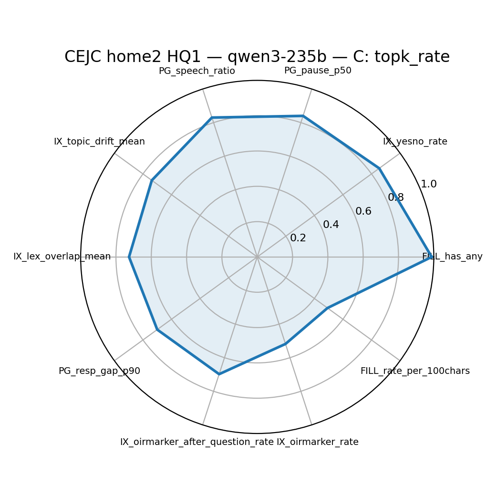</a> 
<b>topk_rate</b>（クリックで拡大）
  
<a href="assets/figs/radar_qwen3-235b_C_sign_agree.png">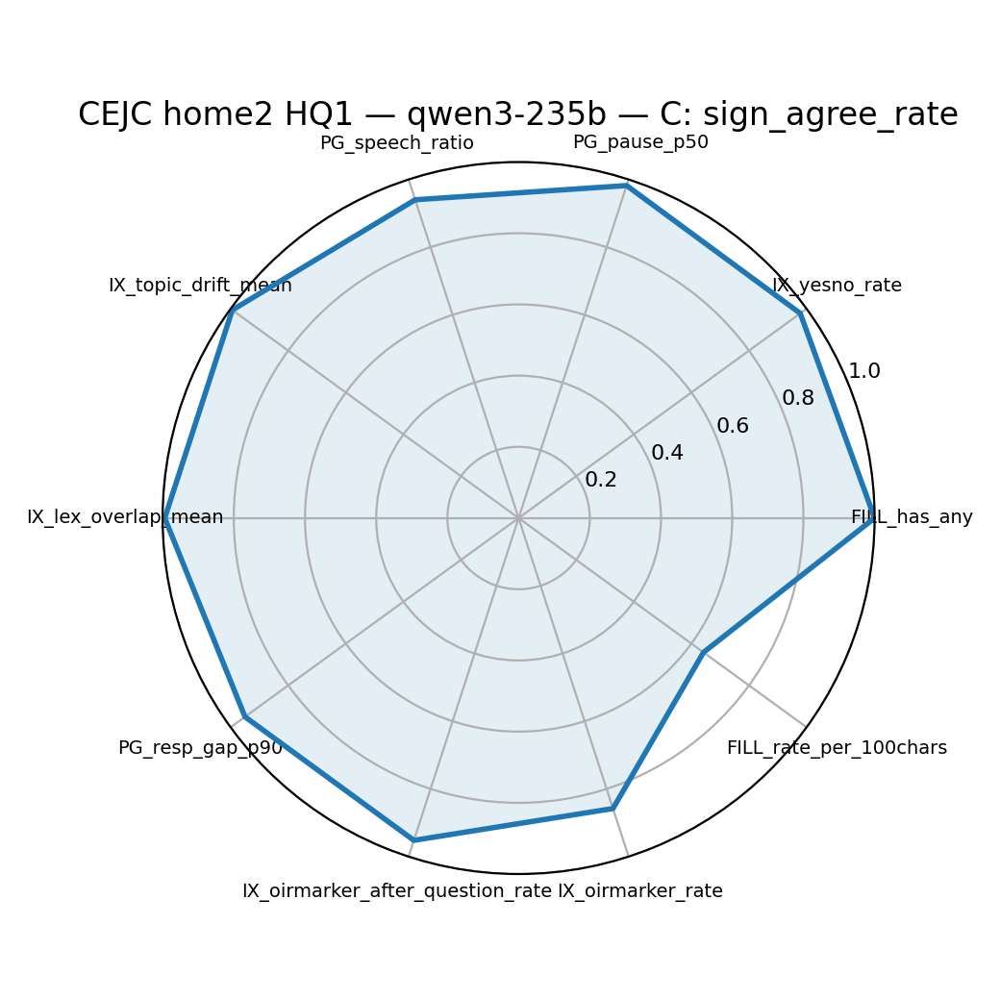</a> 
<b>sign_agree_rate</b>（クリックで拡大）

</td>
</tr>
</table>

<table>
<tr>
<td valign="top" width="62%">

### A Top10（qwen3-235b）
| Feature | Dir | topk_rate | sign_agree |
|---|:---:|---:|---:|
| FILL_rate_per_100chars | + | 0.974 | 0.998 |
| PG_pause_p90 | − | 0.914 | 0.976 |
| PG_pause_mean | − | 0.806 | 0.886 |
| PG_speech_ratio | + | 0.748 | 0.914 |
| RESP_NE_ENTROPY | − | 0.746 | 0.918 |
| RESP_NE_AIZUCHI_RATE | + | 0.742 | 0.946 |
| FILL_has_any | − | 0.702 | 0.436 |
| IX_yesno_after_question_rate | + | 0.686 | 0.908 |
| PG_pause_p50 | − | 0.668 | 0.830 |
| IX_yesno_rate | − | 0.554 | 0.820 |

</td>
<td valign="top" width="38%" align="center">

<a href="assets/figs/radar_qwen3-235b_A_topk_rate.png">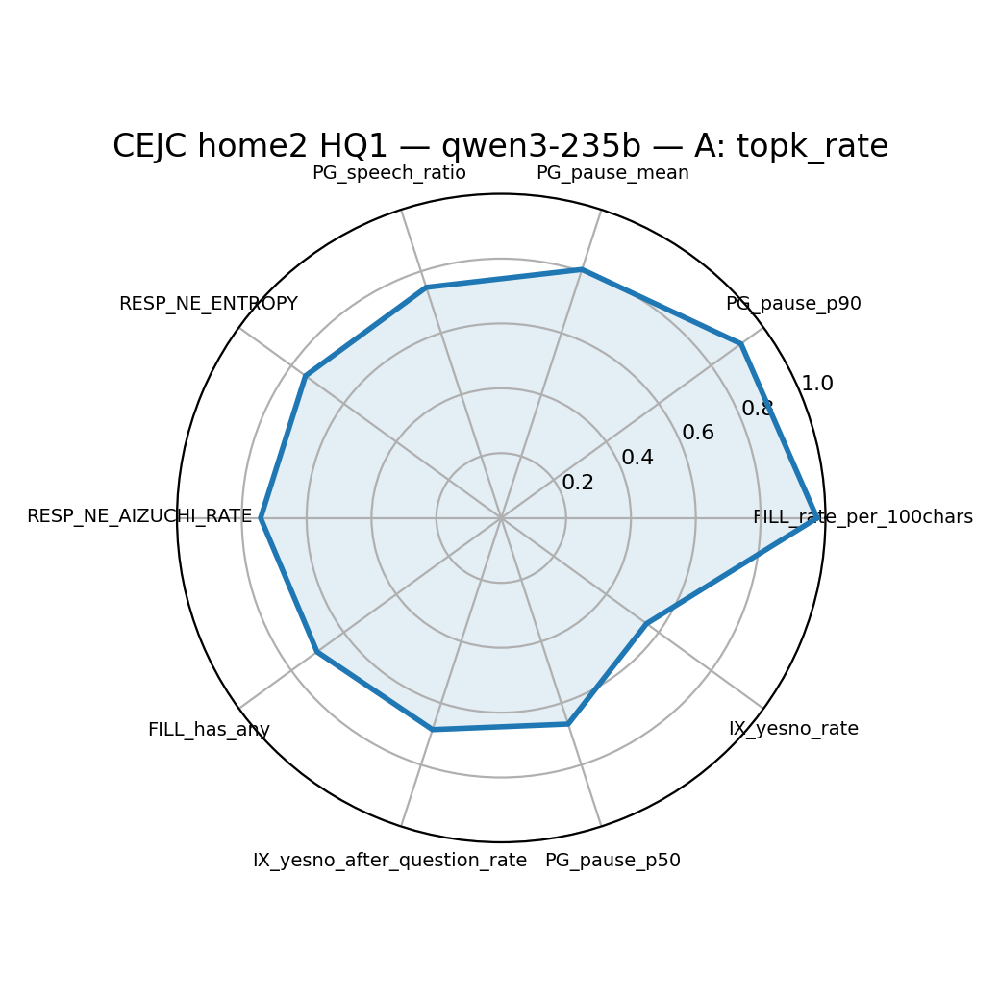</a> 
<b>topk_rate</b>
  
<a href="assets/figs/radar_qwen3-235b_A_sign_agree.png">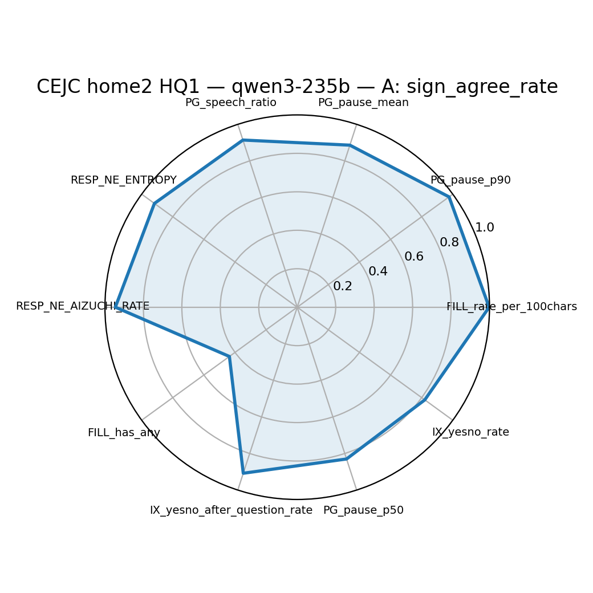</a> 
<b>sign_agree_rate</b>

</td>
</tr>
</table>

<table>
<tr>
<td valign="top" width="62%">

### E Top10（qwen3-235b）
| Feature | Dir | topk_rate | sign_agree |
|---|:---:|---:|---:|
| PG_pause_p90 | − | 0.990 | 0.998 |
| PG_pause_mean | − | 0.890 | 0.950 |
| RESP_YO_ENTROPY | + | 0.846 | 0.982 |
| FILL_rate_per_100chars | + | 0.732 | 0.898 |
| PG_pause_p50 | − | 0.714 | 0.824 |
| PG_resp_gap_p90 | + | 0.672 | 0.934 |
| IX_oirmarker_rate | + | 0.666 | 0.902 |
| IX_yesno_after_question_rate | − | 0.642 | 0.898 |
| PG_resp_gap_p50 | − | 0.640 | 0.880 |
| FILL_has_any | + | 0.640 | 0.894 |

</td>
<td valign="top" width="38%" align="center">

<a href="assets/figs/radar_qwen3-235b_E_topk_rate.png">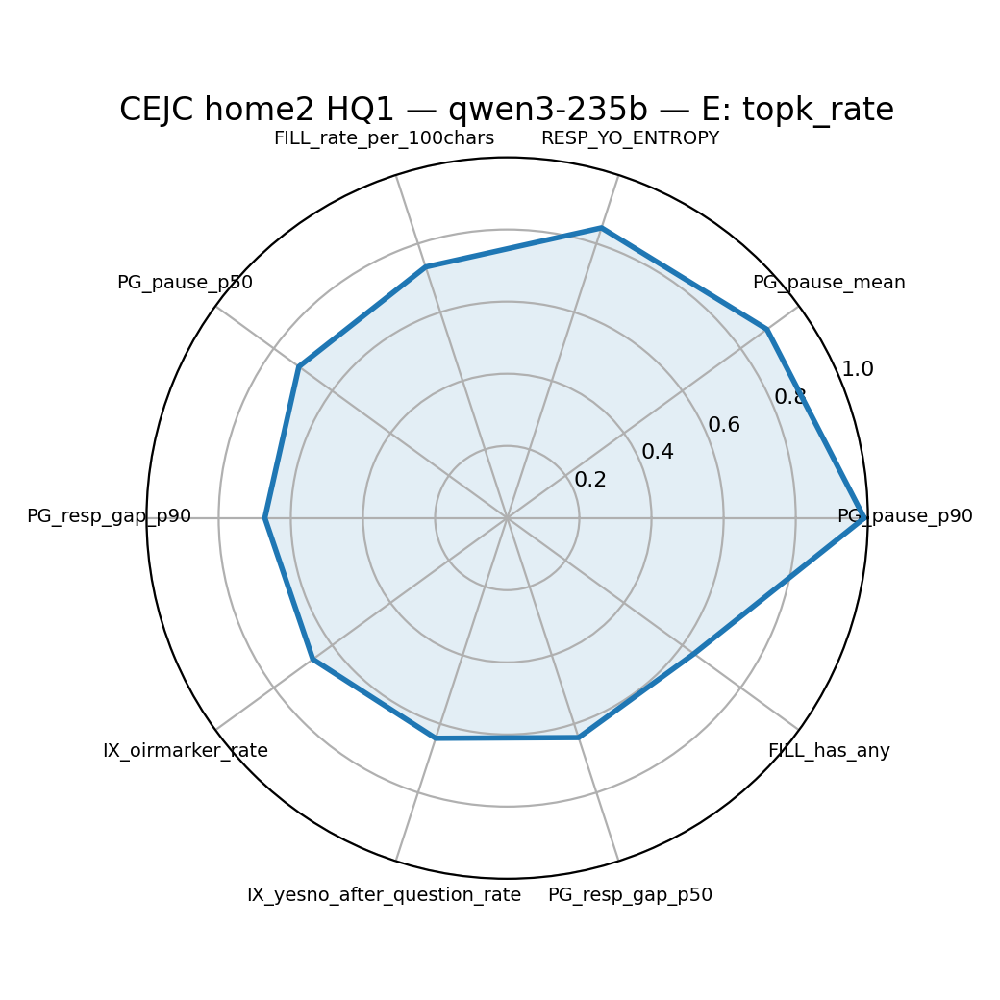</a> 
<b>topk_rate</b>
  
<a href="assets/figs/radar_qwen3-235b_E_sign_agree.png">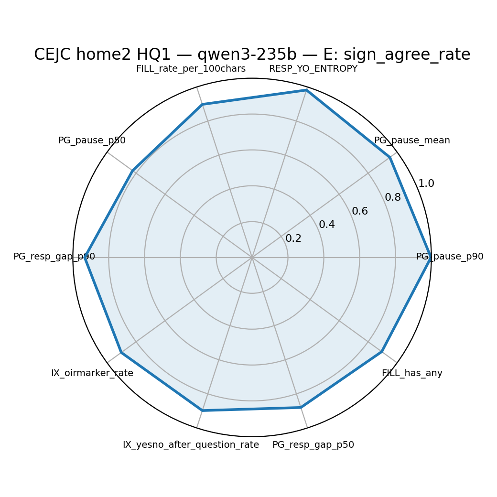</a> 
<b>sign_agree_rate</b>

</td>
</tr>
</table>

<table>
<tr>
<td valign="top" width="62%">

### N Top10（qwen3-235b）
| Feature | Dir | topk_rate | sign_agree |
|---|:---:|---:|---:|
| RESP_NE_AIZUCHI_RATE | − | 0.980 | 1.000 |
| PG_resp_gap_p50 | + | 0.972 | 0.994 |
| IX_yesno_rate | − | 0.728 | 0.876 |
| PG_resp_gap_p90 | + | 0.702 | 0.948 |
| IX_oirmarker_after_question_rate | − | 0.650 | 0.888 |
| RESP_YO_ENTROPY | − | 0.612 | 0.862 |
| FILL_has_any | + | 0.610 | 0.924 |
| IX_yesno_after_question_rate | − | 0.546 | 0.790 |
| IX_oirmarker_rate | + | 0.508 | 0.596 |
| PG_pause_p90 | − | 0.496 | 0.816 |

</td>
<td valign="top" width="38%" align="center">

<a href="assets/figs/radar_qwen3-235b_N_topk_rate.png">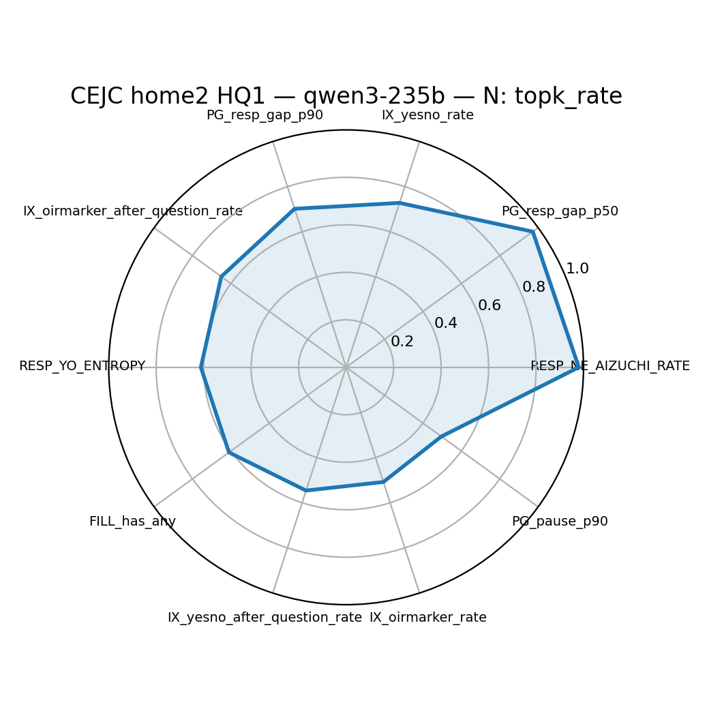</a> 
<b>topk_rate</b>
  
<a href="assets/figs/radar_qwen3-235b_N_sign_agree.png">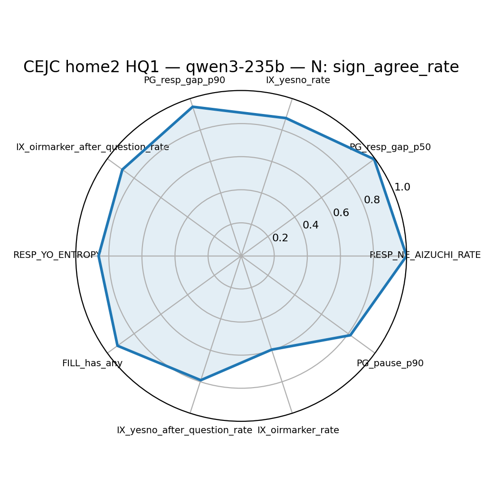</a> 
<b>sign_agree_rate</b>

</td>
</tr>
</table>

<table>
<tr>
<td valign="top" width="62%">

### O Top10（qwen3-235b）
| Feature | Dir | topk_rate | sign_agree |
|---|:---:|---:|---:|
| PG_pause_p50 | + | 0.898 | 0.988 |
| PG_pause_p90 | − | 0.882 | 0.958 |
| PG_resp_gap_p90 | + | 0.880 | 0.988 |
| PG_pause_mean | − | 0.810 | 0.978 |
| IX_oirmarker_rate | + | 0.804 | 0.978 |
| IX_yesno_after_question_rate | − | 0.734 | 0.896 |
| PG_speech_ratio | + | 0.654 | 0.926 |
| RESP_NE_AIZUCHI_RATE | − | 0.592 | 0.942 |
| PG_resp_gap_p50 | + | 0.566 | 0.880 |
| IX_yesno_rate | + | 0.552 | 0.438 |

</td>
<td valign="top" width="38%" align="center">

<a href="assets/figs/radar_qwen3-235b_O_topk_rate.png">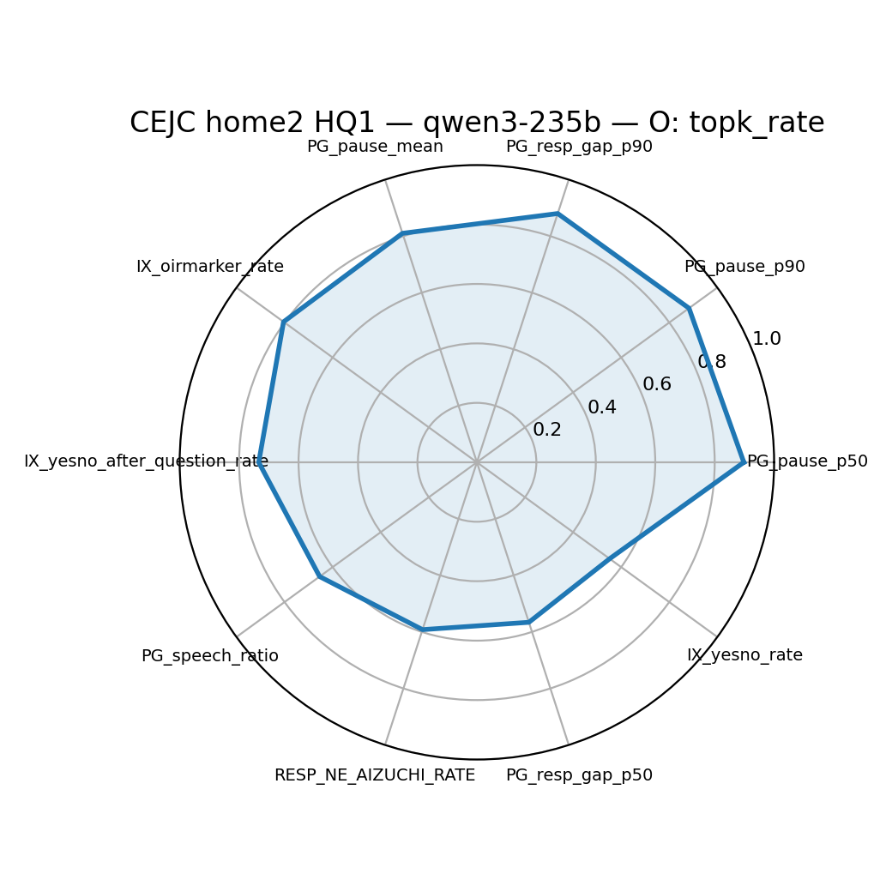</a> 
<b>topk_rate</b>
  
<a href="assets/figs/radar_qwen3-235b_O_sign_agree.png">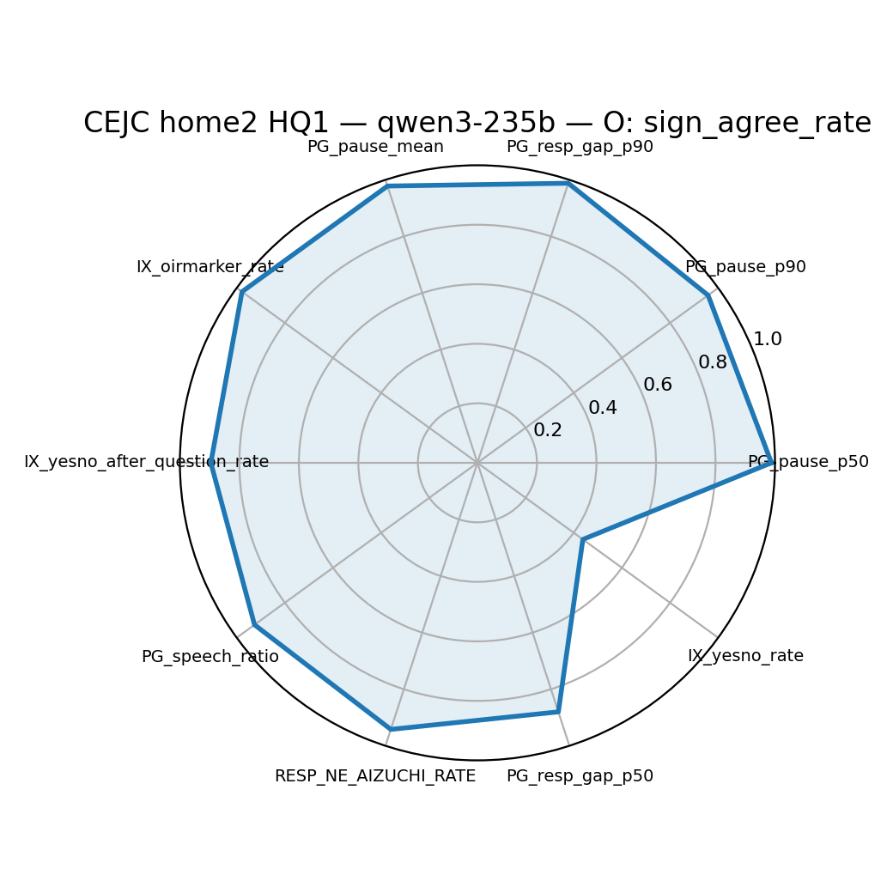</a> 
<b>sign_agree_rate</b>

</td>
</tr>
</table>

---

### Teacher: deepseek-v3

<table>
<tr>
<td valign="top" width="62%">

### C Top10（deepseek-v3）
| Feature | Dir | topk_rate | sign_agree |
|---|:---:|---:|---:|
| IX_yesno_rate | + | 0.876 | 0.988 |
| PG_speech_ratio | + | 0.852 | 0.974 |
| IX_oirmarker_after_question_rate | + | 0.822 | 0.958 |
| PG_pause_p90 | − | 0.694 | 0.978 |
| FILL_has_any | + | 0.678 | 0.942 |
| RESP_NE_AIZUCHI_RATE | + | 0.646 | 0.888 |
| IX_yesno_after_question_rate | + | 0.602 | 0.838 |
| IX_lex_overlap_mean | − | 0.572 | 0.942 |
| PG_resp_gap_p50 | − | 0.556 | 0.772 |
| IX_topic_drift_mean | + | 0.556 | 0.942 |

</td>
<td valign="top" width="38%" align="center">

<a href="assets/figs/radar_deepseek-v3_C_topk_rate.png">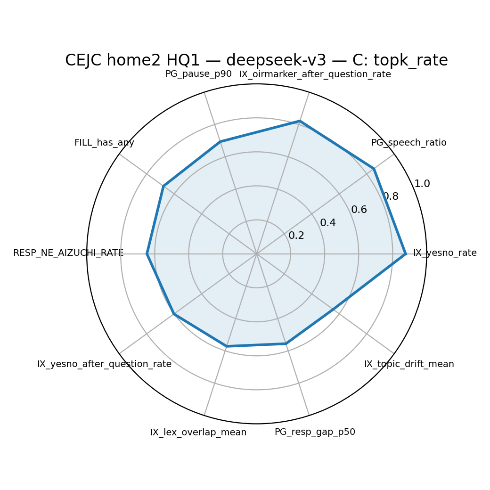</a> 
<b>topk_rate</b>
  
<a href="assets/figs/radar_deepseek-v3_C_sign_agree.png">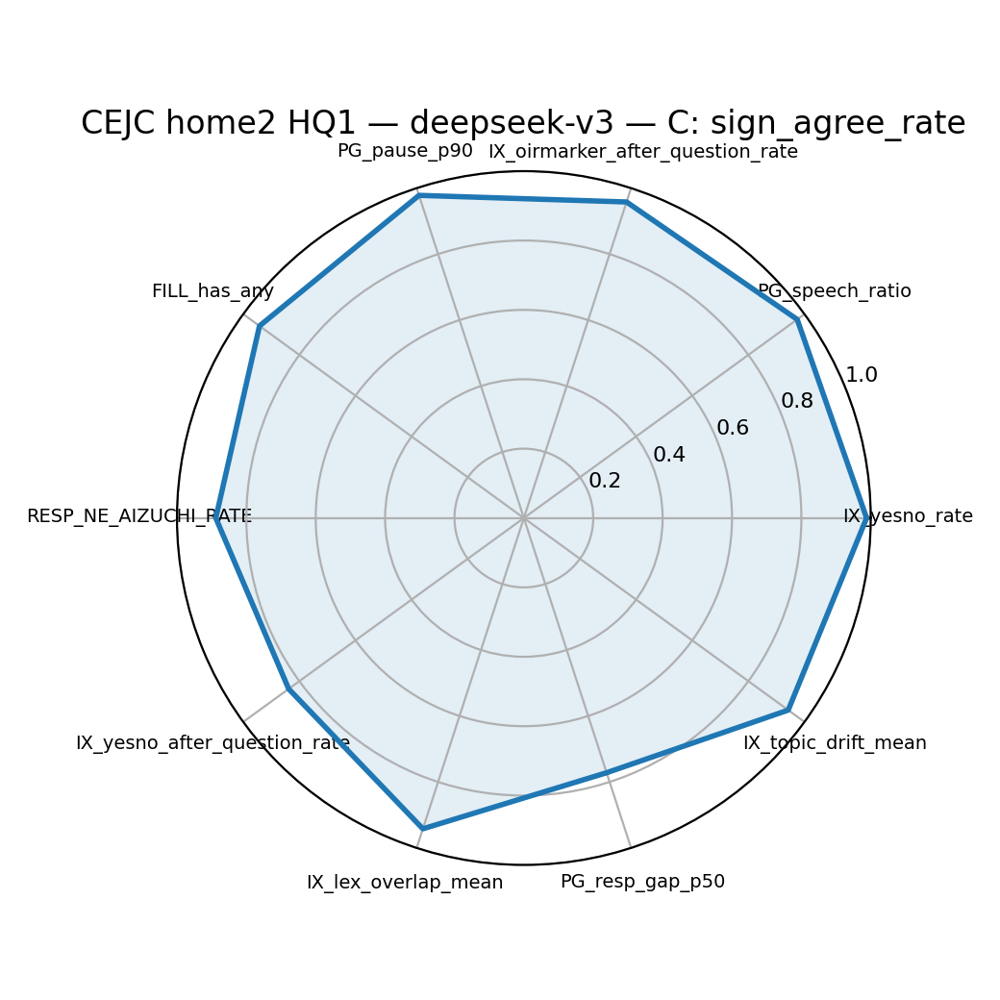</a> 
<b>sign_agree_rate</b>

</td>
</tr>
</table>

<table>
<tr>
<td valign="top" width="62%">

### A Top10（deepseek-v3）
| Feature | Dir | topk_rate | sign_agree |
|---|:---:|---:|---:|
| RESP_NE_ENTROPY | − | 0.964 | 0.998 |
| FILL_rate_per_100chars | + | 0.922 | 0.984 |
| RESP_YO_ENTROPY | + | 0.824 | 0.962 |
| IX_yesno_rate | + | 0.730 | 0.904 |
| PG_speech_ratio | + | 0.660 | 0.896 |
| RESP_NE_AIZUCHI_RATE | + | 0.638 | 0.858 |
| IX_oirmarker_after_question_rate | − | 0.632 | 0.862 |
| PG_pause_mean | − | 0.590 | 0.908 |
| PG_resp_gap_p50 | − | 0.556 | 0.854 |
| PG_pause_p50 | + | 0.516 | 0.556 |

</td>
<td valign="top" width="38%" align="center">

<a href="assets/figs/radar_deepseek-v3_A_topk_rate.png">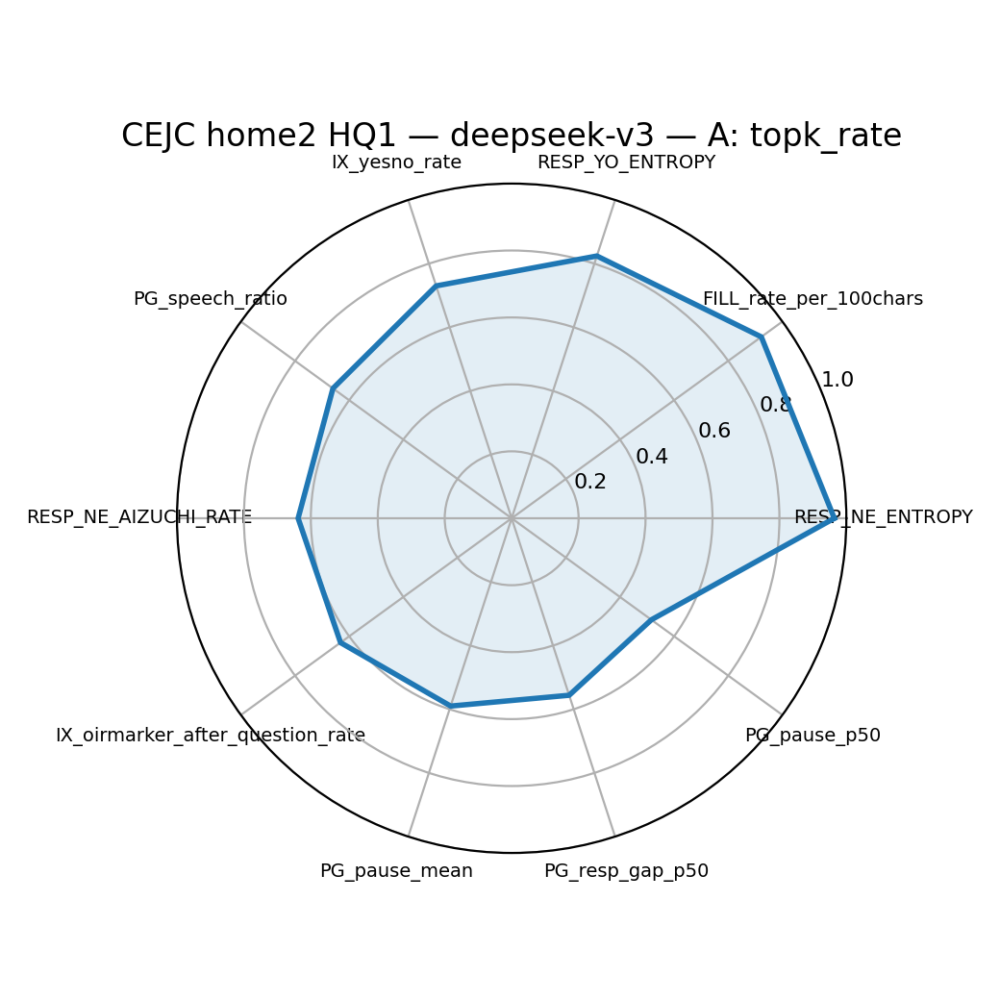</a> 
<b>topk_rate</b>
  
<a href="assets/figs/radar_deepseek-v3_A_sign_agree.png">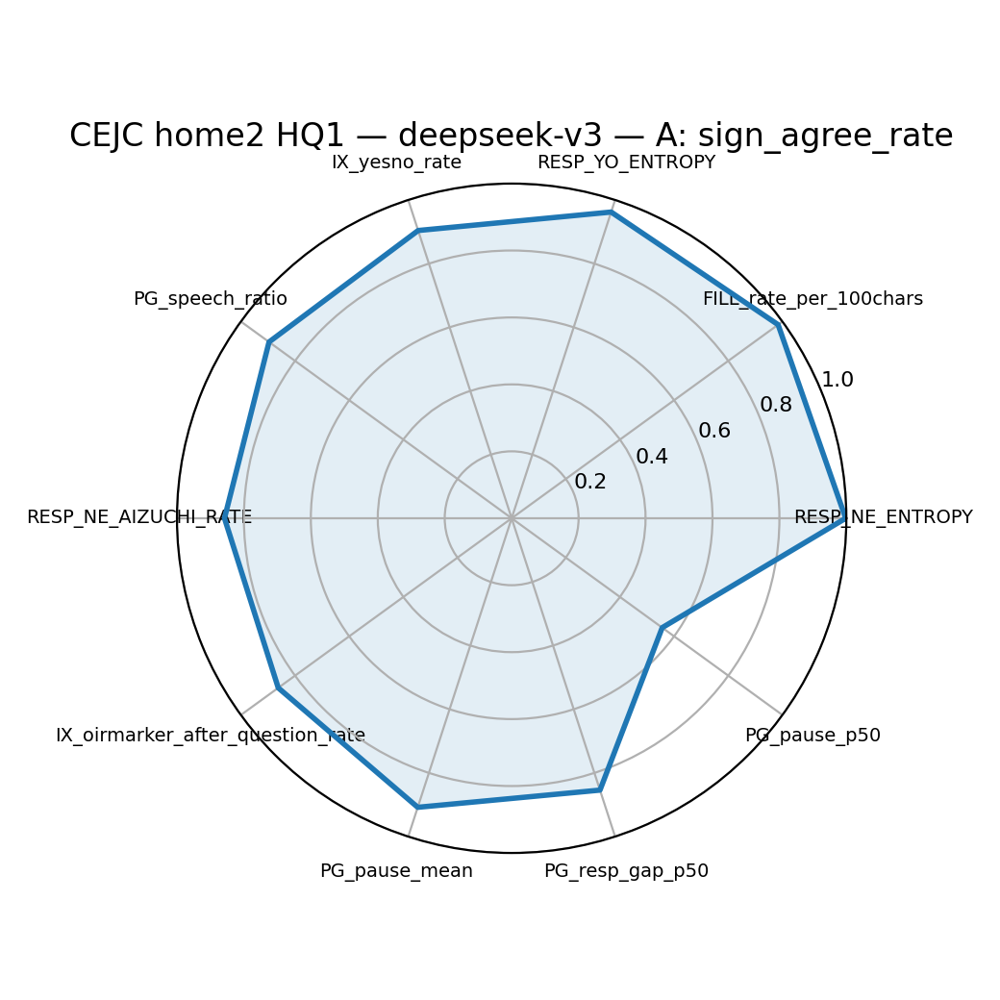</a> 
<b>sign_agree_rate</b>

</td>
</tr>
</table>

<table>
<tr>
<td valign="top" width="62%">

### E Top10（deepseek-v3）
| Feature | Dir | topk_rate | sign_agree |
|---|:---:|---:|---:|
| PG_pause_p90 | − | 0.958 | 0.996 |
| PG_pause_mean | − | 0.828 | 0.974 |
| FILL_rate_per_100chars | + | 0.788 | 0.942 |
| IX_oirmarker_rate | + | 0.666 | 0.864 |
| RESP_YO_ENTROPY | + | 0.658 | 0.906 |
| IX_oirmarker_after_question_rate | − | 0.654 | 0.810 |
| PG_resp_gap_mean | + | 0.600 | 0.896 |
| IX_yesno_after_question_rate | − | 0.586 | 0.872 |
| PG_pause_p50 | − | 0.576 | 0.762 |
| PG_resp_gap_p90 | + | 0.548 | 0.820 |

</td>
<td valign="top" width="38%" align="center">

<a href="assets/figs/radar_deepseek-v3_E_topk_rate.png">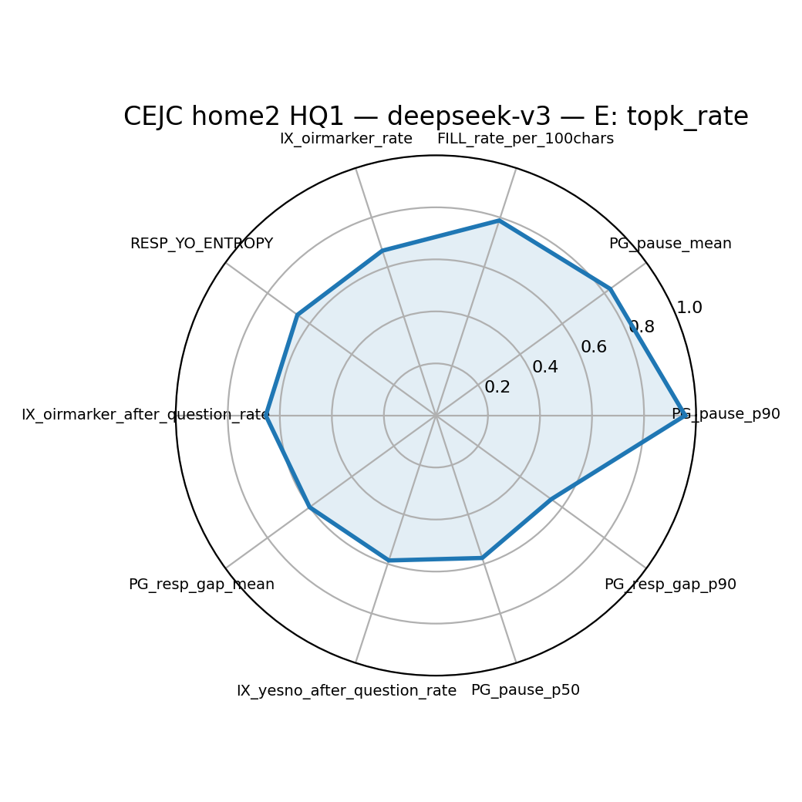</a> 
<b>topk_rate</b>
  
<a href="assets/figs/radar_deepseek-v3_E_sign_agree.png">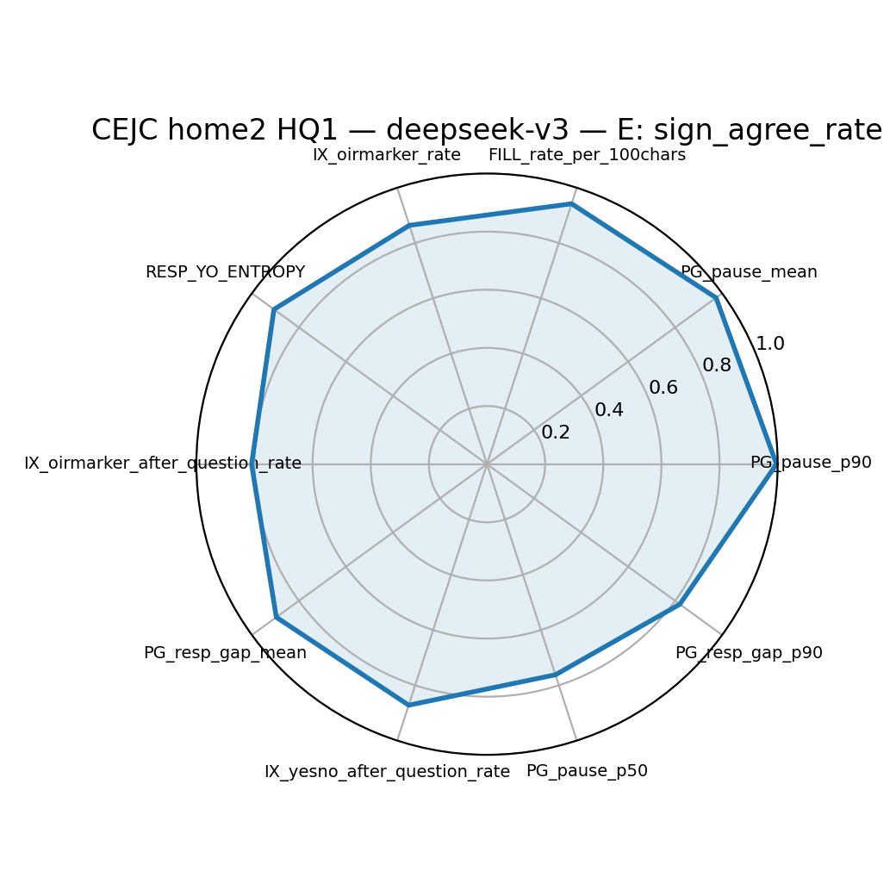</a> 
<b>sign_agree_rate</b>

</td>
</tr>
</table>

<table>
<tr>
<td valign="top" width="62%">

### N Top10（deepseek-v3）
| Feature | Dir | topk_rate | sign_agree |
|---|:---:|---:|---:|
| PG_resp_gap_p50 | + | 0.934 | 0.986 |
| PG_pause_p50 | − | 0.790 | 0.962 |
| RESP_YO_ENTROPY | − | 0.726 | 0.940 |
| FILL_rate_per_100chars | − | 0.724 | 0.922 |
| IX_oirmarker_rate | + | 0.716 | 0.880 |
| IX_yesno_rate | − | 0.674 | 0.830 |
| PG_resp_gap_mean | − | 0.642 | 0.254 |
| FILL_has_any | + | 0.640 | 0.918 |
| RESP_NE_AIZUCHI_RATE | − | 0.624 | 0.858 |
| IX_yesno_after_question_rate | − | 0.564 | 0.804 |

</td>
<td valign="top" width="38%" align="center">

<a href="assets/figs/radar_deepseek-v3_N_topk_rate.png">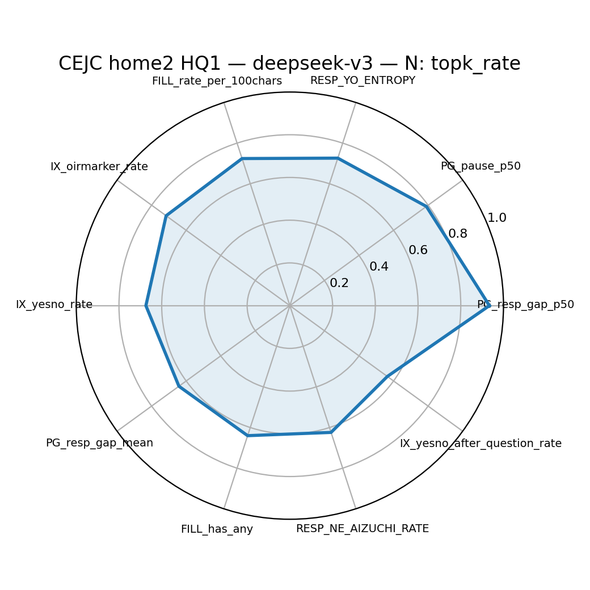</a> 
<b>topk_rate</b>
  
<a href="assets/figs/radar_deepseek-v3_N_sign_agree.png">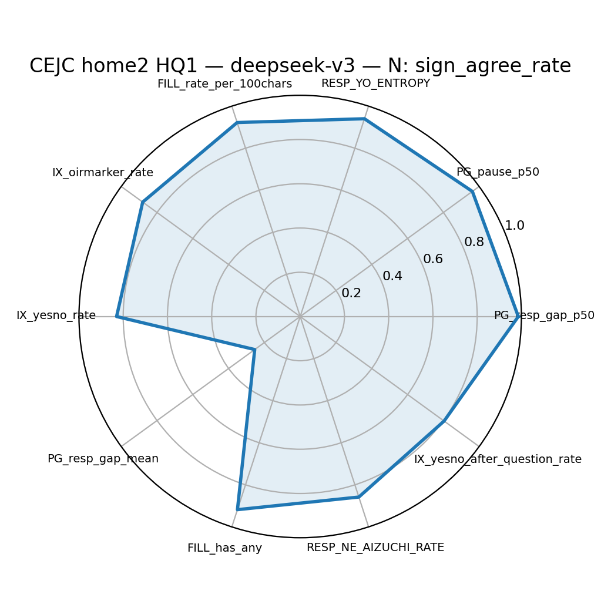</a> 
<b>sign_agree_rate</b>

</td>
</tr>
</table>

<table>
<tr>
<td valign="top" width="62%">

### O Top10（deepseek-v3）
| Feature | Dir | topk_rate | sign_agree |
|---|:---:|---:|---:|
| PG_pause_p90 | − | 0.918 | 0.984 |
| RESP_NE_AIZUCHI_RATE | − | 0.864 | 0.974 |
| IX_oirmarker_rate | + | 0.862 | 0.978 |
| IX_yesno_rate | − | 0.840 | 0.948 |
| FILL_rate_per_100chars | − | 0.768 | 0.950 |
| RESP_NE_ENTROPY | − | 0.750 | 0.948 |
| IX_yesno_after_question_rate | − | 0.732 | 0.892 |
| PG_pause_p50 | + | 0.666 | 0.870 |
| PG_resp_gap_mean | + | 0.576 | 0.926 |
| IX_oirmarker_after_question_rate | − | 0.506 | 0.662 |

</td>
<td valign="top" width="38%" align="center">

<a href="assets/figs/radar_deepseek-v3_O_topk_rate.png">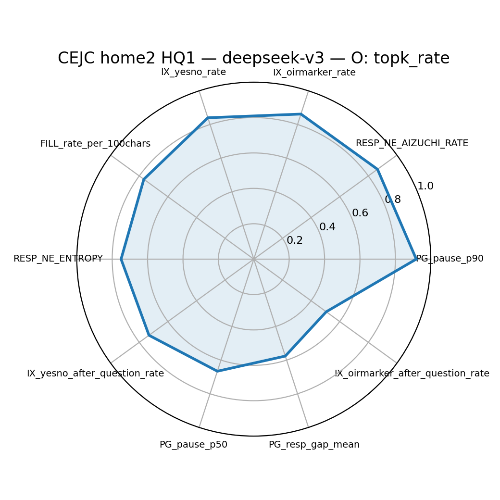</a> 
<b>topk_rate</b>
  
<a href="assets/figs/radar_deepseek-v3_O_sign_agree.png">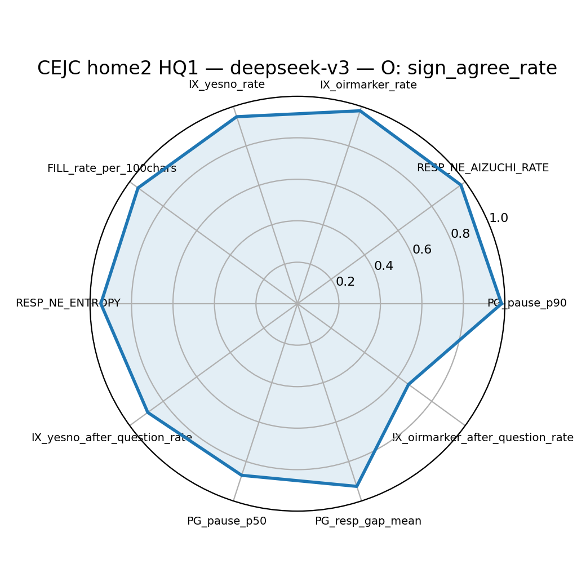</a> 
<b>sign_agree_rate</b>

</td>
</tr>
</table>

---

### Teacher: gpt-oss-120b

<table>
<tr>
<td valign="top" width="62%">

### C Top10（gpt-oss-120b）
| Feature | Dir | topk_rate | sign_agree |
|---|:---:|---:|---:|
| IX_yesno_rate | + | 0.974 | 0.996 |
| FILL_has_any | + | 0.894 | 0.984 |
| IX_oirmarker_after_question_rate | + | 0.870 | 0.990 |
| PG_pause_p50 | − | 0.862 | 0.986 |
| PG_resp_gap_p50 | − | 0.736 | 0.908 |
| PG_speech_ratio | + | 0.698 | 0.802 |
| PG_resp_gap_p90 | + | 0.556 | 0.794 |
| RESP_NE_AIZUCHI_RATE | + | 0.548 | 0.912 |
| PG_pause_mean | + | 0.536 | 0.756 |
| PG_pause_p90 | − | 0.500 | 0.824 |

</td>
<td valign="top" width="38%" align="center">

 
<b>topk_rate</b>
  
<a href="assets/figs/radar_gpt-oss-120b_C_sign_agree.png">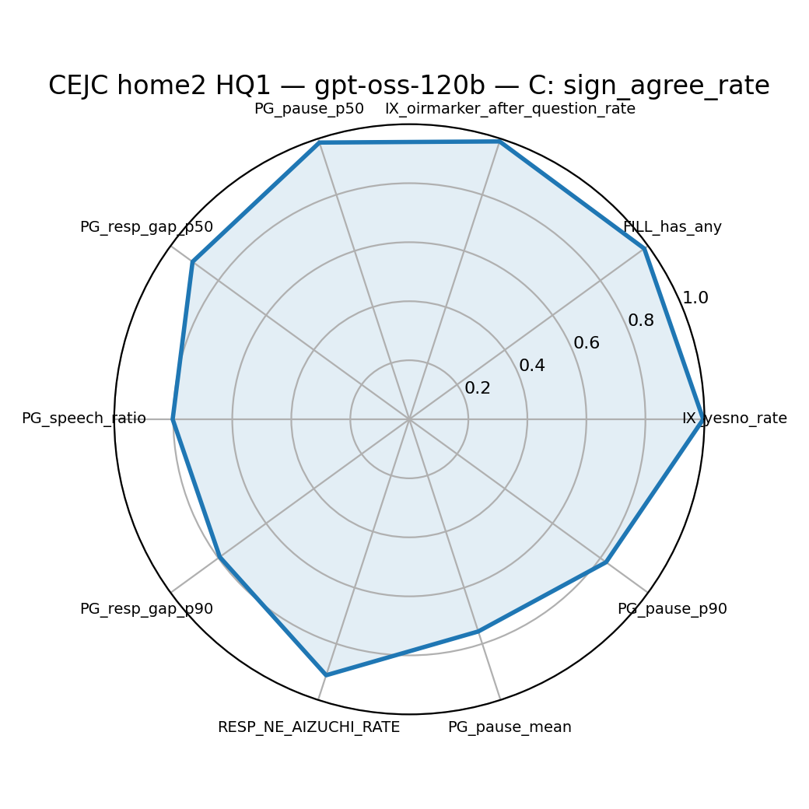</a> 
<b>sign_agree_rate</b>

</td>
</tr>
</table>

<table>
<tr>
<td valign="top" width="62%">

### A Top10（gpt-oss-120b）
| Feature | Dir | topk_rate | sign_agree |
|---|:---:|---:|---:|
| IX_yesno_rate | + | 0.916 | 0.982 |
| RESP_NE_ENTROPY | − | 0.912 | 0.990 |
| PG_pause_p50 | − | 0.836 | 0.966 |
| PG_speech_ratio | + | 0.788 | 0.954 |
| PG_pause_p90 | − | 0.780 | 0.974 |
| IX_yesno_after_question_rate | + | 0.774 | 0.926 |
| RESP_NE_AIZUCHI_RATE | + | 0.674 | 0.942 |
| PG_pause_mean | − | 0.658 | 0.928 |
| PG_resp_gap_p50 | − | 0.600 | 0.928 |
| FILL_rate_per_100chars | + | 0.540 | 0.856 |

</td>
<td valign="top" width="38%" align="center">

<a href="assets/figs/radar_gpt-oss-120b_A_topk_rate.png">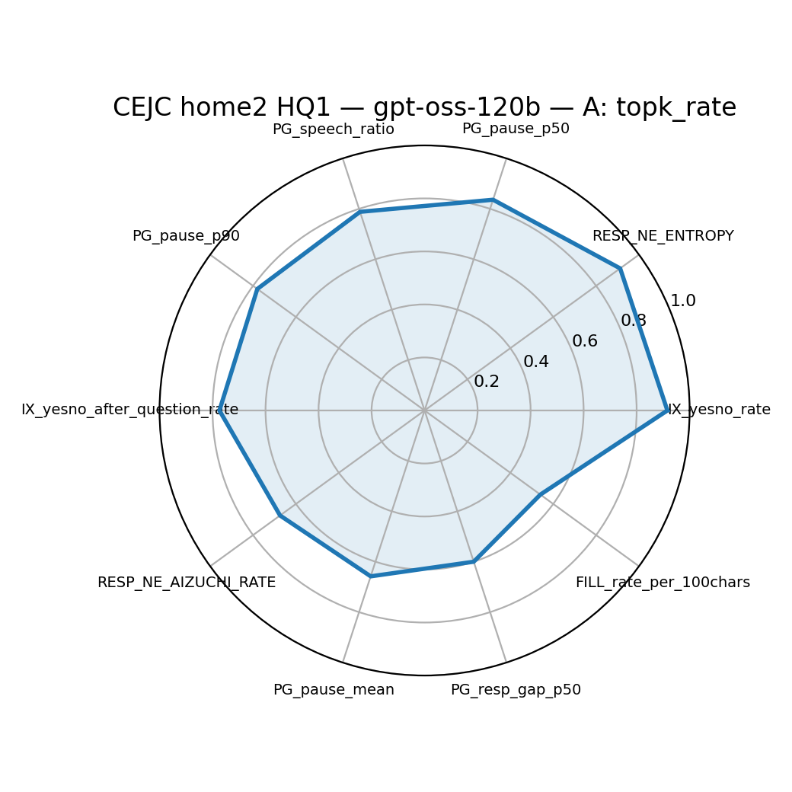</a> 
<b>topk_rate</b>
  
<a href="assets/figs/radar_gpt-oss-120b_A_sign_agree.png">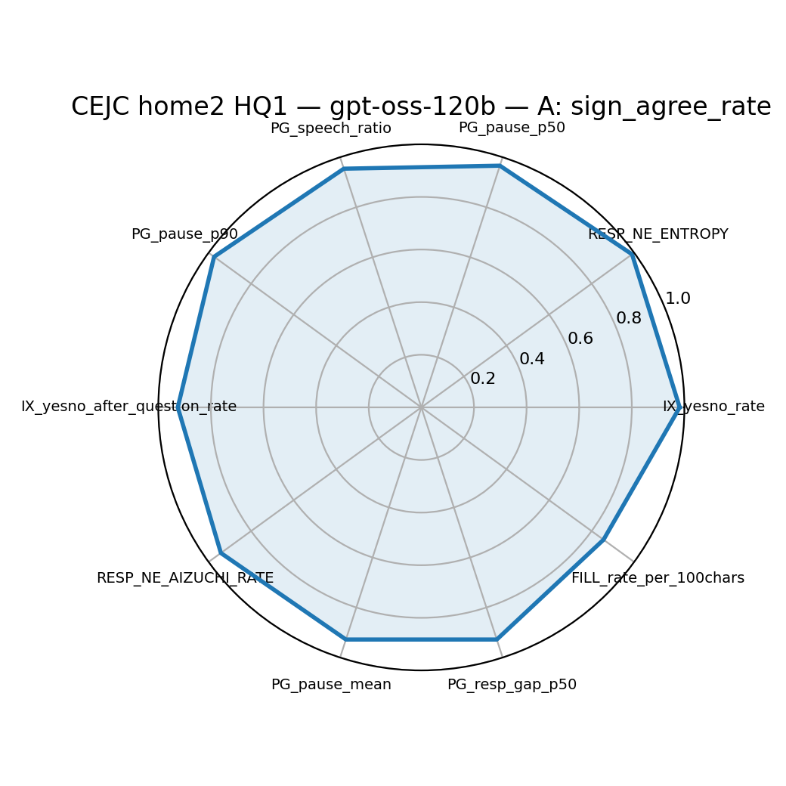</a> 
<b>sign_agree_rate</b>

</td>
</tr>
</table>

<table>
<tr>
<td valign="top" width="62%">

### E Top10（gpt-oss-120b）
| Feature | Dir | topk_rate | sign_agree |
|---|:---:|---:|---:|
| FILL_has_any | + | 0.960 | 0.996 |
| PG_pause_p50 | − | 0.824 | 0.930 |
| PG_speech_ratio | + | 0.784 | 0.918 |
| RESP_YO_ENTROPY | + | 0.742 | 0.916 |
| PG_pause_mean | − | 0.734 | 0.946 |
| PG_pause_p90 | − | 0.724 | 0.938 |
| RESP_NE_AIZUCHI_RATE | + | 0.724 | 0.926 |
| PG_resp_gap_p50 | − | 0.700 | 0.868 |
| FILL_rate_per_100chars | + | 0.650 | 0.776 |
| PG_resp_gap_p90 | + | 0.452 | 0.746 |

</td>
<td valign="top" width="38%" align="center">

<a href="assets/figs/radar_gpt-oss-120b_E_topk_rate.png">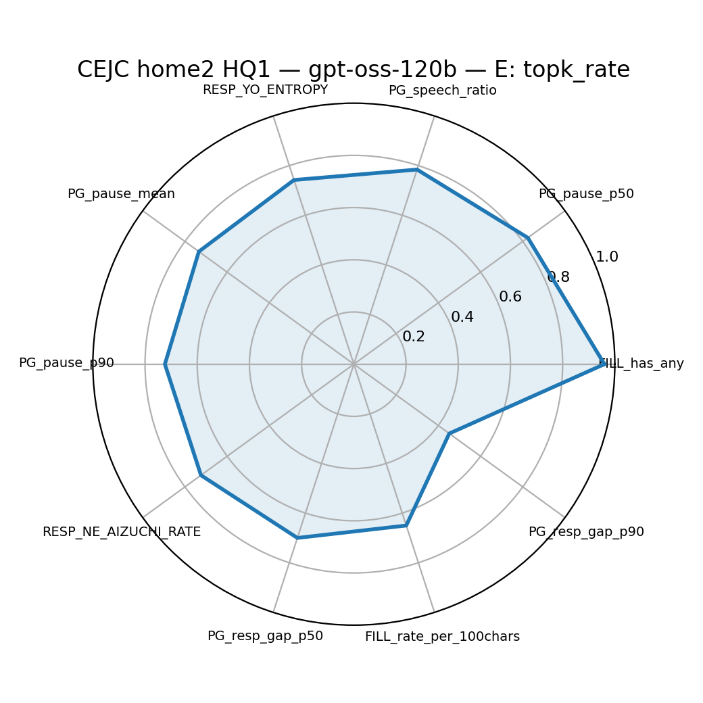</a> 
<b>topk_rate</b>
  
<a href="assets/figs/radar_gpt-oss-120b_E_sign_agree.png">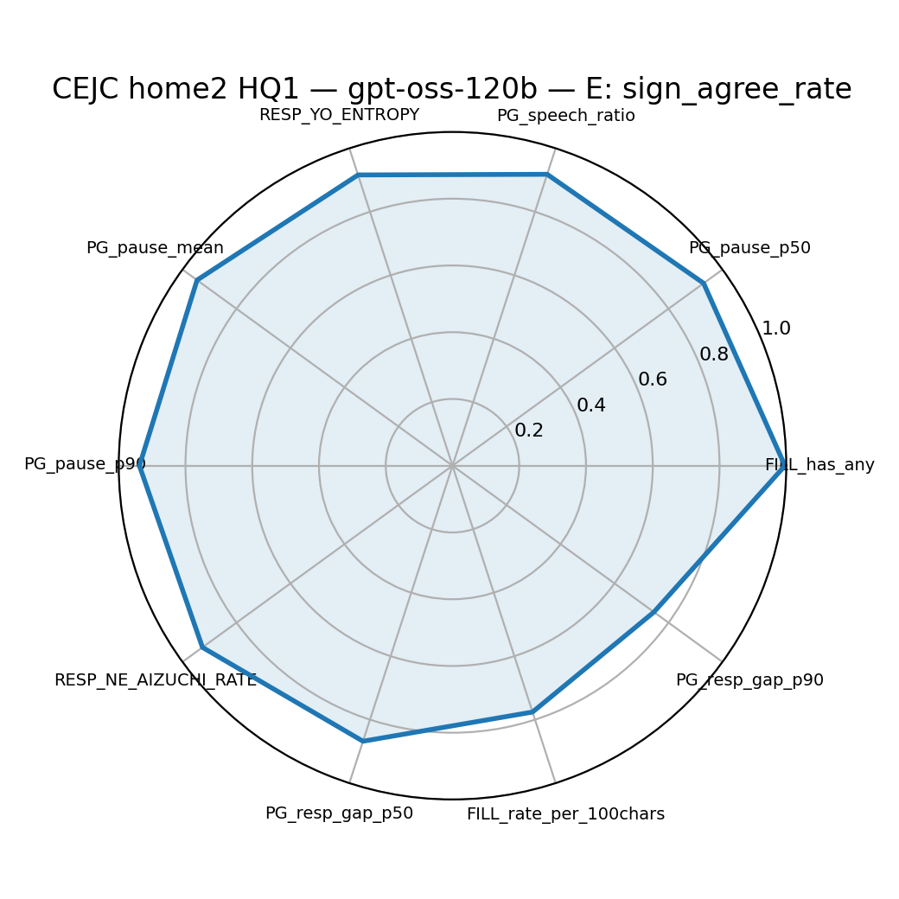</a> 
<b>sign_agree_rate</b>

</td>
</tr>
</table>

<table>
<tr>
<td valign="top" width="62%">

### N Top10（gpt-oss-120b）
| Feature | Dir | topk_rate | sign_agree |
|---|:---:|---:|---:|
| IX_oirmarker_after_question_rate | − | 0.998 | 1.000 |
| IX_yesno_rate | − | 0.996 | 1.000 |
| PG_pause_p50 | − | 0.694 | 0.840 |
| PG_resp_gap_p50 | + | 0.656 | 0.832 |
| IX_yesno_after_question_rate | − | 0.624 | 0.778 |
| RESP_NE_AIZUCHI_RATE | − | 0.612 | 0.866 |
| IX_oirmarker_rate | + | 0.600 | 0.830 |
| PG_resp_gap_mean | + | 0.594 | 0.812 |
| PG_resp_gap_p90 | + | 0.592 | 0.818 |
| FILL_rate_per_100chars | − | 0.548 | 0.818 |

</td>
<td valign="top" width="38%" align="center">

 
<b>topk_rate</b>
  
<a href="assets/figs/radar_gpt-oss-120b_N_sign_agree.png">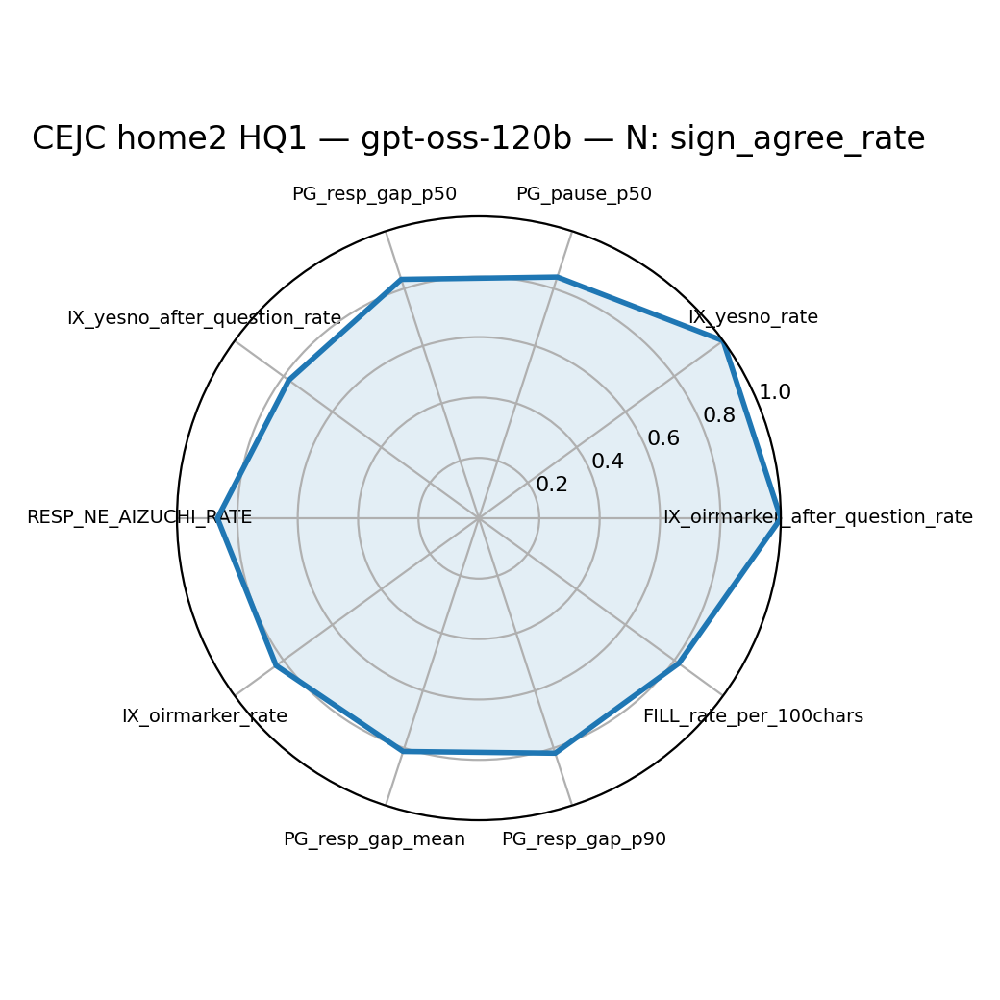</a> 
<b>sign_agree_rate</b>

</td>
</tr>
</table>

<table>
<tr>
<td valign="top" width="62%">

### O Top10（gpt-oss-120b）
| Feature | Dir | topk_rate | sign_agree |
|---|:---:|---:|---:|
| PG_speech_ratio | + | 0.996 | 0.998 |
| FILL_rate_per_100chars | − | 0.988 | 1.000 |
| RESP_NE_AIZUCHI_RATE | − | 0.900 | 0.986 |
| RESP_NE_ENTROPY | − | 0.714 | 0.936 |
| PG_pause_mean | − | 0.678 | 0.862 |
| PG_resp_gap_p50 | + | 0.664 | 0.902 |
| PG_pause_p90 | − | 0.632 | 0.874 |
| IX_yesno_rate | − | 0.622 | 0.708 |
| IX_oirmarker_rate | − | 0.556 | 0.832 |
| RESP_YO_ENTROPY | − | 0.526 | 0.858 |

</td>
<td valign="top" width="38%" align="center">

 
<b>topk_rate</b>
  
<a href="assets/figs/radar_gpt-oss-120b_O_sign_agree.png">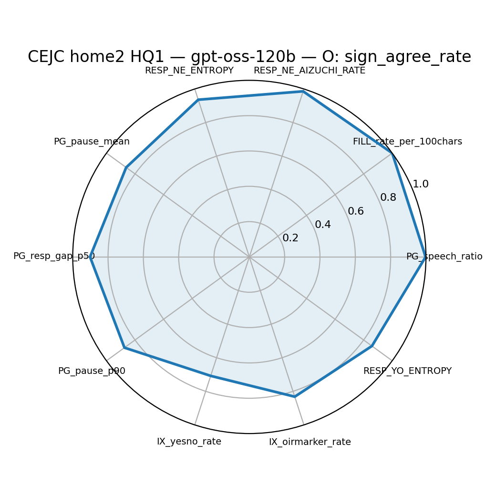</a> 
<b>sign_agree_rate</b>

</td>
</tr>
</table>

---

## 2.2 teacher比較（bootstrap top drivers）: “トリビアル因子”の疑いを監査
teacher別に、**C Top10と他trait Top10がどれだけ被るか**（Overlap）を算出。

| teacher | A overlap | E overlap | N overlap | O overlap |
|---|---:|---:|---:|---:|
| sonnet | 5 | 6 | 5 | 7 |
| qwen3-235b | 5 | 5 | 5 | 5 |
| deepseek-v3 | 5 | 3 | 5 | 5 |
| gpt-oss-120b | 7 | 8 | 6 | 6 |

**読み（bootstrap比較）**
- **gpt-oss-120b は Cと他traitの重なりが大きい（特にE=8/10）**  
  → 多traitで有意になりやすい一方、**同じ特徴で複数traitが立つ（一般因子混入）**の可能性も強まる。  
- deepseek-v3 は E の overlap が小さい（3/10）  
  → Eの教師や特徴が **他traitと異なる/不安定**になっている可能性（PermutationでもEは非有意）。

> 詳細な teacher×trait のTop10一覧は以下（自動生成）に保存：  
> `docs/homework/cejc_bootstrap_teacher_compare.md`  
> 非sonnetの“カード版（表＋レーダー）”は `docs/homework/cejc_bootstrap_cards_nonsonnet.md` に保存。

---

## 3) Sanity check（baseline=Sonnet4）：CとTop10がどれだけ被るか
（当初の“乖離チェック”としての位置づけを維持）

- A: 5/10
- E: 6/10
- N: 5/10
- O: 7/10

**読み（baseline）**
- 完全一致ではない → “全部同じ特徴で当たる”トリビアル懸念は弱い  
- 一方、Oは重なりが多め → 「共通の会話流暢さ因子」っぽい部分が入り込む可能性あり（要監査）

---

## 4) C以外（A/E/N/O）で「18特徴のうち何が顕著に出そうか？」（事前仮説 → 観測との照合）
（baseline中心に書きつつ、teacher依存性がある前提で解釈）

本分析の説明変数は「会話量」ではなく、相互行為の**型**（テンポ/応答/修復/整序/整合/多様性）に限定している。  
そのため、C以外のtraitは「内容（語彙・話題）」よりも、**相互行為としての振る舞い**がどの程度teacherスコアに反映されるかに依存する。

### 4.1 18特徴の“機能カテゴリ”対応
- **テンポ/間**：PG_resp_gap_mean / PG_resp_gap_p50 / PG_resp_gap_p90 / PG_pause_mean / PG_pause_p50 / PG_pause_p90
- **会話主導（量ではなく比）**：PG_speech_ratio
- **整序・計画コスト**：FILL_has_any / FILL_rate_per_100chars
- **応答スタイル（Yes/No）**：IX_yesno_rate / IX_yesno_after_question_rate
- **修復・確認（OIR）**：IX_oirmarker_rate / IX_oirmarker_after_question_rate
- **整合/共有（語彙重なり）**：IX_lex_overlap_mean
- **話題展開（注意：共線性/監査対象）**：IX_topic_drift_mean
- **相槌/反応（NE）**：RESP_NE_AIZUCHI_RATE / RESP_NE_ENTROPY
- **反応の多様性（YO）**：RESP_YO_ENTROPY

### 4.2 観測との照合（baselineの読み + teacher依存性の注記）
- **A（baseline）**：PG_pause_p50 / IX_yesno_after_question_rate が上位 → 「間＋質問後Yes/No」が顕著  
- **E（baseline）**：PG_resp_gap_p50 / PG_pause_p50 / RESP_YO_ENTROPY が上位 → 「テンポ＋多様性」  
- **N/O（baseline）**：Sonnet4では非有意だが、teacherを変えると有意になる場合がある → **teacher依存性**に注意  
  - よって「N/Oは不可能」と断定せず、**teacher一致・一般因子混入の監査**とセットで扱う。

### 4.3 Audit note（再掲）
- `IX_topic_drift_mean` と `IX_lex_overlap_mean` は共線性が強く、符号が対になりやすい。主要主張の中心には置かず補助指標扱いとする。

---

## 5) 解釈メモ（更新版）
- **C**: teacher間一致が高く（mean r≈0.70）、複数teacherで有意に立ちやすい → **本論の中心に置きやすい**  
- **A/E/N/O**: teacher依存性が大きい可能性  
  - 有意になり得るteacherがある一方、teacher一致が低い（特にA）/ bootstrapの重なりが過大（例：gpt-oss）など、**一般因子混入や採点ノイズ**の可能性が残る  
- したがって論文化では  
  - 本論：C中心（teacher頑健性＋一致度の裏付け）  
  - 付録/探索：A/E/N/O（teacher依存性の検証結果として提示）  
が安全かつ説得的。

---

## 6) 生成物リンク（今回追加分）
- teacher間一致（md + png）：`docs/homework/teacher_agreement_big5.md`（pngは `assets/figs/teacher_corr_*.png`）
- bootstrap teacher比較（md）：`docs/homework/cejc_bootstrap_teacher_compare.md`
- bootstrapカード（非sonnet, md）：`docs/homework/cejc_bootstrap_cards_nonsonnet.md`（pngは `assets/figs/radar_{teacher}_{Trait}_*.png`）
- teacher頑健性（Cのみ、表）：`docs/homework/cejc_teacher_check_C_only.md`
- teacher頑健性（A/E/N/O、表）：`docs/homework/cejc_teacher_check_AENO_nonclaude.md`
- 再現手順（runbook）：`docs/homework/runbook.md`