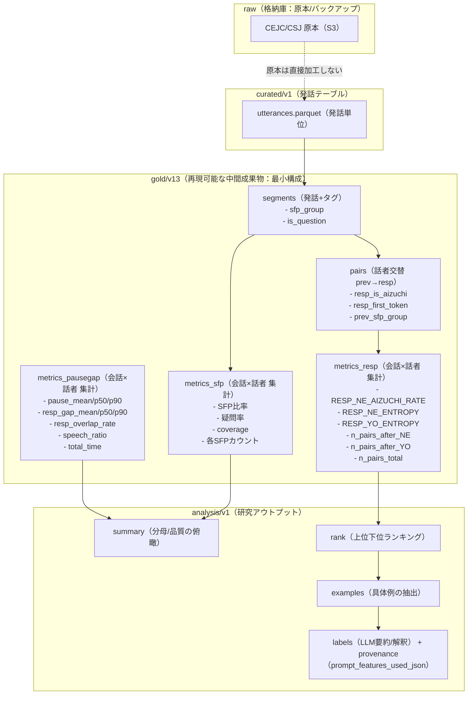

# 宿題（統合版）: 特徴量テーブル & 組み合わせてできること（2026-02-01）
> **先生へ：この1ファイルだけ見ていただければOK** です。  
> 「(1) 特徴量リスト（定義・出力粒度・分母）」→「(2) 組み合わせてできること（スコア化／クラスタ／LLM解釈＋根拠）」の順で、**再現可能な根拠**まで含めて整理しました。  
> **追記（2026-02-02）：** 先生のご指摘に合わせて、**辞書（正規表現/語彙）・計算式・閾値（理由込み）**を、研究議論で読める「短い版」と、再現可能性を担保する「完全版」を **同一ファイル内に共存**させる形で追記しました。

---

## 先生向け短い版（研究議論用サマリー：先にここだけ読めばOK）

### S-0) 何を達成したいか（この宿題の目的）
1. **特徴量の棚卸し**：どのテーブルが、どの粒度で、何を、どの分母で出しているかを明示する  
2. **組み合わせ**：スコア化／クラスタリング／LLM解釈（根拠provenance付き）まで、研究議論に使える形にする  
3. **再現可能性**：辞書（語彙・正規表現）／計算式／閾値と理由を、コードに戻せるレベルで明記する

---

### S-1) goldの位置づけ（raw→curated→gold→analysis）
* **raw**：原本保管（直接加工しない）  
* **curated**：発話テーブル（utterances.parquet）  
* **gold**：curatedから **再現可能に**作る中間成果（segments / pairs / metrics_*）  
* **analysis**：summary / rank / examples / labels（研究アウトプット）

→ **goldを挟む**ことで、原本に手を入れずに、計算を「再現可能」に固定できる。

---

### S-2) 最重要な特徴量セット（粒度・分母・何が分かるか）
* **segments（発話+タグ）**  
  - 粒度：発話  
  - 主な付与：`sfp_group`（NE, NE_Q, YO, NO, NA, MON, OTHER, NONE, NONLEX）、`is_question`  
  - 分母：会話×話者の `n_utt`  
  - 目的：終助詞・疑問の分布、coverage（分析可能率）を見る

* **pairs（話者交替 prev→resp）**  
  - 粒度：話者交替ペア  
  - 主な付与：`prev_sfp_group`、`resp_is_aizuchi`、`resp_first_token`  
  - 分母：`n_pairs_total`、条件付きは `n_pairs_after_NE`  
  - 目的：応答の型（相槌率、語彙固定化）を見る

* **metrics_resp（会話×応答側話者）**  
  - `RESP_NE_AIZUCHI_RATE`：NE/NE_Q直後の相槌率  
  - `RESP_NE_ENTROPY`：NE/NE_Q直後の応答1語目分布のentropy（log2）  
  - 分母：`n_pairs_after_NE`（信頼性の鍵）  
  - 目的：対人調整（相槌）と応答の多様性（固定化）を同時に捉える

* **metrics_pausegap（会話×話者）**  
  - pause/gap/overlap/speech比率など  
  - 音声境界ノイズ対策の閾値：`gap_tol=0.05s`（理由は後述）  
  - 目的：タイミング（テンポ・間）を見る

---

### S-3) 研究議論で重要な「辞書」「閾値」
#### 辞書（コピペ可能な形は完全版の Appendix D に集約）
* **疑問終端語（is_question）**：`か, かな, かね, でしょう, でしょ, だろう, だろ, の`  
* **相槌辞書（resp_is_aizuchi）**：`はい, ええ, うん, うーん, ううん, いいえ, いや, そう, そうだ, そうです, そうですね, そうだね, そうなんだ, なるほど, へえ, へー, ほー, ふーん, あー, おー, えー, まー, うんうん, そうそう`  
* **フィラー辞書（FILL）**：`えっと系, えー系, あの, その, まあ, なんか, ほら`  
* **OIR（聞き返し/修復）辞書（IX）**：`えっ, え？, ん？, 何？, もう一回, 聞こえ, 聞き取れ, どういうこと, どういう, つまり, ってこと, 今なんて, 今(なんて)?`  
* **YES/NO応答辞書（IX）**：`はい, ええ, うん, うーん, ううん, いいえ, いや, そう, そうです, そうだ, そうですね`

#### 閾値（なぜその値か：完全版 Appendix C に一覧）
* `gap_tol=0.05s`：音声境界の数十msノイズを吸収し、pauseを過剰カウントしないため  
* `min_ne_events=20`（analysis reliable 推奨）：比率・entropy推定が小標本で不安定になるのを避け、rankがノイズ支配にならないようにするため  
* `k-per-speaker=5`（examples）：人手確認の負荷を抑えつつ、タイプ把握に最低限必要な例数として採用  
* `epsilon=1e-12`（FILL log）：log(0)回避と数値発散防止

---

### S-4) 研究での使い方（議論の切り口）
1. **相槌率が高い話者**は「対人調整が強い」可能性があるが、**entropyが低い**と「型が固定化」している可能性  
2. **timing（pause/gap/overlap）**と **相槌率/entropy** を組み合わせると、質的説明（タイプ分け）に落とせる  
3. **LLM labels**は説明だけでなく、`prompt_features_used_json` を必須化して **根拠監査（provenance）**ができる

---

## 完全版（再現可能仕様：辞書・式・閾値を省略なしで記述）

---

## 0) gold の意味（raw と S3 の関係）
**gold = raw（原本）を直接触らず、curated（utterances）から “再現可能に生成する” 中間成果物**です。  
研究で扱いやすい最小構成（segments / pairs / metrics_*）に変換して、analysis（summary/rank/examples/labels）へ接続します。



---

## 1) (1) 特徴量リスト（定義・出力粒度・分母まで）

まずは「どのテーブルが、どの粒度で、何を、どの分母で出しているか」を **横スクロール無しで**見える形に整理しました。

### 1.1 生成タイプ（3分類）

* **RAW**：rawデータそのまま（列の再配置や抽出のみ）
* **SIMPLE**：ちょっとだけ加工（単純集計/比率/1語目抽出）
* **NEW**：新規アイデアで計算（entropy / scoring / clustering / LLM provenance）

---

### 1.2 特徴量テーブル（一覧）

| 層        | テーブル                          |      出力粒度 | 生成タイプ  | 何が入るか（最小要約）                                                                                | 分母/安定性（重要）                                                |
| -------- | ----------------------------- | --------: | ------ | ------------------------------------------------------------------------------------------ | --------------------------------------------------------- |
| curated  | curated/v1 **utterances**     |        発話 | RAW    | 必須列：`conversation_id` / `speaker_id` / `text`　任意列：`start_time` / `end_time` / `utterance_id` / `corpus` / `unit_type` | 入力なので分母なし                                                 |
| gold     | gold/v13 **segments**         |     発話+タグ | SIMPLE | `sfp_group`（NE, NE_Q, YO, NO, NA, MON, OTHER, NONE, NONLEX）/ `is_question` / `utt_index` | 分母=発話数（会話×話者の `n_utt`）                                    |
| gold     | gold/v13 **pairs**            |    話者交替ペア | SIMPLE | 話者交替のみ抽出し、`prev_sfp_group` / `resp_is_aizuchi` / `resp_first_token` を付与 | 分母= `n_pairs_total`、条件付きは `n_pairs_after_NE`、`n_pairs_after_YO` |
| gold     | gold/v13 **metrics_sfp**      |     会話×話者 | SIMPLE | `n_sfp_*`（各SFPカウント）/ `rate_sfp_*`（各SFP比率）/ `coverage` / `rate_question` | 分母= `n_utt`（発話数）                                          |
| gold     | gold/v13 **metrics_resp**     |     会話×話者 | NEW    | `RESP_NE_AIZUCHI_RATE` / `RESP_NE_ENTROPY` / `RESP_YO_ENTROPY` / `n_pairs_total` / `n_pairs_after_NE` / `n_pairs_after_YO` | 分母= `n_pairs_after_NE`、`n_pairs_after_YO`（analysisで `min_ne_events` で足切り） |
| gold     | gold/v13 **metrics_pausegap** |     会話×話者 | NEW    | `pause_mean/p50/p90` / `resp_gap_mean/p50/p90` / `resp_overlap_rate` / `speech_ratio` / `total_time` | 分母= `n_segments` / `n_resp_events` / `total_time`       |
| analysis | analysis/v1 **summary**       | dataset集計 | SIMPLE | dataset別の件数、分母、主要指標の平均値（`*_mean`）                                                                        | “空欄”は再集計で埋める運用                                            |
| analysis | analysis/v1 **rank**          |     会話×話者 | NEW    | 指標 `RESP_NE_AIZUCHI_RATE` で上位下位ランキング（top/bottom）                                                    | reliable（`n_pairs_after_NE>=min_ne_events`）のみ                     |
| analysis | analysis/v1 **examples**      |        例文 | NEW    | rank対象話者から NE直後ペア例文を抽出（`k-per-speaker`）                                                                 | reliable前提＋`k-per-speaker`                                |
| analysis | analysis/v1 **labels（LLM）**   |      例×説明 | NEW    | LLM要約/解釈 + **根拠provenance**（`prompt_features_used_json`） + `labels_json` + `top_contrib_json`                                   | 監査可能（根拠列を必須保持）                                              |

---

### 1.2.B この表で参照している「辞書」「計算式」「閾値」の場所（省略なしの索引）
* segments：疑問終端語・SFP末尾形ルール → **1.2.A-2**  
* pairs：相槌辞書・先頭トークン抽出 → **1.2.A-3**  
* metrics_sfp：カウント・比率・coverage・疑問率 → **1.2.A-4**  
* metrics_resp：相槌率・entropy（log2） → **1.2.A-5**  
* metrics_pausegap：`gap_tol=0.05s` と pause/gap/overlap/speech → **1.2.A-6**  
* reliable（analysis）：`min_ne_events` と理由 → **1.2.A-8** および **Appendix C**  
* examples：`k-per-speaker` と理由 → **1.2.A-9** および **Appendix C**  
* FILL：フィラー辞書・式・epsilon → **Appendix A** および **Appendix C**  
* IX：OIR/YESNO辞書・式 → **Appendix B**  
* 辞書を「コピペ用に一括」→ **Appendix D**  
* 計算式を「コピペ用に一括」→ **Appendix E**

---

## 1.2.A 辞書・計算式・閾値（理由込み） — 完全版（省略なし）

<details>
<summary><strong>1.2.A-1 curated/v1 utterances（辞書・式・閾値）</strong></summary>

### 目的
* gold生成の入力となる「発話テーブル」をそのまま保持（RAW）。

### 辞書
* なし（入力テーブル）。

### 計算式
* なし（入力テーブル）。

### 閾値
* なし。

</details>

---

<details>
<summary><strong>1.2.A-2 gold/v13 segments（辞書・式・閾値）</strong></summary>

## A) 出力列（省略なし）
```text
conversation_id
utt_index
speaker_id
start_time
end_time
text
sfp_group
is_question
```

## B) 会話内ソートと utt_index 再採番（安定性）
### 計算（擬似コード）
1) 会話内でソートキーを作る（存在する列だけ使用）  
- 優先順位（全て昇順）  
  1. start_time  
  2. end_time  
  3. utterance_id  
  4. 元行index（最後のtie-breaker）

2) ソート後に再採番  
- utt_index = cumcount()（会話内で 0..）

### 閾値
* なし（安定ソートは順序の安定化）。

## C) is_question（疑問フラグ）

### 辞書（疑問終端語：省略なし）
```text
か
かな
かね
でしょう
でしょ
だろう
だろ
の
```

### 計算式（Trueになる条件：省略なし）
以下のいずれかを満たすとき is_question=True：

1) text が ? で終わる  
2) text が ？ で終わる  
3) text の末尾が上の疑問終端語のいずれかに一致する

形式化：
- is_question(text) = 1{ endswith(text,"?") OR endswith(text,"？") OR endswith_any(text, QUESTION_ENDINGS) }

### 閾値
* なし（終端一致のルール）。

### 理由
* 句読点 ? / ？ が無い転記でも、「か/かな/かね/でしょう/でしょ/だろう/だろ/の」で疑問を拾うため。

## D) sfp_group（終助詞・文末表現カテゴリ）

### 前処理（省略なし）
1) text が None または空文字 → sfp_group="NONE"  
2) text が角括弧タグのみ（例：<笑>, <息>, <咳>） → sfp_group="NONE"  
   - 判定regex（角括弧タグのみ）
     ```text
     ^\s*<[^>]+>\s*$
     ```
3) text が丸括弧から始まる（例：(笑), (小声)） → sfp_group="NONLEX"  
   - 判定regex
     ```text
     ^\s*\([^)]*\)
     ```

### 辞書（末尾形の正規表現：省略なし）
末尾一致（$）で判定する。

* RE_NE（ね系）
```text
(ね|ねえ|ねー|ねぇ)$
```

* RE_YONE（よね系）
```text
(よね|よねえ|よねー|よねぇ)$
```

* RE_YO（よ系）
```text
(よ|よぉ|よー)$
```

* RE_NO（の系）
```text
(の)$
```

* RE_NA（な系）
```text
(な|なぁ|なー)$
```

* RE_MON（もん系）
```text
(もん|だもん|ですもん|だもんね|ですもんね)$
```

### グループ決定ロジック（優先順位：省略なし）

0) 前処理で NONE / NONLEX が確定している場合はそれを返す

1) is_question=True の場合  
- RE_NE または RE_YONE に一致 → "NE_Q"  
- 上記に一致しない → "OTHER"

2) is_question=False の場合  
- RE_YONE に一致 → "NE"  
- RE_NE に一致 → "NE"  
- RE_YO に一致 → "YO"  
- RE_NO に一致 → "NO"  
- RE_NA に一致 → "NA"  
- RE_MON に一致 → "MON"  
- 上記すべてに不一致 → "OTHER"

### 閾値
* なし（末尾一致ルール）。

### 理由
* 研究上の最初の切り分けとして「調整／同意要求（NE系）」と「提示・断定（YO系）」を粗く切るため。  
* 疑問は NE系のみ NE_Q とし、それ以外の疑問は OTHER に寄せて「疑問の拾い漏れ」を減らすため。

</details>

---

<details>
<summary><strong>1.2.A-3 gold/v13 pairs（辞書・式・閾値）</strong></summary>

## A) 対象（話者交替ペアのみ）
同一会話内の連続発話 (u_{t-1}, u_t) に対し  
speaker_id(u_{t-1}) != speaker_id(u_t) のときのみ抽出する。  
speaker_id(u_{t-1}) == speaker_id(u_t) のときは除外する。

## B) 出力列（省略なし）
```text
conversation_id
prev_utt_index
resp_utt_index
prev_speaker_id
resp_speaker_id
prev_text
resp_text
prev_sfp_group
resp_is_aizuchi
resp_first_token
```

## C) resp_first_token（応答の1語目）

### 辞書（トークン抽出 regex：省略なし）
```text
[ぁ-んァ-ン一-龥ー]+
```

### 前処理（相槌用の正規化：省略なし）
1) 空白正規化  
- normalize_ws(x) = trim(replace_regex(str(x), r"\s+", " "))

2) 記号前後空白の除去（句読点・疑問符・感嘆符）  
- replace_regex(resp_text_norm, r"\s*([、,。．!！?？])\s*", r"\1")

3) 先頭の丸括弧注記を1回だけ削除  
- replace_regex(resp_text_norm, r"^\([^)]*\)", "")

### 計算式（先頭トークン：省略なし）
- resp_first_token = first_match(TOKEN_RE, resp_text_norm)
- マッチが無い場合 resp_first_token = ""（空文字）

## D) resp_is_aizuchi（相槌フラグ）

### 辞書（相槌語彙：省略なし）
以下を「相槌として独立した先頭語」として扱う。

```text
はい
ええ
うん
うーん
ううん
いいえ
いや
そう
そうだ
そうです
そうですね
そうだね
そうなんだ
なるほど
へえ
へー
ほー
ふーん
あー
おー
えー
まー
うんうん
そうそう
```

### 表記ゆらぎ吸収の前処理（省略なし）
1) 長音の圧縮  
- replace_regex(text, r"ー+", "ー")

2) 連続同一文字の圧縮（3回以上→2回）  
- replace_regex(text, r"(.)\1{2,}", r"\1\1")

### 判定regex（先頭一致＋境界：省略なし）
```text
^(はい|ええ|うん|うーん|ううん|いいえ|いや|そう|そうだ|そうです|そうですね|そうだね|そうなんだ|なるほど|へえ|へー|ほー|ふーん|あー|おー|えー|まー|うんうん|そうそう)([、,。．!！?？\s]|$)
```

### 計算式（省略なし）
- resp_is_aizuchi = 1{ RE_AIZUCHI.match(resp_text_norm) }

### 閾値
* なし（辞書＋正規表現の一致）。

### 理由
* resp_first_token だけで判定すると、語彙が取りこぼされるため。  
* 「先頭一致＋後続境界（句読点/空白/文末）」で、相槌として独立しているケースを拾うため。

### オプション：--loose-aizuchi（拡張辞書：省略なし）
高再現率モードで追加する相槌パターン。

```text
うん、そう
うん、はい
ええ、そう
はい、そう
そう、そう
```

</details>

---

<details>
<summary><strong>1.2.A-4 gold/v13 metrics_sfp（辞書・式・閾値）</strong></summary>

## A) 集計粒度
- conversation_id × speaker_id

## B) 必要入力
- segments

## C) 計算式（省略なし）

### 1) カウント（省略なし）
- n_utt       = count(segments)
- n_sfp_NE    = count_if(sfp_group == "NE")
- n_sfp_NE_Q  = count_if(sfp_group == "NE_Q")
- n_sfp_YO    = count_if(sfp_group == "YO")
- n_sfp_NO    = count_if(sfp_group == "NO")
- n_sfp_NA    = count_if(sfp_group == "NA")
- n_sfp_MON   = count_if(sfp_group == "MON")
- n_sfp_OTHER = count_if(sfp_group == "OTHER")
- n_sfp_NONLEX= count_if(sfp_group == "NONLEX")
- n_sfp_NONE  = count_if(sfp_group == "NONE")

### 2) 比率（省略なし）
- rate_sfp_NE    = n_sfp_NE    / n_utt
- rate_sfp_NE_Q  = n_sfp_NE_Q  / n_utt
- rate_sfp_YO    = n_sfp_YO    / n_utt
- rate_sfp_NO    = n_sfp_NO    / n_utt
- rate_sfp_NA    = n_sfp_NA    / n_utt
- rate_sfp_MON   = n_sfp_MON   / n_utt
- rate_sfp_OTHER = n_sfp_OTHER / n_utt
- rate_sfp_NONLEX= n_sfp_NONLEX/ n_utt
- rate_sfp_NONE  = n_sfp_NONE  / n_utt

### 3) coverage（分析に使える割合：省略なし）
- n_valid  = n_utt - n_sfp_OTHER - n_sfp_NONLEX - n_sfp_NONE
- coverage = n_valid / n_utt

### 4) 疑問率（省略なし）
- rate_question = mean(is_question)

## D) 閾値
* なし（集計式のみ）。

## E) 理由
* coverage は「終助詞・疑問が付与できた比率」を示す。タグや非言語注記が多いと下がるため、品質俯瞰に使う。

</details>

---

<details>
<summary><strong>1.2.A-5 gold/v13 metrics_resp（辞書・式・閾値）</strong></summary>

## A) 集計粒度
- conversation_id × resp側 speaker_id

## B) 必要入力
- pairs

## C) 条件集合（省略なし）
- COND_NE = {"NE","NE_Q"}
- COND_YO = {"YO"}

## D) 計算式（省略なし）

### 1) ペア数（省略なし）
- n_pairs_total    = count(pairs)
- n_pairs_after_NE = count_if(prev_sfp_group ∈ COND_NE)
- n_pairs_after_YO = count_if(prev_sfp_group ∈ COND_YO)

### 2) NE直後の相槌率（省略なし）
- RESP_NE_AIZUCHI_RATE = mean(resp_is_aizuchi | prev_sfp_group ∈ COND_NE)

具体化：
- RESP_NE_AIZUCHI_RATE = (1 / n_pairs_after_NE) * Σ 1{resp_is_aizuchi=1 AND prev_sfp_group∈COND_NE}
- n_pairs_after_NE=0 の場合は欠損

### 3) entropy（Shannon entropy; log2：省略なし）

対象トークン集合：
- T_NE = { resp_first_token_i | prev_sfp_group_i ∈ COND_NE AND resp_first_token_i != "" }

確率分布：
- p_NE(t) = count(t in T_NE) / |T_NE|

entropy：
- RESP_NE_ENTROPY = - Σ_{t} p_NE(t) * log2(p_NE(t))
- T_NE が空の場合は欠損

### 4) YO直後 entropy（同一定義：省略なし）
- T_YO = { resp_first_token_i | prev_sfp_group_i ∈ COND_YO AND resp_first_token_i != "" }
- p_YO(t) = count(t in T_YO) / |T_YO|
- RESP_YO_ENTROPY = - Σ_{t} p_YO(t) * log2(p_YO(t))
- T_YO が空の場合は欠損

## E) 閾値
* なし（goldでは計算するだけで足切りしない）。

## F) 理由
* entropy を1語目で取る理由：応答の型（はい/うん/そう等）の固定化を最小仮定で捉えるため。  
* 形態素解析無しでも頑健に動くため（正規表現で抽出可能）。

</details>

---

<details>
<summary><strong>1.2.A-6 gold/v13 metrics_pausegap（辞書・式・閾値）</strong></summary>

## A) 目的
TextGrid/TRN 由来の speech 区間から pause/gap/overlap/speech を統計化（Phase4）。

## B) 閾値（省略なし）
### gap_tol
- gap_tol = 0.05 秒

### 理由（省略なし）
- 音声アライン／ラベリング境界のブレが数十ms生じるため、50ms未満は同一発話の境界ノイズとして吸収する。  
- 50ms未満の微小無音をpauseとして数えると pause が過剰に増え、話者比較が歪むため。

## C) 共通：speech区間→pause（省略なし）

1) speechマージ  
- 隣接する speech 区間 (s_i,e_i) と (s_{i+1},e_{i+1}) について  
  (s_{i+1} - e_i) <= gap_tol のときマージする。

2) pause定義  
- pause_i = start_{i+1} - end_i（pause_i > 0 のみ）

3) 統計  
- pause_mean = mean(pause_list)
- pause_p50  = median(pause_list)
- pause_p90  = quantile(pause_list, 0.90)

## D) CEJC：応答gap/overlap（話者交替イベント単位：省略なし）

定義：
- 会話内の全speechイベント（start/end,speaker）を start 順に並べる  
- 隣接イベントで話者が交替したとき g = next.start - prev.end を計算し、応答側話者に帰属する

分岐：
- g >= 0 → resp_gap に追加
- g < 0  → resp_overlaps += 1
- n_resp_events も応答側話者で +1

統計：
- resp_gap_mean = mean(resp_gap_list)
- resp_gap_p50  = median(resp_gap_list)
- resp_gap_p90  = quantile(resp_gap_list, 0.90)
- resp_overlap_rate = resp_overlaps / n_resp_events

## E) CEJC：speech_ratio（省略なし）
- speech_time = Σ(speech区間長)
- total_time は variant ごとの最大時間を足し上げ（variantを独立とみなす）
- speech_ratio = speech_time / total_time

## F) CSJ（v0：省略なし）
- TRN tierから無音 '#' と '' を除外して speech区間化する  
- pause は同様に算出する  
- v0では resp_gap/overlap 系は未算出（欠損または0固定の運用）

</details>

---

<details>
<summary><strong>1.2.A-7 analysis/v1 summary（辞書・式・閾値）</strong></summary>

目的：
- dataset別の件数・分母・主要指標の平均値を俯瞰する

計算式（省略なし）：
- dataset別に、conversation_id / speaker_id / dataset を除いた numeric 列について  
  col_mean = mean(col) を1行に集約する

閾値：
- なし

理由：
- 分母不足や値域破綻を入口で検知できるため

</details>

---

<details>
<summary><strong>1.2.A-8 analysis/v1 rank（辞書・式・閾値）</strong></summary>

目的：
- 指標 RESP_NE_AIZUCHI_RATE で上位下位を抽出し、examplesに接続する

計算式（省略なし）：
- score = RESP_NE_AIZUCHI_RATE
- reliable 内で
  - top50    = sort_desc(score).head(50)
  - bottom50 = sort_asc(score).head(50)

閾値（信頼性フィルタ：省略なし）：
- reliable = 1{ n_pairs_after_NE >= min_ne_events }

既定値：
- min_ne_events = 10

研究運用推奨：
- min_ne_events = 20

理由（省略なし）：
- 比率の標準誤差は概ね sqrt(p(1-p)/n) で n が小さいと不安定になる  
- n=20 なら p=0.5 でも標準誤差 ≈ 0.111  
- n=10 だと ≈ 0.158 で、ランキングがノイズで上下しやすい  
- entropy は分布推定であり、n が小さいと過小評価（低entropy）になりやすい  
- 20以上を最低ラインとして、観測薄を除外する

</details>

---

<details>
<summary><strong>1.2.A-9 analysis/v1 examples（辞書・式・閾値）</strong></summary>

目的：
- rank上位/下位の話者について、NE直後ペアの具体例文を抽出する

計算式（省略なし）：
- pairs から以下の条件で抽出する
  - conversation_id と応答側 speaker_id を固定
  - prev_sfp_group ∈ {"NE","NE_Q"}
  - k-per-speaker 件を抽出する

閾値（省略なし）：
- k-per-speaker = 5

理由（省略なし）：
- 少数例でも応答の型を把握できる最小単位として 5 を採用する  
- 例が多いと人手確認コストが急増するため

</details>

---

<details>
<summary><strong>1.2.A-10 analysis/v1 labels（LLM）— provenance含む（辞書・式・閾値）</strong></summary>

目的：
- 例文＋特徴量から LLM が要約・解釈を作り、何を根拠にしたかを監査できるようにする

出力（最低限：省略なし）：
- labels_text（要約文）
- labels_json（構造化）
- top_contrib_json（寄与上位）
- prompt_features_used_json（根拠特徴量の列名集合）

計算式（省略なし）：
- prompt_features_used_json = json_dump(feature_names_used_in_prompt)

閾値（省略なし）：
- prompt_features_used_json は欠損不可（non-null必須）

理由（省略なし）：
- explainability の最低条件として、LLMが参照した特徴量を必ず残す必要がある

</details>

---

## 1.3 “raw列がどれだけ gold で使われるか”の対応（最小）

curated/v1 utterances に存在する列と、gold生成での扱い：

* 必須（gold生成で必ず使う）
  * conversation_id
  * speaker_id
  * text
* 任意（ある場合だけ使う：安定ソート）
  * start_time
  * end_time
  * utterance_id
* 任意（メタ情報として保持/参照可能）
  * corpus
  * unit_type

---

<details>
<summary><strong>【実体確認】curated utterances の列（CEJC/CSJ）</strong></summary>

cols=8：

```text
conversation_id
utterance_id
speaker_id
start_time
end_time
text
corpus
unit_type
```

</details>

---

## 2) metrics_resp の定義（式まで：1行で理解できる）

metrics_resp は pairs を条件（NE/NE_Q, YO）で絞って、応答側話者単位に集計します。

* n_pairs_total：その話者が応答側になった話者交替ペア数  
* n_pairs_after_NE：直前発話が NE/NE_Q のペア数（条件付き分母）  
* RESP_NE_AIZUCHI_RATE：NE/NE_Q直後に resp_is_aizuchi==True で返した割合  
  * RESP_NE_AIZUCHI_RATE = mean(resp_is_aizuchi | prev_sfp_group ∈ {NE, NE_Q})
* RESP_NE_ENTROPY：NE/NE_Q直後の resp_first_token 分布の Shannon entropy(log2)  
* RESP_YO_ENTROPY：YO直後の resp_first_token 分布の Shannon entropy(log2)

reliability（信頼性足切り）：
- analysis/rank/examples は原則 min_ne_events=20（n_pairs_after_NE >= 20）を採用（理由は 1.2.A-8 と Appendix C）

<details>
<summary><strong>【実体確認】gold/v13 metrics_resp の列（CEJC/CSJ）</strong></summary>

```text
conversation_id
speaker_id
n_pairs_total
n_pairs_after_NE
n_pairs_after_YO
RESP_NE_AIZUCHI_RATE
RESP_NE_ENTROPY
RESP_YO_ENTROPY
```

</details>

---

## 3) dataset split（cejc_dyad / csj_dialog）はどこで決まるか

* gold（metrics_resp 等）は dataset 列を持たない  
* analysis 側で segments を使い、会話ごとの話者数 n_speakers = nunique(speaker_id) から split する

- cejc_dyad：n_speakers == 2  
- csj_dialog：n_speakers >= 2  

---

## 4) (2) 組み合わせてできること（スコア化／クラスタリング／LLM解釈＋根拠）

### 4.1 信頼性フィルタ（reliable）
- reliable = metrics_resp[n_pairs_after_NE >= 20]
- reliable rows = 526（CEJC+CSJ合算の手元確認）

---

### 4.2 スコア化（例：相槌率↑ + 低エントロピー↑）

合成スコア例：
- score_example = z(RESP_NE_AIZUCHI_RATE) + (-z(RESP_NE_ENTROPY))

上位例（手元確認の抜粋）：

```text
corpus conversation_id speaker_id  n_pairs_after_NE  RESP_NE_AIZUCHI_RATE  RESP_NE_ENTROPY  score_example
cejc   T006_005        IC01        39               1.000000              1.696182         5.527754
cejc   S002_005        IC02        20               0.850000              1.816642         4.386513
cejc   C001_004        IC01        21               0.857143              2.030087         4.114151
cejc   K009_012        IC03        24               0.833333              1.976287         4.041697
cejc   T006_009        IC01        23               0.826087              1.994841         3.967581
```

---

### 4.3 クラスタリング（タイプ分け）

CEJC reliable（n_pairs_after_NE>=20）で以下を実施：

- 特徴：RESP_NE_AIZUCHI_RATE, RESP_NE_ENTROPY, RESP_YO_ENTROPY  
- 標準化 → PCA(2次元) → KMeans(k=4)

クラスタ件数（手元確認）：

```text
cluster  count
0        132
1        119
2        180
3         89
```

k=4 の理由（省略なし）：
- 解釈可能性（タイプ名を付けて議論できる粒度）を優先し、粗すぎず細かすぎない基準として 4 を採用する  
- 2〜3は粗く、5以上はタイプ命名と議論が難しくなることが多い

---

### 4.4 LLMサマライズ解釈 + provenance（根拠追跡）

- labels parquet 例：artifacts/.../labels_tb500_UIFINAL_...__FIXED.parquet  
- prompt_features_used_json が 500/500 非空（non-null rate=1.0）  
- labels_json / top_contrib_json も保持  
→ 説明文＋根拠特徴＋寄与上位をセットで提示可能

---

## 5) 先生に見せる時の「一言まとめ」（読み上げ用）

- gold は raw を直接触らず curated（発話テーブル）から再現可能に生成する中間成果物  
- gold の最小構成（segments/pairs/metrics_*）により  
  1) 特徴量の定義（粒度と分母）を明確化  
  2) スコア化・クラスタ・LLM解釈（根拠provenance付き）まで一気通貫で回せる  

---

# Appendix（研究議論の補助：読みやすい説明 → 直後に完全仕様を掲載）

---

## Appendix A) FILL（フィラー）特徴量（説明＋辞書・式・閾値）

### A-0) 何を測るか（説明）
フィラーは「言い淀み／言い直しの前兆／発話計画の負荷」を反映しやすい。  
ここでは、**特定の語彙（えっと、えー、あの、まあ等）**の出現を数え、話者ごとの頻度を正規化して比較可能にする。

<details>
<summary><strong>Appendix A-1 FILL 辞書（省略なし）</strong></summary>

### フィラー辞書（省略なし）
- eto = (えっと|えーっと|ええと|えーと)
- e   = (えー+|ええ+)
- ano = (あの)
- sono= (その)
- maa = (まあ|まぁ)
- nanka=(なんか)
- hora=(ほら)

### 二重カウント回避（省略なし）
1) eto を先に数える  
2) eto に該当する部分をテキストから除去した後に e を数える

</details>

<details>
<summary><strong>Appendix A-2 FILL 計算式（省略なし）</strong></summary>

### 集計粒度
- speaker_key（labelsの speaker_id に合わせる）

### 定義（話者単位：省略なし）
- FILL_text_len = Σ len(text)
- FILL_n_rows   = 発話行数
- FILL_has_any  = フィラーが1回以上出た発話行数（0/1フラグの合計）
- FILL_cnt_eto  = count_regex(eto)
- FILL_cnt_e    = count_regex(e) after removing eto matches
- FILL_cnt_ano  = count_regex(ano)
- FILL_cnt_sono = count_regex(sono)
- FILL_cnt_maa  = count_regex(maa)
- FILL_cnt_nanka= count_regex(nanka)
- FILL_cnt_hora = count_regex(hora)

- FILL_cnt_total = FILL_cnt_e + FILL_cnt_eto + FILL_cnt_ano + FILL_cnt_sono + FILL_cnt_maa + FILL_cnt_nanka + FILL_cnt_hora
- FILL_rate_per_100chars = FILL_cnt_total / (FILL_text_len/100)

### 数値安定化（省略なし）
- epsilon = 1e-12
- FILL_z_log_rate_per_100chars = zscore( log(FILL_rate_per_100chars + epsilon) )

</details>

<details>
<summary><strong>Appendix A-3 FILL 閾値（省略なし）</strong></summary>

- epsilon = 1e-12  
理由：log(0) を避け、極小値で数値が発散しないようにするため

</details>

---

## Appendix B) IX_*（相互行為指標）— 説明＋辞書・式・閾値

### B-0) 何を測るか（説明）
IX_* は、話者交替ペアを単位に「相互行為の質」に関係しやすい proxy を作る。  
ここでは、**聞き返し（OIR）**、**YES/NO応答**、**語彙重なり（lexical overlap）**、**話題逸脱（topic drift）**を定義し、会話×応答側話者で集計する。

<details>
<summary><strong>Appendix B-1 IX 辞書（OIR/YESNO/正規化：省略なし）</strong></summary>

### 空白正規化（省略なし）
- normalize_ws(x) = trim(replace_regex(str(x), r"\s+", " "))

### OIR（聞き返し/修復マーカー）辞書（regex：省略なし）
```text
(えっ|え？|ん？|何？|もう一回|聞こえ|聞き取れ|どういう(こと)?|つまり|ってこと|今(なんて)?)
```

### YES/NO 応答辞書（regex：先頭一致：省略なし）
```text
^(はい|ええ|うん|うーん|ううん|いいえ|いや|そう|そうです|そうだ|そうですね)
```

</details>

<details>
<summary><strong>Appendix B-2 IX 計算式（省略なし）</strong></summary>

## 入力（省略なし）
- pairs（prev→resp）
- segments（質問フラグ補助: is_question）

## tokenize_jp(text)（省略なし）

### fugashi利用可の場合（省略なし）
- pos1 ∈ {名詞, 動詞, 形容詞, 副詞} の surface を採用

### fugashi無し fallback（省略なし）
- 空白除去後の文字列 t から文字2-gram
- tokens = [ t[i:i+2] for i = 0..len(t)-2 ]

## Jaccard（省略なし）
- J(A,B) = |A ∩ B| / |A ∪ B|  
- A=B=∅ のとき J(A,B)=0
- IX_lex_overlap_i = J(tokens(prev_i), tokens(resp_i))

## per-pair 指標（省略なし）
- IX_is_oirmarker_i = 1{ RE_OIR.search(resp_i) }
- IX_is_yesno_i     = 1{ RE_YESNO.match(resp_i) }
- IX_prev_is_question_i = 1{ prev_is_question_i = True }
- IX_topic_drift_i  = 1 - IX_lex_overlap_i

## speaker集計（conversation_id × resp側 speaker：省略なし）
- IX_n_pairs = |P(c,s)|

平均（省略なし）
- IX_prev_question_rate = mean(IX_prev_is_question)
- IX_oirmarker_rate     = mean(IX_is_oirmarker)
- IX_yesno_rate         = mean(IX_is_yesno)
- IX_lex_overlap_mean   = mean(IX_lex_overlap)
- IX_topic_drift_mean   = mean(IX_topic_drift)

分位点（省略なし）
- IX_lex_overlap_p10  = Q0.10({IX_lex_overlap_i})
- IX_topic_drift_p90  = Q0.90({IX_topic_drift_i})

条件付き（直前が質問のペアのみ：省略なし）
- Pq(c,s) = { i∈P(c,s) | IX_prev_is_question_i=1 }
- IX_n_pairs_after_question = |Pq|
- IX_oirmarker_after_question_rate = mean_{i∈Pq} IX_is_oirmarker（|Pq|=0なら欠損）
- IX_yesno_after_question_rate     = mean_{i∈Pq} IX_is_yesno（|Pq|=0なら欠損）
- IX_lex_overlap_after_question_mean= mean_{i∈Pq} IX_lex_overlap（|Pq|=0なら欠損）

</details>

<details>
<summary><strong>Appendix B-3 IX 閾値（省略なし）</strong></summary>

- 分位点 p10/p90 を 0.10 / 0.90 に固定  
理由：平均だけでは分布の歪みが見えにくいため、低側/高側の代表として 10%/90% 点を併記し、外れ値の影響を受けにくい端の情報を保持するため

</details>

---

## Appendix C) 閾値一覧（この文書に出てくる全て：省略なし）

| 名称 | 値 | 使う場所 | 目的 | 理由（省略なし） |
|---|---:|---|---|---|
| gap_tol | 0.05 秒 | metrics_pausegap | speech区間マージ | 音声境界の数十msノイズを吸収し、微小無音で pause が過剰増加するのを防ぐ |
| min_ne_events（既定） | 10 | analysis reliable | 最低観測数 | 探索段階で行数を確保しつつ、最低限の安定性を持たせる |
| min_ne_events（推奨） | 20 | analysis reliable | 観測薄の除外 | 比率推定の不安定性と entropy の過小評価を抑え、rankがノイズ支配になるのを避ける |
| k-per-speaker | 5 | examples | 例文抽出量 | 人手確認の負荷を抑えつつ、タイプ把握に最低限必要な例数として採用する |
| epsilon（FILL） | 1e-12 | FILL log | log安定化 | log(0) を避け、極小値で数値が発散しないようにする |
| KMeans k | 4 | clustering例 | タイプ分け | 解釈可能性を優先し、粗すぎず細かすぎない粒度として採用する |

---

## Appendix D) 辞書まとめ（コピペ用：省略なし）

<details>
<summary><strong>Appendix D-1 疑問終端語（is_question）</strong></summary>

```text
か
かな
かね
でしょう
でしょ
だろう
だろ
の
```

</details>

<details>
<summary><strong>Appendix D-2 SFP末尾形（segments.sfp_group 用 regex）</strong></summary>

```text
RE_NE   = (ね|ねえ|ねー|ねぇ)$
RE_YONE = (よね|よねえ|よねー|よねぇ)$
RE_YO   = (よ|よぉ|よー)$
RE_NO   = (の)$
RE_NA   = (な|なぁ|なー)$
RE_MON  = (もん|だもん|ですもん|だもんね|ですもんね)$

TAG_ONLY = ^\s*<[^>]+>\s*$
PAREN_HEAD= ^\s*\([^)]*\)
```

</details>

<details>
<summary><strong>Appendix D-3 相槌辞書（pairs.resp_is_aizuchi）</strong></summary>

```text
はい
ええ
うん
うーん
ううん
いいえ
いや
そう
そうだ
そうです
そうですね
そうだね
そうなんだ
なるほど
へえ
へー
ほー
ふーん
あー
おー
えー
まー
うんうん
そうそう
```

判定regex（先頭一致＋境界）：

```text
^(はい|ええ|うん|うーん|ううん|いいえ|いや|そう|そうだ|そうです|そうですね|そうだね|そうなんだ|なるほど|へえ|へー|ほー|ふーん|あー|おー|えー|まー|うんうん|そうそう)([、,。．!！?？\s]|$)
```

</details>

<details>
<summary><strong>Appendix D-4 フィラー辞書（FILL）</strong></summary>

```text
eto = (えっと|えーっと|ええと|えーと)
e   = (えー+|ええ+)
ano = (あの)
sono= (その)
maa = (まあ|まぁ)
nanka=(なんか)
hora=(ほら)
```

</details>

<details>
<summary><strong>Appendix D-5 OIR/YESNO辞書（IX）</strong></summary>

```text
RE_OIR   = (えっ|え？|ん？|何？|もう一回|聞こえ|聞き取れ|どういう(こと)?|つまり|ってこと|今(なんて)?)
RE_YESNO = ^(はい|ええ|うん|うーん|ううん|いいえ|いや|そう|そうです|そうだ|そうですね)
```

</details>

---

## Appendix E) 計算式まとめ（コピペ用：省略なし）

<details>
<summary><strong>Appendix E-1 normalize_ws</strong></summary>

```text
normalize_ws(x) = trim(replace_regex(str(x), r"\s+", " "))
```

</details>

<details>
<summary><strong>Appendix E-2 metrics_sfp</strong></summary>

```text
n_utt       = count(segments)
n_sfp_NE    = count_if(sfp_group == "NE")
n_sfp_NE_Q  = count_if(sfp_group == "NE_Q")
n_sfp_YO    = count_if(sfp_group == "YO")
n_sfp_NO    = count_if(sfp_group == "NO")
n_sfp_NA    = count_if(sfp_group == "NA")
n_sfp_MON   = count_if(sfp_group == "MON")
n_sfp_OTHER = count_if(sfp_group == "OTHER")
n_sfp_NONLEX= count_if(sfp_group == "NONLEX")
n_sfp_NONE  = count_if(sfp_group == "NONE")

rate_sfp_X = n_sfp_X / n_utt

n_valid  = n_utt - n_sfp_OTHER - n_sfp_NONLEX - n_sfp_NONE
coverage = n_valid / n_utt

rate_question = mean(is_question)
```

</details>

<details>
<summary><strong>Appendix E-3 metrics_resp</strong></summary>

```text
COND_NE = {"NE","NE_Q"}
COND_YO = {"YO"}

n_pairs_total    = count(pairs)
n_pairs_after_NE = count_if(prev_sfp_group ∈ COND_NE)
n_pairs_after_YO = count_if(prev_sfp_group ∈ COND_YO)

RESP_NE_AIZUCHI_RATE = mean(resp_is_aizuchi | prev_sfp_group ∈ COND_NE)

T_NE = { resp_first_token_i | prev_sfp_group_i ∈ COND_NE AND resp_first_token_i != "" }
p_NE(t) = count(t in T_NE) / |T_NE|
RESP_NE_ENTROPY = - Σ_t p_NE(t) * log2(p_NE(t))

T_YO = { resp_first_token_i | prev_sfp_group_i ∈ COND_YO AND resp_first_token_i != "" }
p_YO(t) = count(t in T_YO) / |T_YO|
RESP_YO_ENTROPY = - Σ_t p_YO(t) * log2(p_YO(t))
```

</details>

<details>
<summary><strong>Appendix E-4 pause / gap / overlap（metrics_pausegap）</strong></summary>

```text
gap_tol = 0.05

merge speech intervals if (next.start - cur.end) <= gap_tol

pause_i = start_{i+1} - end_i  (pause_i > 0 only)
pause_mean = mean(pause_list)
pause_p50  = median(pause_list)
pause_p90  = quantile(pause_list, 0.90)

for speaker change events:
g = next.start - prev.end
if g >= 0: resp_gap_list += g
if g < 0:  resp_overlaps += 1
resp_overlap_rate = resp_overlaps / n_resp_events
```

</details>
