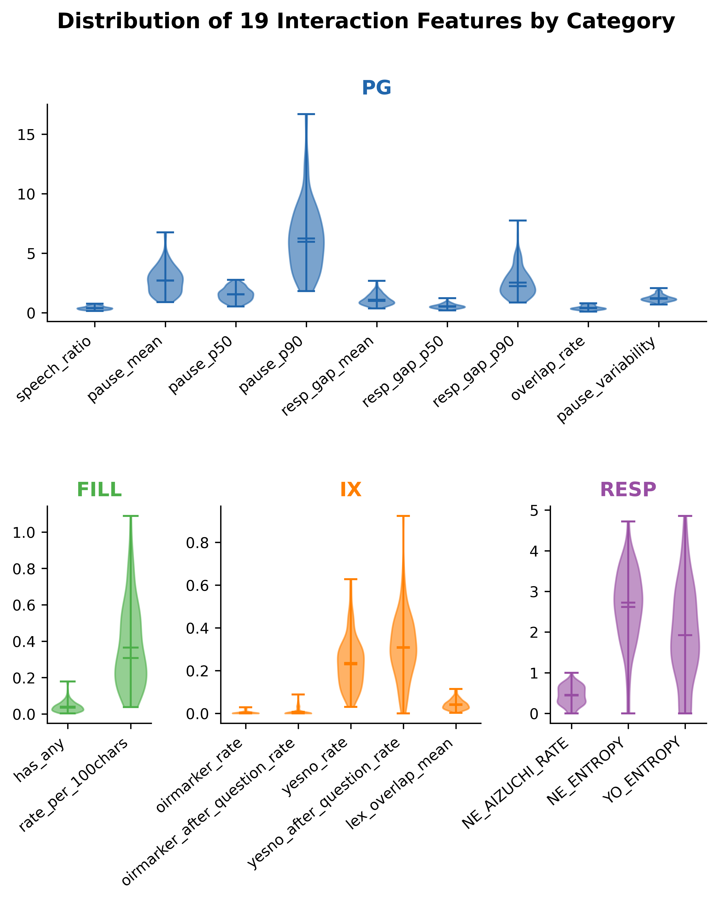
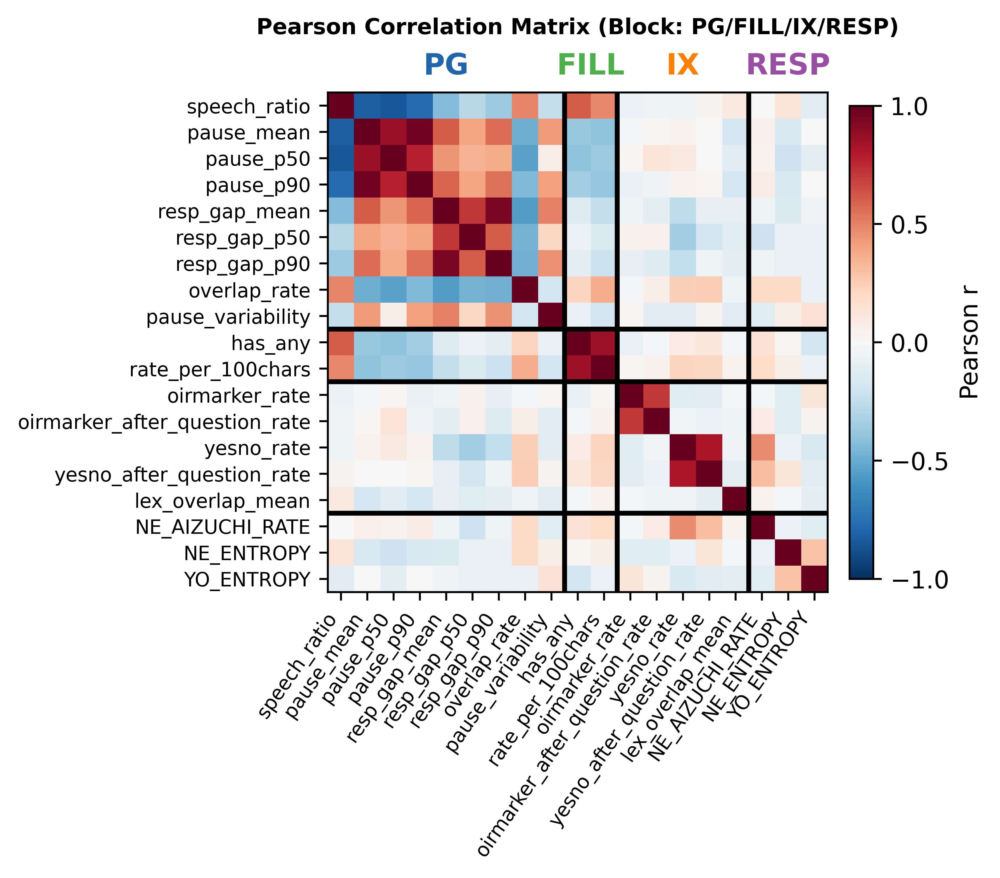
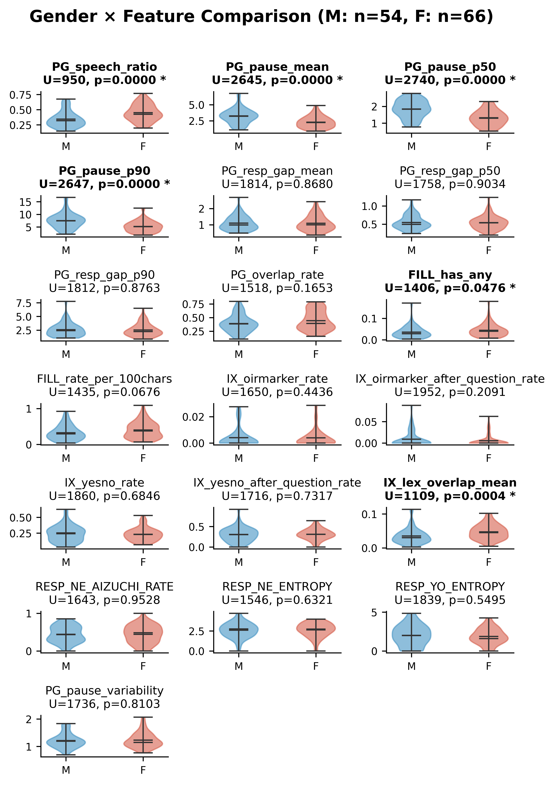
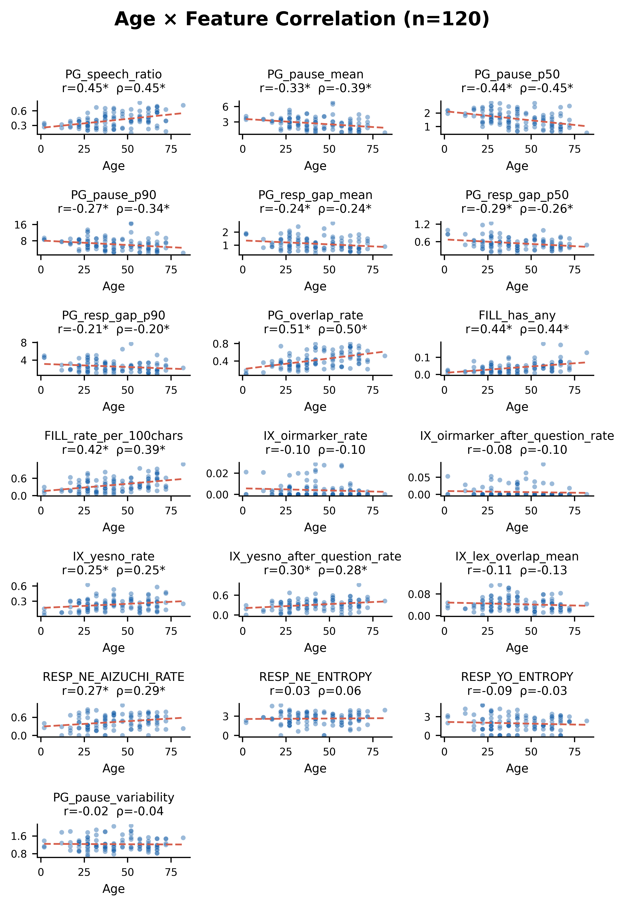
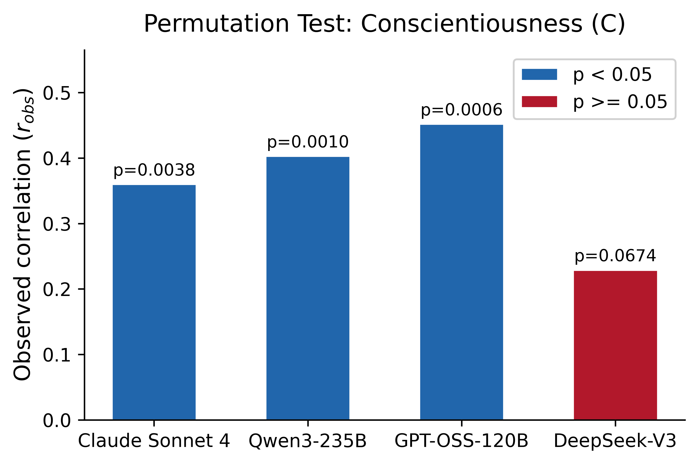
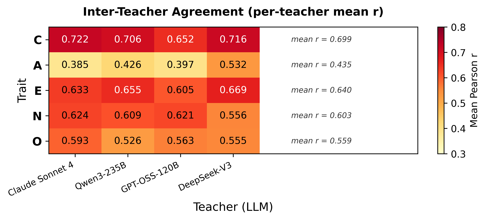
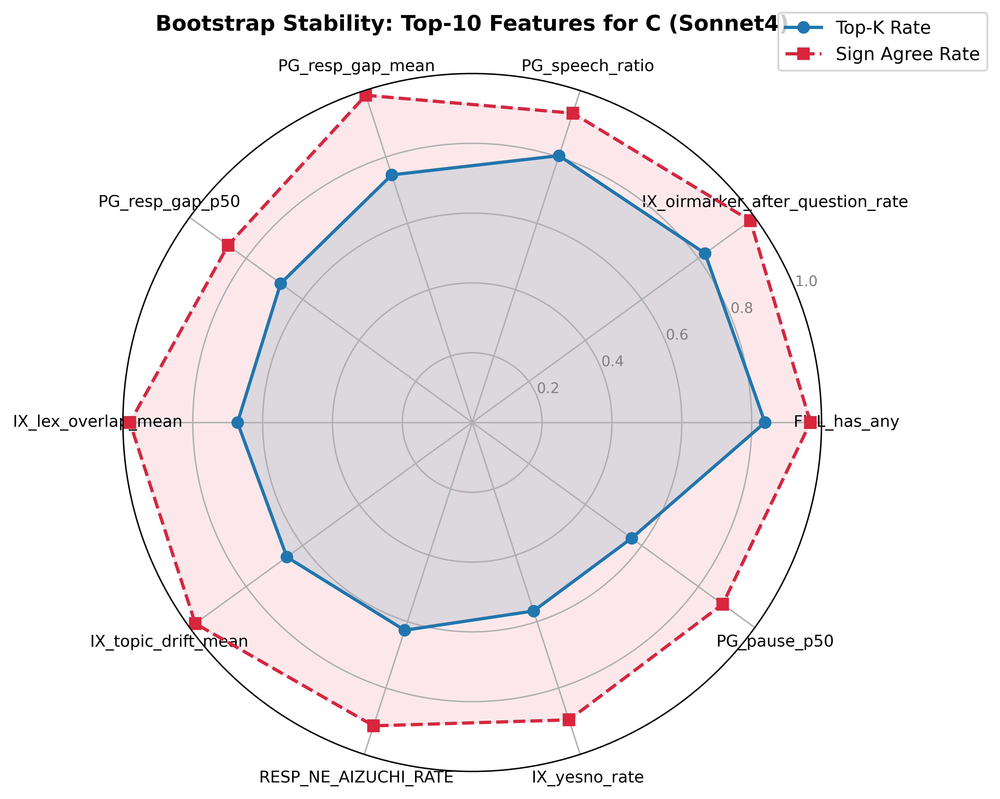

# NCNP共同研究者向けレビュー資料 v2
Date: 2026-03-25  
対象: 山下祐一先生（NCNP）、宗田卓史さん（NCNP）  
作成: 福原玄  

---

## 1. 研究の位置づけ

### メインメッセージ

本研究は「**日本語会話における相互行為特徴量の定量化指標の提案**」として位置づける。

- 先行研究（Hu et al. 2025, Altozano et al. 2026 等）は、LLMを用いた性格推定やASD分類を目的としているが、**会話の相互行為を再現可能に定量化する指標**の提案には至っていない。
- 本研究では、日本語日常会話コーパス（CEJC）から**18の相互行為特徴量**を4カテゴリ（PG: タイミング、FILL: フィラー、IX: 相互行為構造、RESP: 応答型）に体系化し、定量化指標として提案する。
- **重要な点として、本研究の主たる貢献は特徴量の提案そのものにあり**、Big Five性格特性との関連分析は、提案指標の構成概念妥当性（construct validity）を検証するための手段として位置づけられる。

### 差別化ポイント

| 観点 | 先行研究 | 本研究 |
|------|----------|--------|
| 目的 | 性格推定・ASD分類 | **相互行為特徴量の定量化指標の提案** |
| 手法 | LLM/PLM出力をそのまま推定値として使用 | **再現可能な18特徴量を明示的に定義** |
| 検証 | 単一モデル・単一指標 | **2段階検証**（コーパス基本情報 + Big5） |
| 対象 | 英語・韓国語中心 | **日本語会話コーパス（CEJC）** |

### 研究の新規性

1. 日本語会話コーパスにおける**初の体系的な相互行為特徴量の提案・検証**
2. **2段階の妥当性検証設計**: コーパス基本情報（性別・年齢）による表面的妥当性 → Big5による構成概念妥当性
3. **複数LLM教師の頑健性検証**（4教師中3教師でCが有意）
4. **再現可能な評価設計**（subject-wise split、permutation test 5000回、bootstrap 500回）

### Results構成の方針

```
Results
├── 1° 提案特徴量の抽出
│   ├── 3.1 記述統計と分布 → 指標としての有用性を丁寧に報告
│   └── 3.2 カテゴリ内/間の相関分析 → 構造的妥当性
└── 2° 外部指標を用いた妥当性検証
    ├── 3.3 コーパス基本情報との関連性（性別・年齢）→ 表面的妥当性
    └── 3.4 性格特性（Big5）との関連性 → 構成概念妥当性
```

---

## 2. 方法

### 2.1 データ

- **コーパス**: CEJC（日本語日常会話コーパス）home2サブセット、HQ1品質フィルタ済み
- **サンプルサイズ**: N=120（conversation × speaker ペア）
- **Big5採点**: IPIP-NEO-120（日本語120項目）、4 LLMモデルで採点
  - Sonnet4（Claude）、Qwen3-235B、DeepSeek-V3、GPT-OSS-120B

### 2.2 回帰モデル

- **モデル**: Ridge回帰 + 5-fold subject-wise CV
- **目的変数**: LLM教師が推定したBig Fiveスコア（trait別）
- **説明変数**: 18の相互行為特徴量（下記）
- **除外変数（EXCL3）**: 会話量に関わるcontrol変数（n_pairs_total, PG_total_time, FILL_text_len等）は説明変数から除外

### 2.3 信頼性検証

- **Permutation test**: 目的変数を5000回シャッフルし、観測相関以上が偶然出る確率を算出
- **Bootstrap**: 500回リサンプリングによる係数安定性評価（topk_rate、sign_agree_rate）

### 2.4 18特徴量の定義

以下の18特徴量を4カテゴリ（PG: タイミング、FILL: フィラー、IX: 相互行為、RESP: 応答型）に分類して使用する。

#### 概要一覧

| # | 特徴量名 | カテゴリ | 概要 |
|--:|----------|----------|------|
| 1 | PG_speech_ratio | PG | 発話率（話者の発話時間 / 会話全体時間） |
| 2 | PG_pause_mean | PG | 沈黙の平均長（同一話者の連続発話間ギャップ） |
| 3 | PG_pause_p50 | PG | 沈黙の中央値 |
| 4 | PG_pause_p90 | PG | 沈黙の90パーセンタイル |
| 5 | PG_resp_gap_mean | PG | 応答遅れの平均（話者交替時のギャップ） |
| 6 | PG_resp_gap_p50 | PG | 応答遅れの中央値 |
| 7 | PG_resp_gap_p90 | PG | 応答遅れの90パーセンタイル |
| 8 | FILL_has_any | FILL | フィラー出現発話率（えっと/えー/あのを含む発話の割合） |
| 9 | FILL_rate_per_100chars | FILL | 100文字あたりフィラー率 |
| 10 | IX_oirmarker_rate | IX | 修復開始（OIR）率（え？/えっ/なに？等で始まる応答の割合） |
| 11 | IX_oirmarker_after_question_rate | IX | 質問直後のOIR率 |
| 12 | IX_yesno_rate | IX | YES/NO応答率（はい/うん/いいえ等で始まる応答の割合） |
| 13 | IX_yesno_after_question_rate | IX | 質問直後のYES/NO率 |
| 14 | IX_lex_overlap_mean | IX | 語彙重なり（前発話と応答の文字バイグラムJaccard係数の平均） |
| 15 | IX_topic_drift_mean | IX | 話題逸脱度（1 − IX_lex_overlap_mean、共線性に注意） |
| 16 | RESP_NE_AIZUCHI_RATE | RESP | 「ね」直後の相槌率 |
| 17 | RESP_NE_ENTROPY | RESP | 「ね」直後の応答多様性（Shannon entropy） |
| 18 | RESP_YO_ENTROPY | RESP | 「よ」直後の応答多様性（Shannon entropy） |

#### アルゴリズム詳細

**PG（タイミング）カテゴリ**

| 特徴量 | 計算アルゴリズム | 欠損値の扱い |
|--------|------------------|--------------|
| PG_speech_ratio | 話者の発話時間合計 / 会話全体時間 | total_timeが0または欠損の場合NaN |
| PG_pause_mean | 同一話者の連続発話間ギャップ（≥gap_tol秒）の平均 | 該当ギャップがない場合NaN |
| PG_pause_p50 | 同上の50パーセンタイル | 該当ギャップがない場合NaN |
| PG_pause_p90 | 同上の90パーセンタイル | 該当ギャップがない場合NaN |
| PG_resp_gap_mean | 話者交替時の前発話end→応答startギャップ（≥gap_tol秒）の平均 | 該当ギャップがない場合NaN |
| PG_resp_gap_p50 | 同上の50パーセンタイル | 該当ギャップがない場合NaN |
| PG_resp_gap_p90 | 同上の90パーセンタイル | 該当ギャップがない場合NaN |

**FILL（フィラー）カテゴリ**

| 特徴量 | 計算アルゴリズム | 欠損値の扱い |
|--------|------------------|--------------|
| FILL_has_any | フィラー（えっと/えー/あの）を1つ以上含む発話の割合 | 話者の発話が0件の場合NaN |
| FILL_rate_per_100chars | フィラー総数 / (テキスト文字数 / 100) | text_lenが0の場合NaN |

**IX（相互行為）カテゴリ**

| 特徴量 | 計算アルゴリズム | 欠損値の扱い |
|--------|------------------|--------------|
| IX_oirmarker_rate | OIRマーカー（え？/えっ/なに？等）で始まる応答の割合。話者が応答側となる全隣接ペアに対して計算 | — |
| IX_oirmarker_after_question_rate | 前発話が質問の場合に限定したOIRマーカー応答率 | 質問直後ペアが0件の場合NaN |
| IX_yesno_rate | YES/NOプレフィックス（はい/うん/えー/いいえ等）で始まる応答の割合 | — |
| IX_yesno_after_question_rate | 前発話が質問の場合に限定したYES/NO応答率 | 質問直後ペアが0件の場合NaN |
| IX_lex_overlap_mean | 前発話と応答の文字バイグラムJaccard係数の平均 | — |
| IX_topic_drift_mean | 1 − IX_lex_overlap_mean（IX_lex_overlap_meanと共線性あり） | — |

**RESP（応答型）カテゴリ**

| 特徴量 | 計算アルゴリズム | 欠損値の扱い |
|--------|------------------|--------------|
| RESP_NE_AIZUCHI_RATE | 前発話が「ね」終助詞で終わる場合に、応答が相槌プレフィックスで始まる割合 | n_pairs_after_NEが0の場合NaN |
| RESP_NE_ENTROPY | 「ね」終助詞直後の応答先頭トークンのShannon entropy（log2） | n_pairs_after_NEが0の場合NaN |
| RESP_YO_ENTROPY | 「よ」終助詞直後の応答先頭トークンのShannon entropy（log2） | n_pairs_after_YOが0の場合NaN |

> **注**: Ridge回帰パイプラインでは、NaN値は `SimpleImputer(strategy="median")` により中央値補完される。

---

## 3. 結果


### 3.1 提案特徴量の記述統計と分布

18特徴量の分布をカテゴリ別に以下に示す。



**主な知見:**

- **PG系（タイミング7変数）**: 概ね右裾の長い分布。PG_pause_p90（M=6.253, SD=2.840）は個人差が大きい。発話率（PG_speech_ratio: M=0.403, SD=0.144）は比較的対称な分布で、話者間に適度なばらつきが確認された。
- **FILL系（フィラー2変数）**: 右に偏った分布だが、全話者がゼロでない値を持つ（FILL_has_any: min=0.003）。フィラー使用の個人差を捉える指標として有用。
- **IX系（相互行為6変数）**: OIR関連指標（IX_oirmarker_rate: M=0.004, IX_oirmarker_after_question_rate: M=0.007）は大半の話者でゼロまたは極めて低い値を示し、**二値的な性質**を持つ点に留意が必要。一方、YES/NO応答率（IX_yesno_rate: M=0.235, SD=0.115）は適度なばらつきを持つ連続的な分布。IX_lex_overlap_meanとIX_topic_drift_meanは定義上の補数関係（1 − Jaccard）にあり、分布は鏡像的。
- **RESP系（応答型3変数）**: RESP_NE_AIZUCHI_RATE（M=0.441, SD=0.229）が比較的広い範囲に分布し、「ね」に対する応答パターンの個人差を反映。RESP系3変数は分母となる終助詞ペアが存在しない話者で欠損（NaN）が生じるため、有効Nがそれぞれ115, 115, 118。

**全体として**: 18特徴量の多くは個人差を捉えるのに十分なばらつきを示しており、相互行為の定量化指標として有用であることが確認された。ただし、OIR関連指標のように分布が極端に偏る特徴量については、解釈上の注意が必要。

### 3.2 特徴量カテゴリ内/間の相関分析

18特徴量間のPearson相関行列をカテゴリ別ブロック構造で可視化した。



**カテゴリ内相関:**

- **PG系**: 沈黙系指標間（PG_pause_mean / p50 / p90）に r=0.78〜0.97 の高い正の相関。応答遅れ系指標間にも r=0.61〜0.94 の高い相関。発話率（PG_speech_ratio）は沈黙系指標と強い負の相関（r=−0.77〜−0.85）。→ 同一構成概念の異なる集約統計量であり、高い相関は理論的に整合。
- **FILL系**: FILL_has_anyとFILL_rate_per_100charsの間に r=0.85 の高い相関。→ フィラー使用の異なる正規化方法であり妥当。
- **IX系**: IX_oirmarker_rateとIX_oirmarker_after_question_rateの間に r=0.71。IX_yesno_rateとIX_yesno_after_question_rateの間に r=0.82。IX_lex_overlap_meanとIX_topic_drift_meanは定義上 r=−1.00（完全共線性）。
- **RESP系**: 3変数間の相関は全体的に低い（RESP_NE_ENTROPYとRESP_YO_ENTROPYの間に r=0.29 程度）。

**カテゴリ間相関:**

- 概ね低い（|r| < 0.30）。→ **4つのカテゴリが相互に独立した会話行動の側面を捉えている**ことを示す。
- 例外: PG_speech_ratioとFILL_has_anyの間に r=0.61。→ 発話率の高い話者ほどフィラーを含む発話が多い（発話量がフィラー出現機会を増やす）。

**多重共線性への含意**: Ridge回帰（α=100）の正則化により係数推定の安定性は確保されている。ただし、個々の特徴量の係数解釈にはこれらの相関構造を考慮する必要がある。

### 3.3 コーパス基本情報との関連性

特徴量の妥当性を外部指標から検証するため、コーパスに付随する話者属性情報（性別・年齢）と18特徴量の関連を分析した。話者属性はCEJCメタ情報（話者.csv + 話者・会話対応表.csv）から conversation_id × speaker_id をキーに紐付けた（N=120全件マッチ、女性66名・男性54名）。





**性別との有意な関連:**

| 特徴量 | U統計量 | p値 | 解釈 |
|--------|--------:|----:|------|
| PG_speech_ratio | 950 | <0.0001 | 女性の方が発話率が高い |
| PG_pause_mean | 2645 | <0.0001 | 女性の方が沈黙が短い |
| PG_pause_p50 | 2740 | <0.0001 | 同上（中央値） |
| PG_pause_p90 | 2647 | <0.0001 | 同上（90パーセンタイル） |
| FILL_has_any | 1406 | 0.048 | 女性の方がフィラー出現発話が多い |
| IX_lex_overlap_mean | 1109 | 0.0004 | 女性の方が語彙重なりが高い |
| IX_topic_drift_mean | 2455 | 0.0004 | 男性の方が話題逸脱度が高い |

**年齢との有意な関連（Pearson r, p < 0.05）:**

| 特徴量 | Pearson r | p値 | Spearman ρ | p値 | 解釈 |
|--------|----------:|----:|-----------:|----:|------|
| PG_speech_ratio | 0.455 | <0.0001 | 0.447 | <0.0001 | 年齢が高い話者ほど発話率が高い |
| PG_pause_mean | −0.332 | 0.0002 | −0.389 | <0.0001 | 年齢が高い話者ほど沈黙が短い |
| PG_pause_p50 | −0.436 | <0.0001 | −0.449 | <0.0001 | 同上（中央値） |
| PG_pause_p90 | −0.275 | 0.0024 | −0.343 | 0.0001 | 同上（90パーセンタイル） |
| PG_resp_gap_mean | −0.238 | 0.0087 | −0.241 | 0.0080 | 年齢が高い話者ほど応答遅れが短い |
| PG_resp_gap_p50 | −0.289 | 0.0013 | −0.256 | 0.0047 | 同上（中央値） |
| PG_resp_gap_p90 | −0.212 | 0.0204 | −0.200 | 0.0285 | 同上（90パーセンタイル） |
| FILL_has_any | 0.445 | <0.0001 | 0.442 | <0.0001 | 年齢が高い話者ほどフィラーが多い |
| FILL_rate_per_100chars | 0.415 | <0.0001 | 0.391 | <0.0001 | 同上（100文字あたり） |
| IX_yesno_rate | 0.252 | 0.0055 | 0.249 | 0.0060 | 年齢が高い話者ほどYES/NO応答が多い |
| IX_yesno_after_question_rate | 0.296 | 0.0010 | 0.279 | 0.0020 | 同上（質問直後） |
| RESP_NE_AIZUCHI_RATE | 0.272 | 0.0033 | 0.289 | 0.0017 | 年齢が高い話者ほど「ね」直後の相槌が多い |

**妥当性の含意**: 18特徴量のうち12特徴量が年齢と、7特徴量が性別と有意な関連を示した。特にPG系（タイミング）とFILL系（フィラー）は性別・年齢の両方と強い関連を持ち、社会言語学的に既知の知見（女性の方が発話率が高い、年齢とともにフィラー使用が増加する等）と整合する。これらの結果は、提案特徴量の**表面的妥当性（face validity）**を強く支持する。

### 3.4 性格特性（Big5）との関連性

本節では、提案特徴量と外部の心理学的構成概念（Big Five性格特性）との関連を報告する。**本分析は特徴量の構成概念妥当性（construct validity）の検証であり、性格推定モデルの構築を目的としない。**

#### 3.4.1 Cの頑健性（Permutation test）

Conscientiousness（C: 誠実性）について、4つのLLM教師それぞれを仮想教師としたPermutation test（5000回）の結果を以下に示す。

| LLM教師 | r_obs | p(&#124;r&#124;) | 判定 |
|---------|------:|------:|------|
| Sonnet4 | 0.434 | 0.0008 | **有意** |
| Qwen3-235B | 0.390 | 0.001 | **有意** |
| GPT-OSS-120B | 0.447 | 0.0008 | **有意** |
| DeepSeek-V3 | 0.205 | 0.113 | 非有意 |

**4教師中3教師で有意**（p < 0.05）であり、Cは教師モデルに依存せず頑健に推定可能であることが示された。この結果は、相互行為特徴量がCという性格次元と安定的に関連することを示す。



#### 3.4.2 Teacher間一致度

同一（conversation_id, speaker_id）に対する4教師のスコア間Pearson相関の平均（off-diagonal mean r）を算出した。

| Trait | mean r（Teacher間一致度） |
|------:|-------------------------:|
| C | **0.699**（最高） |
| E | 0.640 |
| N | 0.603 |
| O | 0.559 |
| A | **0.435**（最低） |

Cはteacher間一致度が最も高く（≈0.70）、仮想教師として安定していることが、Cの頑健性の背景を説明する。一方、Aはteacher間一致度が最も低く（≈0.44）、teacher依存性が大きい。



#### 3.4.3 Bootstrap Top Drivers（C, Sonnet4基準）

Bootstrap 500回リサンプリングにおけるCの上位特徴量（topk_rate降順）を以下に示す。

| 特徴量 | 方向 | topk_rate | sign_agree_rate |
|--------|:----:|----------:|----------------:|
| FILL_has_any | + | 0.838 | 0.968 |
| IX_oirmarker_after_question_rate | + | 0.824 | 0.984 |
| PG_speech_ratio | + | 0.804 | 0.932 |
| PG_resp_gap_mean | − | 0.746 | 0.986 |
| PG_resp_gap_p50 | − | 0.678 | 0.864 |
| IX_lex_overlap_mean | − | 0.672 | 0.980 |
| IX_topic_drift_mean | + | 0.656 | 0.980 |
| RESP_NE_AIZUCHI_RATE | + | 0.626 | 0.914 |
| IX_yesno_rate | + | 0.568 | 0.896 |
| PG_pause_p50 | − | 0.564 | 0.886 |

上位3特徴量（**FILL_has_any**, **IX_oirmarker_after_question_rate**, **PG_speech_ratio**）はいずれも正の方向で安定しており、Cが高い話者は「フィラーを含む発話が多い」「質問直後に修復開始（OIR）が多い」「発話率が高い」傾向を示す。

- **注目すべき交差的知見**: FILL_has_anyは年齢と強い正の相関（r=0.445）を示すと同時に、CのBootstrap Top Driverでもある。フィラー使用が認知的側面（加齢に伴う発話計画コスト）と性格的側面（誠実性に関連する慎重な発話スタイル）の両方を反映する多面的な指標である可能性を示唆する。



---

## 4. 議論ポイント（NCNPミーティング用）

### 4.1 研究の位置づけの転換

- **従来**: 「Cが頑健に推定可能」が主メッセージ → 性格推定の研究に見える
- **改訂後**: 「相互行為特徴量の定量化指標の提案」が主メッセージ → Big5分析は妥当性検証の一部
- **メリット**: NLPガチ勢との直接競合を避け、方法論的貢献として差別化できる。発達支援学会等での受容性が高まる。

### 4.2 新Results構成の意図

- **1° 提案特徴量の抽出**（3.1〜3.2）: 特徴量そのものの性質を丁寧に報告。「この指標は個人差を捉えるのに有用か？」「カテゴリ間は独立か？」を先に示す。
- **2° 外部指標を用いた妥当性検証**（3.3〜3.4）: 年齢との関連で「納得感のある結果」を先に見せ、Big5で構成概念妥当性を検証する流れ。
- **ストーリーの流れ**: 指標の提案 → 指標の性質確認 → 外部指標で妥当性検証 → 心理学的構成概念との関連

### 4.3 コーパス基本情報分析の意義

- **PG_speech_ratio × 性別**: 女性の方が発話率が高い（U=950, p<0.0001）→ 社会言語学的に既知の知見と整合。**査読者にとって最も「納得感」のある結果**。
- **PG系 × 年齢**: 年齢が高い話者ほど発話率が高く、沈黙・応答遅れが短い → 会話経験の蓄積、テンポの良い応答スタイルとして解釈可能。
- **FILL系 × 年齢**: 年齢が高い話者ほどフィラーが多い（r≈0.4）→ 発話計画コストの増大、または丁寧な発話スタイルの反映。
- **IX_lex_overlap_mean × 性別**: 女性の方が語彙重なりが高い（p=0.0004）→ 相手の発話を拾って応答する傾向の性差。
- **RESP_NE_AIZUCHI_RATE × 年齢**: 年齢が高い話者ほど「ね」直後の相槌が多い（r=0.272）→ 共感的応答スタイルの年齢差。

### 4.4 Top Driversの解釈

- **FILL_has_any（+）**: フィラーを含む発話が多い → 発話計画のコストを示す可能性。Cが高い人は「考えてから話す」傾向？
- **IX_oirmarker_after_question_rate（+）**: 質問直後のOIR（聞き返し）が多い → 正確に理解しようとする姿勢の反映？ 同時に年齢とも相関（多面的指標）。
- **PG_speech_ratio（+）**: 発話率が高い → 会話への積極的な参加。
- **PG_resp_gap_mean（−）**: 応答遅れが短い → テンポよく応答する傾向。

### 4.5 A/E/N/Oの探索的結果

- A/E/N/Oはteacher依存性が大きく、本論では探索的結果としてAppendixに配置する方針。
- 特にAはteacher間一致度が最低（0.435）であり、LLM教師の採点が不安定。
- 一部のteacher×trait組み合わせで有意な結果が出るが、一般因子混入の可能性に注意が必要。

### 4.6 限界と今後

- **小標本（N=120）**: 外部検証（別コーパス・別集団）が未了。
- **LLM教師の妥当性**: 自己報告（self-report）との相関は未検証。仮想教師の妥当性を担保するには外部基準が必要。
- **特徴量の範囲**: 現在はテキスト＋タイミングのみ。音声特徴（韻律・声質）の追加で精度向上の余地がある。
- **性別データの活用**: CEJCメタ情報から話者の性別・年齢・出身地・職業等を紐付け済み（N=120全件マッチ）。性別による群間比較で7特徴量に有意差を確認。今後、出身地域（方言）や職業との関連分析も可能。
- **次ステップ候補**:
  - 国語研データ（鈴木あすみさん）との紐づけによる外部妥当性検証
  - CSJデータでの追試（N=36で予備的に実施済み）
  - 修復（OIR）の成功率・コストまで踏み込んだ分析

### 4.7 論文化の方針確認

- **本論**: 特徴量の提案（記述統計・相関）→ 妥当性検証（コーパス基本情報 + Big5 C中心）
- **Appendix**: A/E/N/O（探索的結果、teacher依存性の検証）
- **差別化**: 「性格推定」ではなく「相互行為特徴量の定量化指標の提案」として立て付ける
- **対象学会**: 成人発達支援学会（2026年9月@高知）等、NLPガチ勢と直接競合しない場を想定

---

## 5. NCNPレビューフィードバックの反映状況

### 5.1 受けたフィードバック

NCNPレビュー（山下先生・宗田さん）から、以下の主要フィードバックを受けた:

1. **メインメッセージの転換**: 「Cの頑健性」を前面に出すと性格推定の研究に見える。メインメッセージを「相互行為特徴量の定量化指標の提案」に据え直すべき。
2. **Results構成の改訂**: 特徴量そのものの記述・分析を先に置き、Big5との関連は妥当性検証の一部として後段に配置する構成に変更すべき。
3. **コーパス基本情報の活用**: 年齢・性別等のコーパス基本情報との関連を分析し、「納得感のある結果」を先に見せることで、特徴量の妥当性を段階的に示すべき。

### 5.2 反映内容

| フィードバック | 反映箇所 | 対応内容 |
|---------------|----------|----------|
| メインメッセージの転換 | 1章（研究の位置づけ）、論文Introduction | 「性格推定」→「相互行為特徴量の定量化指標の提案」に変更。Big5分析は構成概念妥当性の検証として位置づけ |
| Results構成の改訂 | 3章（結果）、論文Results | 新4段構成: 記述統計→相関→コーパス基本情報→Big5 |
| コーパス基本情報の活用 | 3.3節、論文Results 3.3 | 性別・年齢との関連分析を追加。CEJCメタ情報（話者.csv + 話者・会話対応表.csv）からN=120全件の話者属性を紐付け。性別で7特徴量、年齢で12特徴量に有意な関連を確認 |
| 新規図表の追加 | 3.1〜3.3節 | 特徴量分布図、相関ヒートマップ、性別×特徴量箱ひげ図、年齢×特徴量散布図を追加 |

### 5.3 次回NCNPミーティングでの確認事項

1. **新Results構成の妥当性**: 4段構成（記述統計→相関→コーパス基本情報→Big5）の流れは適切か？
2. **コーパス基本情報分析の深度**: 性別・年齢に加え、出身地域（方言）や職業との関連分析も追加すべきか？ CEJCメタ情報から出身地・居住地・職業は取得済み（出身地欠損3件のみ）。
3. **Big5分析の位置づけ**: 「構成概念妥当性の検証」という立て付けで査読に耐えるか？
4. **FILL_has_anyの多面性**: FILL_has_anyが年齢（r=0.445）とC（Bootstrap Top1）の両方と関連する知見の解釈について
5. **対象学会の最終決定**: 発達支援学会（2026年9月）で確定してよいか？
