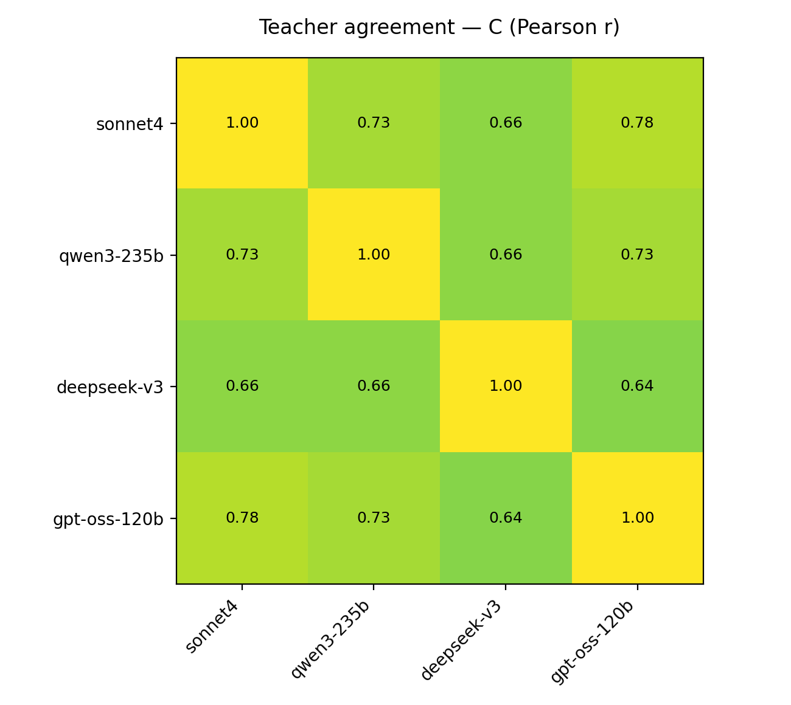
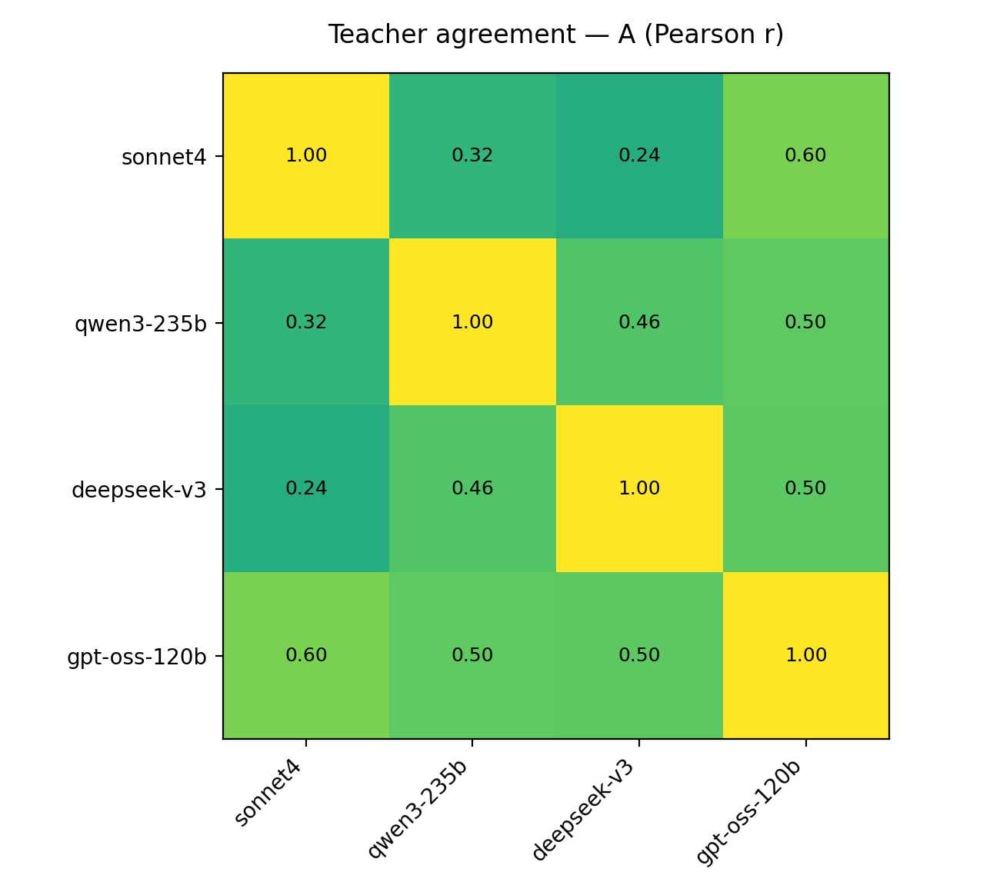
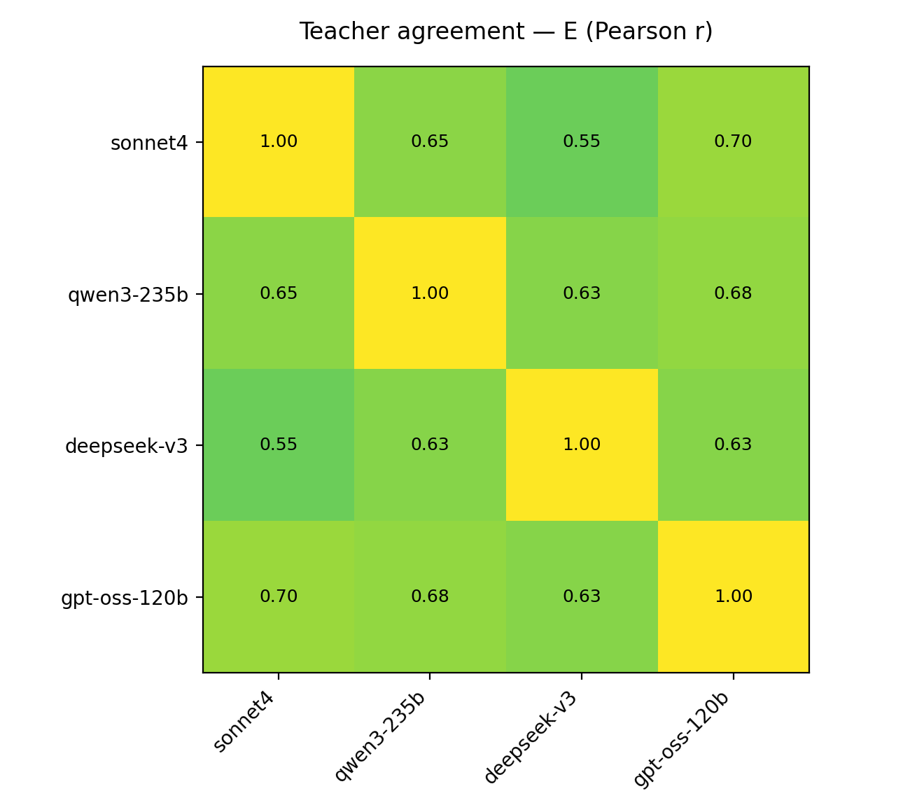
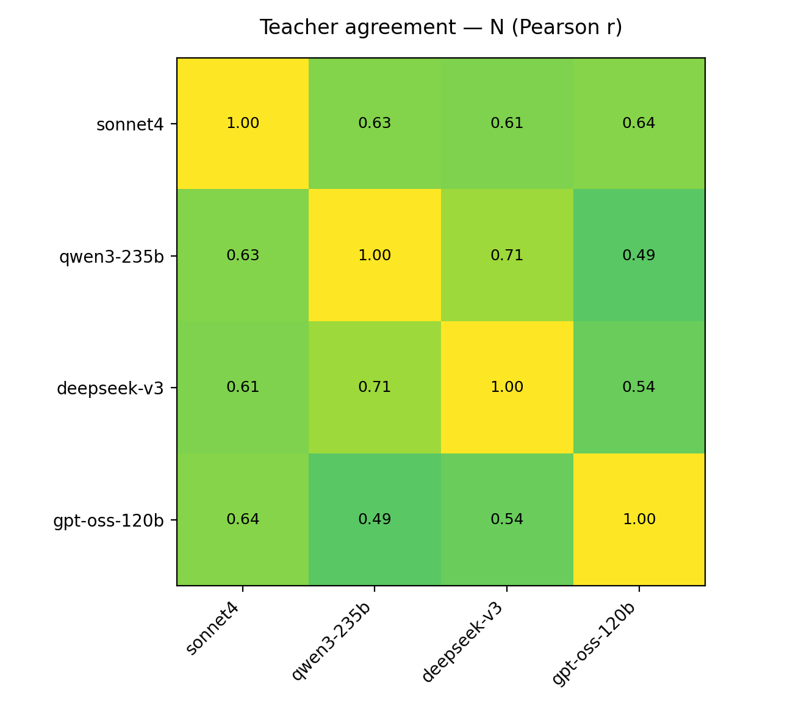
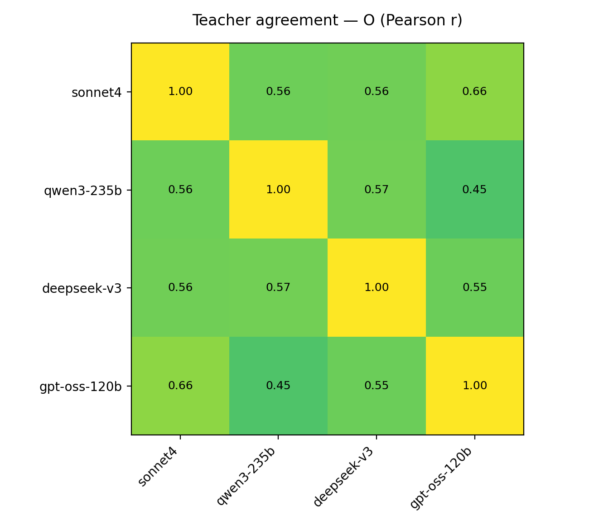

# Teacher agreement (Big5)

Same (conversation_id, speaker_id) trait scores across teachers; Pearson correlation.

Teachers: Sonnet4 / Qwen3-235B / DeepSeek-V3 / GPT-OSS-120B

## C

- N pairs: 120
- Mean off-diagonal r: 0.699

## A

- N pairs: 120
- Mean off-diagonal r: 0.435

## E

- N pairs: 120
- Mean off-diagonal r: 0.640

## N

- N pairs: 120
- Mean off-diagonal r: 0.603

## O

- N pairs: 120
- Mean off-diagonal r: 0.559

## Summary

| Trait | N | mean off-diagonal r |
|---:|---:|---:|
| C | 120 | 0.699 |
| A | 120 | 0.435 |
| E | 120 | 0.640 |
| N | 120 | 0.603 |
| O | 120 | 0.559 |
