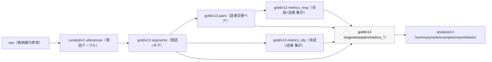

# 宿題メモ：特徴量テーブルと“組み合わせてできること”

## 0) goldの意味（raw→curated→gold→analysis）

gold は raw（原本）を直接触らず、curated（発話テーブル）から **再現可能に生成する中間成果物**。
研究で扱いやすい最小構成（segments/pairs/metrics_*）に変換し、analysis で dataset split / rank / examples / LLM説明へ接続する。



## 1) (1) 特徴量リスト（定義・出力粒度・分母）

| テーブル | 出力粒度 | 主な列（例） | 定義（要約） | 分母/安定性（例） |
| --- | --- | --- | --- | --- |
| curated/v1 utterances | utterance（発話） | conversation_id, utterance_id, speaker_id, start_time, end_time, text, corpus, unit_type | 必須列: conversation_id/speaker_id/text。start_time/end_time/utterance_id等は任意（ソート・tie-breakerに利用） | 分母: n/a（入力テーブル） |
| gold/v13 segments | utterance（発話+タグ） | conversation_id, utt_index, speaker_id, start_time, end_time, text, sfp_group, is_question | utterancesを会話内でソートし utt_index 付与。text→規則で is_question, sfp_group を付与。 | 分母: 発話数 n_segments（=会話×話者の n_utt など） |
| gold/v13 pairs | pair（話者交替 prev→resp） | conversation_id, prev_speaker_id, prev_text, (prev_sfp_group ...), resp_speaker_id, resp_text, resp_first_token, resp_is_aizuchi, (prev_sfp_group/resp_sfp_group など) | 会話内の隣接発話から、話者が切り替わった瞬間のみ抽出。resp_first_token と resp_is_aizuchi を付与。 | 分母: n_pairs_total（=応答側話者のペア数）/ 条件付きは n_pairs_after_NE 等 |
| gold/v13 metrics_sfp | conversation×speaker（集計） | SFP比率・疑問率・coverage等（列はparquet実体に依存） | segments（sfp_group, is_question）から、会話×話者で出現率・疑問率を集計。 | 分母: n_utt（会話×話者の発話数） |
| gold/v13 metrics_resp | conversation×speaker（集計） | n_pairs_total, n_pairs_after_NE, n_pairs_after_YO, RESP_NE_AIZUCHI_RATE, RESP_NE_ENTROPY, RESP_YO_ENTROPY | pairs を条件（prev_sfp_groupがNE/NE_Q/YO）で絞り、応答側話者で集計。AIZUCHI_RATE=相槌フラグ平均。ENTROPY=resp_first_token分布のShannon entropy(log2)。 | 分母: n_pairs_after_NE / n_pairs_after_YO（analysisでは min_ne_events=20 等で信頼性フィルタ） |
| gold/v13 metrics_pausegap（Phase4） | conversation×speaker（集計） | pause/gap/overlap/speech 等の統計（列はparquet実体に依存） | TextGrid由来の timing を会話×話者で統計化し、analysisのsummary/rankへ統合可能。 | 分母: n_segments / n_resp_events / total_time 等 |


### dataset（cejc_dyad / csj_dialog 等）について

- goldの metrics_resp 等には `dataset` 列を持たせていない（実体確認: has_dataset=False）。
- analysis側で `segments` から `n_speakers = nunique(speaker_id)` を計算して split する：
  - cejc_dyad: n_speakers==2
  - csj_dialog: n_speakers>=2

## 2) 参考：今回確認した raw/curated の列（実体）

- **curated_utterances_cejc** rows=577885 cols=8
```text
conversation_id
utterance_id
speaker_id
start_time
end_time
text
corpus
unit_type
```
- **curated_utterances_csj** rows=66117 cols=8
```text
conversation_id
utterance_id
speaker_id
start_time
end_time
text
corpus
unit_type
```
- **gold_metrics_resp_cejc** rows=2033 cols=8
```text
conversation_id
speaker_id
n_pairs_total
n_pairs_after_NE
n_pairs_after_YO
RESP_NE_AIZUCHI_RATE
RESP_NE_ENTROPY
RESP_YO_ENTROPY
```
- **gold_metrics_resp_csj** rows=36 cols=8
```text
conversation_id
speaker_id
n_pairs_total
n_pairs_after_NE
n_pairs_after_YO
RESP_NE_AIZUCHI_RATE
RESP_NE_ENTROPY
RESP_YO_ENTROPY
```

---

## 3) (2) 組み合わせてできること（実行結果の根拠）

### 3.1 信頼性フィルタ（reliable）

- `min_ne_events=20`（= `metrics_resp.n_pairs_after_NE>=20`）で reliable speaker を定義

- 今回の確認: reliable rows = **526**（CEJC+CSJ 合算）

### 3.2 スコア化（例：相槌率↑ + 低エントロピー↑）

- 例スコア（試作）: `score_example = z(RESP_NE_AIZUCHI_RATE) + (-z(RESP_NE_ENTROPY))`

- 上位例（top5）:

```text
corpus conversation_id speaker_id  n_pairs_after_NE  RESP_NE_AIZUCHI_RATE  RESP_NE_ENTROPY  score_example
  cejc        T006_005       IC01                39              1.000000         1.696182       5.527754
  cejc        S002_005       IC02                20              0.850000         1.816642       4.386513
  cejc        C001_004       IC01                21              0.857143         2.030087       4.114151
  cejc        K009_012       IC03                24              0.833333         1.976287       4.041697
  cejc        T006_009       IC01                23              0.826087         1.994841       3.967581
```

（top/bottom を作れば、`examples` と接続して “なぜ高い/低いか” を具体例で説明可能）

### 3.3 クラスタリング（タイプ分け）

- CEJC reliable（n_pairs_after_NE>=20）に対し、`[RESP_NE_AIZUCHI_RATE, RESP_NE_ENTROPY, RESP_YO_ENTROPY]` を標準化 → PCA(2次元) → KMeans(4クラスタ)

- クラスタ件数:

```text
 cluster  count
       0    132
       1    119
       2    180
       3     89
```

（各クラスタの平均プロファイルを出し、代表会話を examples と一緒に提示すると“タイプ説明”ができます）

### 3.4 LLMサマライズ解釈 + provenance（根拠追跡）

- labels parquet: `artifacts/_archive/llm500_opus45_20260104_231148/labels_tb500_UIFINAL_opus45.parquet`

- `prompt_features_used_json` が **500/500 非空（non-null rate=1.0）** → 「LLMが何の特徴を根拠に説明したか」を監査可能

- `labels_json` / `top_contrib_json` も保持 → “説明文 + 根拠特徴 + 寄与上位” をセットで提示可能
