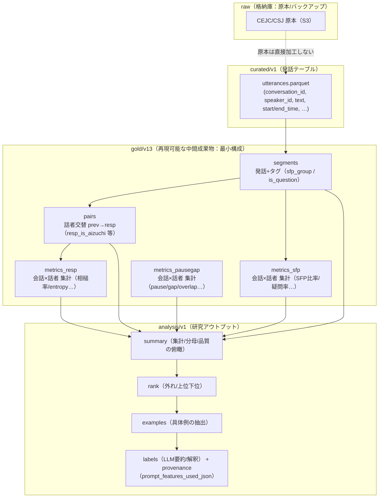

# 宿題メモ：特徴量テーブルと“組み合わせてできること”

## 0) goldの意味（raw→curated→gold→analysis）

gold は raw（原本）を直接触らず、curated（発話テーブル）から **再現可能に生成する中間成果物**。
研究で扱いやすい最小構成（segments/pairs/metrics_*）に変換し、analysis で dataset split / rank / examples / LLM説明へ接続する。



## 1) (1) 特徴量リスト（定義・出力粒度・分母）

> **狙い：横スクロール無しで「何がどこで作られるか」を一目で説明**  
> 詳細（列名など）は表の下の `<details>` に畳み込み、先生にはまず表だけ見せれば理解できる構成にしています。

### 1.1 生成タイプ（3分類）

- **RAW**：raw/curated の列をそのまま（ほぼコピー）
- **SIMPLE**：単純な加工（ソート・フラグ付与・集計・比率など）
- **NEW**：新規アイデア（entropy / スコア化 / クラスタ / LLM解釈＋provenance など）

### 1.2 一覧（先生向け・横スクロール無し）

| 層 | テーブル | 出力粒度 | 生成タイプ | 何が増えるか（要点） | 分母 / 安定性（要点） |
| --- | --- | --- | --- | --- | --- |
| curated | curated/v1 utterances | 発話 | **RAW** | 発話テーブル（最小必須: conversation_id / speaker_id / text） | 入力テーブル（分母 n/a） |
| gold | gold/v13 segments | 発話+タグ | **SIMPLE** | utt_index を付与し、text から **is_question / sfp_group** を規則で付与 | 発話数（会話×話者の n_utt） |
| gold | gold/v13 pairs | 話者交替ペア | **SIMPLE** | 話者交替のみ抽出（prev→resp）し、**resp_first_token / resp_is_aizuchi** を付与 | n_pairs_total / 条件付きは n_pairs_after_* |
| gold | gold/v13 metrics_sfp | 会話×話者 | **SIMPLE** | SFP群比率・疑問率などを集計（segments由来） | 分母: n_utt（会話×話者の発話数） |
| gold | gold/v13 metrics_resp | 会話×話者 | **SIMPLE + NEW** | NE/YO条件で絞って集計：**相槌率（SIMPLE）**＋**entropy（NEW）** | 分母: n_pairs_after_NE / n_pairs_after_YO（例: min_ne_events=20で足切り） |
| gold | gold/v13 metrics_pausegap | 会話×話者 | **SIMPLE** | TextGrid由来の timing 統計（pause/gap/overlap/speech 等） | n_segments / n_resp_events / total_time 等 |
| analysis | analysis/v1 summary/rank/examples | 集計/ランキング/例 | **SIMPLE** | dataset split（dyad/dialog）・rank・examples を生成 | reliable は n_pairs_after_NE で判定 |
| analysis | analysis/v1 labels（LLM） | 例×説明 | **NEW** | LLMの要約/解釈 + **根拠provenance（prompt_features_used_json）** | 監査可能（根拠列を保持） |

### 1.3 dataset split（cejc_dyad / csj_dialog）について

- gold（metrics_*）自体には `dataset` 列を持たせていない（= 分割情報は後段で付与）。
- analysis 側で `segments` から `n_speakers = nunique(speaker_id)` を計算して split：
  - cejc_dyad: n_speakers == 2
  - csj_dialog: n_speakers >= 2

### 1.4 詳細（列名：必要なときだけ開く）

<details>
<summary><b>curated/v1 utterances（実体の列）</b></summary>

```text
conversation_id
utterance_id
speaker_id
start_time
end_time
text
corpus
unit_type
````

</details>

<details>
<summary><b>gold/v13 segments（実体の列）</b></summary>

```text
conversation_id
utt_index
speaker_id
start_time
end_time
text
sfp_group
is_question
```

</details>

<details>
<summary><b>gold/v13 pairs（代表列）</b></summary>

```text
conversation_id
prev_speaker_id
prev_text
(prev_sfp_group ...)   # 実体にあれば
resp_speaker_id
resp_text
resp_first_token
resp_is_aizuchi
```

</details>

<details>
<summary><b>gold/v13 metrics_resp（実体の列）</b></summary>

```text
conversation_id
speaker_id
n_pairs_total
n_pairs_after_NE
n_pairs_after_YO
RESP_NE_AIZUCHI_RATE
RESP_NE_ENTROPY
RESP_YO_ENTROPY
```

</details>

## 2) 参考：今回確認した raw/curated の列（実体）

- **curated_utterances_cejc** rows=577885 cols=8
```text
conversation_id
utterance_id
speaker_id
start_time
end_time
text
corpus
unit_type
```
- **curated_utterances_csj** rows=66117 cols=8
```text
conversation_id
utterance_id
speaker_id
start_time
end_time
text
corpus
unit_type
```
- **gold_metrics_resp_cejc** rows=2033 cols=8
```text
conversation_id
speaker_id
n_pairs_total
n_pairs_after_NE
n_pairs_after_YO
RESP_NE_AIZUCHI_RATE
RESP_NE_ENTROPY
RESP_YO_ENTROPY
```
- **gold_metrics_resp_csj** rows=36 cols=8
```text
conversation_id
speaker_id
n_pairs_total
n_pairs_after_NE
n_pairs_after_YO
RESP_NE_AIZUCHI_RATE
RESP_NE_ENTROPY
RESP_YO_ENTROPY
```

---

## 3) (2) 組み合わせてできること（実行結果の根拠）

### 3.1 信頼性フィルタ（reliable）

- `min_ne_events=20`（= `metrics_resp.n_pairs_after_NE>=20`）で reliable speaker を定義

- 今回の確認: reliable rows = **526**（CEJC+CSJ 合算）

### 3.2 スコア化（例：相槌率↑ + 低エントロピー↑）

- 例スコア（試作）: `score_example = z(RESP_NE_AIZUCHI_RATE) + (-z(RESP_NE_ENTROPY))`

- 上位例（top5）:

```text
corpus conversation_id speaker_id  n_pairs_after_NE  RESP_NE_AIZUCHI_RATE  RESP_NE_ENTROPY  score_example
  cejc        T006_005       IC01                39              1.000000         1.696182       5.527754
  cejc        S002_005       IC02                20              0.850000         1.816642       4.386513
  cejc        C001_004       IC01                21              0.857143         2.030087       4.114151
  cejc        K009_012       IC03                24              0.833333         1.976287       4.041697
  cejc        T006_009       IC01                23              0.826087         1.994841       3.967581
```

（top/bottom を作れば、`examples` と接続して “なぜ高い/低いか” を具体例で説明可能）

### 3.3 クラスタリング（タイプ分け）

- CEJC reliable（n_pairs_after_NE>=20）に対し、`[RESP_NE_AIZUCHI_RATE, RESP_NE_ENTROPY, RESP_YO_ENTROPY]` を標準化 → PCA(2次元) → KMeans(4クラスタ)

- クラスタ件数:

```text
 cluster  count
       0    132
       1    119
       2    180
       3     89
```

（各クラスタの平均プロファイルを出し、代表会話を examples と一緒に提示すると“タイプ説明”ができます）

### 3.4 LLMサマライズ解釈 + provenance（根拠追跡）

- labels parquet: `artifacts/_archive/llm500_opus45_20260104_231148/labels_tb500_UIFINAL_opus45.parquet`

- `prompt_features_used_json` が **500/500 非空（non-null rate=1.0）** → 「LLMが何の特徴を根拠に説明したか」を監査可能

- `labels_json` / `top_contrib_json` も保持 → “説明文 + 根拠特徴 + 寄与上位” をセットで提示可能
