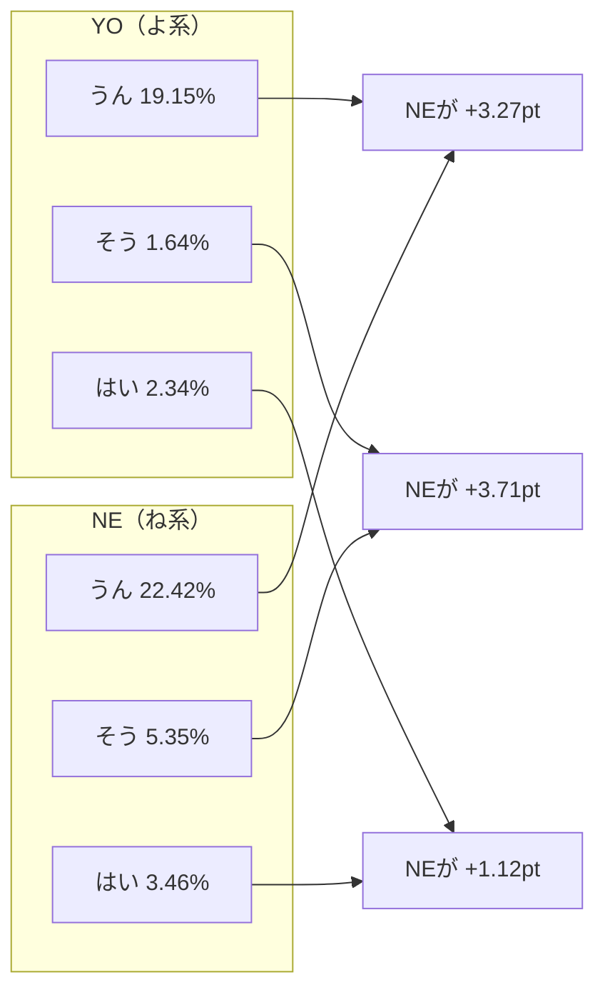

# CSJ/CEJC corpus pipeline（S3格納庫 + curated(v1) → gold(v13) → analysis(v1)）作業サマリー & 再現手順

更新日: 2026-01-02  
対象: CSJ / CEJC コーパスを AWS S3 を「格納庫」として安全に保管し、S3上で **curated(v1) → gold(v13) → analysis(v1)** を生成して語用論指標（終助詞/疑問/相槌）＋会話タイミング指標（Pause/Gap 等）を分析可能な状態に整備する。

---

## 1. 目的（山下先生向け要約）

- CSJ/CEJC の利用許諾・ガイドラインに沿って **第三者アクセスを防止できるS3保管体制** を整備する。  
- コーパスから **発話（utterances）→ 指標付きセグメント（segments）→ 応答ペア（pairs）→ 集計指標（metrics）** の形に変換し、研究で利用可能な「gold」データセットを作る。  
- 「相槌（aizuchi）」・「疑問判定（question）」・「終助詞群（SFP）」の妥当性を検証し、ルールを段階的に改善（v8→v13）。  
- gold(v13) を入力として **analysis/v1/gold=v13**（summary/rank/examples/report）を再生成し、研究用アウトプットを最新化。  
- （追加）TextGrid 由来の **Pause/Gap / overlap / speech ratio** を gold(v13) に `metrics_pausegap` として追加し、analysis(v1) の **summary / rank / examples** に統合した。  
- （追加）LLM（Bedrock Claude Opus 4.5）により、外れ値例へ説明ラベルを付与し、レビュー可能な HTML ダッシュボード（labels_v0）を生成した。さらに **labels_v0 に Pause/Gap 指標を 60/60 件で付与**できる状態を確立した。

---

## 2. 対象バケット（格納庫）

- AWSアカウント: 982534361827
- リージョン: ap-northeast-1 (Tokyo)

### 2.1 原本保管（バックアップ）
- `leadlea-csj-backup-982534361827-20251223-002451`
- `leadlea-cejc-backup-982534361827-20251219`

### 2.2 解析用アウトプット（curated / gold / analysis）
- `leadlea-asd-curated-982534361827-20251230`
  - curated(v1): `s3://leadlea-asd-curated-982534361827-20251230/curated/v1`
  - gold: `s3://leadlea-asd-curated-982534361827-20251230/gold`
  - analysis: `s3://leadlea-asd-curated-982534361827-20251230/analysis/v1`

---

## 3. 適用レギュレーション（根拠）

### CSJ 利用許諾契約
- 無断アクセス防止、利用者以外アクセス不可、ID/パスワード等でアクセス制限  
  → 第10条（話し言葉コーパスの管理）
- 契約終了時の返却/破棄/削除、要求時の証明  
  → 第18条（契約終了時の措置）

### CEJC 利用許諾契約
- 無断アクセス防止、利用者以外アクセス不可、ID/パスワード等でアクセス制限  
  → 第10条（日常会話コーパスの管理）
- 契約終了時の返却/破棄/削除、要求時の証明  
  → 第18条（契約終了時の措置）

### CEJC 利用ガイドライン
- ネットワーク環境（ファイルサーバ等）に複製する場合、権利者以外がアクセスできない環境整備  
  → 「② データの管理」

---

## 4. S3 格納庫のセキュリティ実装（監査可能な状態）

両バケット共通で以下を確認・設定済み。

### 4.1 Block Public Access（公開遮断）
- BlockPublicAcls: true  
- IgnorePublicAcls: true  
- BlockPublicPolicy: true  
- RestrictPublicBuckets: true  

### 4.2 Object Ownership（ACL無効化）
- ObjectOwnership: `BucketOwnerEnforced`

### 4.3 Versioning（バージョニング）
- Status: `Enabled`

### 4.4 Default Encryption（SSE-KMS）
- SSEAlgorithm: `aws:kms`
- KMS key ARN: `arn:aws:kms:ap-northeast-1:982534361827:key/5dc3c3b6-251c-4cbd-b1a4-40f92db8f58c`
- BucketKeyEnabled: true

### 4.5 Bucket Policy（TLS強制）
- `aws:SecureTransport=false` を拒否（DenyInsecureTransport）

---

## 5. パイプライン成果（curated(v1) → gold(v13)）

### 5.1 gold の出力テーブル（v13）
各 corpus ごとに、以下テーブルを S3 に生成。

- segments: 発話に SFP（終助詞群）と疑問フラグを付与
- pairs: 話者交替時のみ prev→resp の応答ペアを生成（resp側に相槌フラグ等）
- metrics_sfp: 会話×話者単位で SFP/疑問の比率などを集計
- metrics_resp: 会話×話者単位で「NE後の相槌率」や「応答語彙エントロピー」などを集計
- metrics_pausegap（Phase4で追加）: 会話×話者単位で pause/gap/overlap/speech の統計量を集計

出力先（例: v13）  
- `s3://leadlea-asd-curated-982534361827-20251230/gold/v13/corpus=cejc/table=...`
- `s3://leadlea-asd-curated-982534361827-20251230/gold/v13/corpus=csj/table=...`

### 5.2 妥当性検証とルール改善（v8 → v13）
相槌の取りこぼし（短応答なのに non-aizuchi）を中心に検証し、段階的にルールを更新。

- v8: 初期 gold 生成（CEJC/CSJ ともに生成可能。CSJはタグ混在の影響あり）
- v9〜v11: CSJタグ（<H>/<FV>/<息> 等）や括弧注記の正規化、相槌検出の頑健化
- v12: 「うんー」等の **長音（ー）を含む相槌** を拾えるよう改善（CEJCで改善が観測）
- v13: 同意系の相槌（**ですよね/だよね/まあね/まぁね**）を追加（微増で副作用小）

---

## 6. 運用ルール（研究運用としての遵守事項）

### 6.1 アクセス主体（Principals）の最小化
- 人が直接触る IAM ユーザ/ロールは最小限
- 解析は Lambda 等の実行ロールに限定（必要権限のみ）
- 追加する場合も「本件利用者の範囲」から逸脱しない（契約/ガイドライン順守）

### 6.2 IAM 権限（例）
- 読み取り: `s3:GetObject`, `s3:ListBucket`
- SSE-KMS: `kms:Decrypt`（必要に応じ `kms:Encrypt`/`kms:GenerateDataKey`）

### 6.3 ローカル削除（借用マシン対応）
- S3 への格納・スモークチェック完了後、ローカルのコーパス実体は削除
- 監査用には「設定確認結果（テキスト）」と「バケットポリシー全文（JSON）」のみ保持  
  （コーパス実体や詳細ファイル一覧は原則残さない）

---

## 7. 再現性（環境変数・検証コマンド・最終コマンド）

### 7.1 必須 env（解析出力先）
```bash
export S3_KMS_KEY_ARN="arn:aws:kms:ap-northeast-1:982534361827:key/5dc3c3b6-251c-4cbd-b1a4-40f92db8f58c"
export OUT_CURATED="s3://leadlea-asd-curated-982534361827-20251230/curated/v1"
export OUT_GOLD="s3://leadlea-asd-curated-982534361827-20251230/gold"
export ANALYSIS_OUT="s3://leadlea-asd-curated-982534361827-20251230/analysis/v1"
export GV=13
````

（任意）envファイル化

```bash
cat > env_asd.sh <<'SH'
export S3_KMS_KEY_ARN="arn:aws:kms:ap-northeast-1:982534361827:key/5dc3c3b6-251c-4cbd-b1a4-40f92db8f58c"
export OUT_CURATED="s3://leadlea-asd-curated-982534361827-20251230/curated/v1"
export OUT_GOLD="s3://leadlea-asd-curated-982534361827-20251230/gold"
export ANALYSIS_OUT="s3://leadlea-asd-curated-982534361827-20251230/analysis/v1"
export GV=13
SH
source env_asd.sh
```

### 7.2 S3セキュリティ設定の監査コマンド（第三者説明用）

```bash
REGION="ap-northeast-1"
BUCKETS=(
  "leadlea-csj-backup-982534361827-20251223-002451"
  "leadlea-cejc-backup-982534361827-20251219"
)

for B in "${BUCKETS[@]}"; do
  echo "===== $B ====="
  aws s3api get-public-access-block --bucket "$B" --region "$REGION"
  aws s3api get-bucket-ownership-controls --bucket "$B" --region "$REGION"
  aws s3api get-bucket-versioning --bucket "$B" --region "$REGION"
  aws s3api get-bucket-encryption --bucket "$B" --region "$REGION"
  aws s3api get-bucket-policy --bucket "$B" --region "$REGION" --query Policy --output text | head -c 500; echo " ..."
done
```

### 7.3 gold(v13) 生成（最終コマンド：再現性担保）

```bash
# CSJ v13
python scripts/build_pragmatics_gold_from_utterances.py \
  --corpus csj \
  --utterances-s3 "$OUT_CURATED/corpus=csj/table=utterances/part-00000.parquet" \
  --out-s3-prefix "$OUT_GOLD" \
  --out-version 13 \
  --loose-aizuchi

# CEJC v13
python scripts/build_pragmatics_gold_from_utterances.py \
  --corpus cejc \
  --utterances-s3 "$OUT_CURATED/corpus=cejc/table=utterances/part-00000.parquet" \
  --out-s3-prefix "$OUT_GOLD" \
  --out-version 13 \
  --loose-aizuchi
```

---

## 8. 付録（推奨）

### 8.1 バケットポリシー全文の保存（推奨）

```bash
REGION="ap-northeast-1"
mkdir -p security_artifacts

for B in \
  "leadlea-csj-backup-982534361827-20251223-002451" \
  "leadlea-cejc-backup-982534361827-20251219"; do
  aws s3api get-bucket-policy --bucket "$B" --region "$REGION" \
    --query Policy --output text > "security_artifacts/${B}_bucket-policy.json"
done
```

### 8.2 追加で実施を検討できる項目（監査強化）

* CloudTrail（S3 data events）で当該バケット Read/Write を監査ログ化
* Access Analyzer / Config で継続監視（意図しない公開やポリシー逸脱の検知）
* 重要度が高ければ Object Lock（要件次第）

---

## 9. analysis/v1（gold=v13）再生成（summary / rank / examples / report）

### 9.1 背景

* gold(v13) を前提に、`analysis/v1/gold=v13/…` を最新化（過去の分析成果物を v13 で置き換え）。
* gold(v13) には `subset=dyad/dialog` のディレクトリが無いため、analysis 側で **segments の話者数（nunique）** から dyad/dialog を推定して集計する。

### 9.2 スモークチェック（gold v13 の存在確認）

```bash
aws s3 ls "$OUT_GOLD/v13/corpus=cejc/" --recursive | head -n 20
aws s3 ls "$OUT_GOLD/v13/corpus=csj/"  --recursive | head -n 20
```

### 9.3 analysis v13：summary + rank の再生成（最終）

* 生成スクリプト: `scripts/analyze_gold_to_analysis_v1.py`
* reliability 判定は `metrics_resp.n_pairs_after_NE` を使用（min_ne_events=20）

```bash
mkdir -p logs
export GOLD_VERSION=13
RUN_TAG="$(date +%Y%m%d_%H%M%S)_goldv${GOLD_VERSION}"

python scripts/analyze_gold_to_analysis_v1.py \
  --gold-s3-prefix "$OUT_GOLD" \
  --gold-version "$GOLD_VERSION" \
  --out-s3-prefix "$ANALYSIS_OUT" \
  --kms-key-arn "$S3_KMS_KEY_ARN" \
  --template-gold-version 8 \
  --min-ne-events 20 \
  2>&1 | tee "logs/${RUN_TAG}_analysis_v13.log"
```

生成物（S3）

* summary:

  * `.../analysis/v1/gold=v13/summary/summary_datasets.csv`
  * `.../analysis/v1/gold=v13/summary/summary_datasets.parquet`
* rank:

  * `.../analysis/v1/gold=v13/rank_ne_aizuchi/{cejc_all,cejc_dyad,csj_all,csj_dialog}/{top50,bottom50,all_reliable}.parquet`

確認コマンド：

```bash
aws s3 ls "$ANALYSIS_OUT/gold=v13/summary/" --recursive
aws s3 ls "$ANALYSIS_OUT/gold=v13/rank_ne_aizuchi/" --recursive | head -n 120
```

### 9.4 summary の空欄修正（分母・集計の整合化）

`summary_datasets.csv` が「列はあるが値が空」になったケースに対し、gold(v13) の `segments/pairs/metrics` から集計値を埋める再生成スクリプトを追加。

* スクリプト: `scripts/rebuild_summary_datasets_v13_counts.py`

実行：

```bash
python scripts/rebuild_summary_datasets_v13_counts.py \
  --gold-s3-prefix "$OUT_GOLD" \
  --gold-version 13 \
  --analysis-s3-prefix "$ANALYSIS_OUT" \
  --kms-key-arn "$S3_KMS_KEY_ARN"
```

確認（例）：

```bash
mkdir -p tmp_v13
aws s3 cp "$ANALYSIS_OUT/gold=v13/summary/summary_datasets.csv" tmp_v13/summary_datasets.csv
column -s, -t tmp_v13/summary_datasets.csv | sed -n '1,12p'
```

### 9.5 examples（top/bottom）再生成（全データセット）

* スクリプト: `scripts/build_examples_ne_aizuchi_v1.py`
* 各 dataset の examples を作成し、`examples_all`（全体 top/bottom）も更新する。

```bash
for ds in cejc_dyad cejc_all csj_all csj_dialog; do
  RUN_TAG="$(date +%Y%m%d_%H%M%S)_goldv${GOLD_VERSION}"
  python scripts/build_examples_ne_aizuchi_v1.py \
    --gold-s3-prefix "$OUT_GOLD" \
    --analysis-s3-prefix "$ANALYSIS_OUT" \
    --gold-version "$GOLD_VERSION" \
    --kms-key-arn "$S3_KMS_KEY_ARN" \
    --dataset "$ds" \
    --min-ne-events 20 \
    --k-per-speaker 3 \
    2>&1 | tee "logs/${RUN_TAG}_examples_${ds}.log"
done
```

生成物（例）

* `.../analysis/v1/gold=v13/examples/ne_aizuchi/{cejc_dyad,cejc_all,csj_all,csj_dialog}/examples_{top,bottom,all}.{csv,parquet}`
* `.../analysis/v1/gold=v13/examples_all/{top,bottom}.{csv,parquet}`

確認：

```bash
aws s3 ls "$ANALYSIS_OUT/gold=v13/examples/ne_aizuchi/" --recursive | head -n 120
aws s3 ls "$ANALYSIS_OUT/gold=v13/examples_all/" --recursive
```

### 9.6 CEJC dyad vs CSJ dialog 比較レポート（A4 PDF）

* A4 HTML を生成し、Chrome headless で PDF 化して S3 へ格納。
* スクリプト: `scripts/make_a4_compare_report_v13.py`

```bash
python scripts/make_a4_compare_report_v13.py \
  --summary-csv tmp_v13/summary_datasets.csv \
  --cejc-top-csv tmp_v13/cejc_dyad_examples_top.csv \
  --cejc-bottom-csv tmp_v13/cejc_dyad_examples_bottom.csv \
  --csj-top-csv tmp_v13/csj_dialog_examples_top.csv \
  --csj-bottom-csv tmp_v13/csj_dialog_examples_bottom.csv \
  --out-html reports/goldv13_cejcdyad_vs_csjdialog_a4_full.html \
  --gold-version 13

"/Applications/Google Chrome.app/Contents/MacOS/Google Chrome" \
  --headless --disable-gpu \
  --print-to-pdf="reports/goldv13_cejcdyad_vs_csjdialog_a4_full.pdf" \
  "file://$(pwd)/reports/goldv13_cejcdyad_vs_csjdialog_a4_full.html"

aws s3 cp reports/goldv13_cejcdyad_vs_csjdialog_a4_full.pdf \
  "$ANALYSIS_OUT/gold=v13/report/goldv13_cejcdyad_vs_csjdialog_a4_full.pdf" \
  --sse aws:kms --sse-kms-key-id "$S3_KMS_KEY_ARN"
```

生成物（S3）

* `.../analysis/v1/gold=v13/report/goldv13_cejcdyad_vs_csjdialog_a4_full.pdf`

---

## 10. 既存論文との照合（sanity check：B-1_168）

### 10.1 目的（比較は“参考”・計算妥当性の確認）

* 研究目的は「コーパス比較」ではなく、まずは **gold(v13)→analysis(v1) の計算が破綻していないこと**を、先行研究と同方向の結果で確認する（sanity check）。
* 完全再現（対象会話ID集合まで一致）は求めず、論文記載の条件を **できるだけ再現**して「方向一致」を確認する。

### 10.2 参照した論文

* 「B-1_168（応答の多様性・よ/ね文の比較）」

  * [https://www.ls-japan.org/modules/documents/LSJpapers/meeting/168/handouts/b/B-1_168.pdf](https://www.ls-japan.org/modules/documents/LSJpapers/meeting/168/handouts/b/B-1_168.pdf)

### 10.3 論文側の条件（本文記載に基づく）

* CEJC の **2名会話**を対象
* 「よ」文・「ね」文を抽出（**「よね」は除外**）
* 直後の応答（例：「うん」「そう」「はい」）の出現傾向を比較（図1）
* さらに分析段階では AQ データのある話者に限定する等、母集団が変化する記述あり
  ※ 会話ID/話者IDの列挙がなく、完全一致の同定は困難

### 10.4 v13 gold からの“できるだけ再現”手順（最短）

* スクリプト: `scripts/replicate_b1_168_from_gold_v13.py`
* 近似再現条件：

  1. CEJC の 2名会話（segments の `speaker_id` nunique==2）
  2. `sfp_group` が YO / NE（必要に応じ NE_Q を含める）
  3. 「よね」除外（簡易正規化＋末尾判定）
  4. pairs は **話者違い（prev_speaker_id != resp_speaker_id）** のみ
  5. 直後応答の `resp_first_token` を使い、「うん/そう/はい」率を比較（図1の方向性確認）

実行：

```bash
python scripts/replicate_b1_168_from_gold_v13.py \
  --gold-s3-prefix "$OUT_GOLD" \
  --gold-version 13

# 感度分析（NE_Q を NE に含める）
python scripts/replicate_b1_168_from_gold_v13.py \
  --gold-s3-prefix "$OUT_GOLD" \
  --gold-version 13 \
  --include-ne-q
```

### 10.5 結果（方向一致：sanity check 合格）

v13（近似再現）では、NE（ね系）条件の方が YO（よ系）よりも「うん/そう/はい」の後続率が高いという **方向**が再現された。

* YO: うん 19.15% / そう 1.64% / はい 2.34%
* NE: うん 22.42% / そう 5.35% / はい 3.46%



解釈（sanity check の結論）

* 先行研究（B-1_168）の図1が示す「ね文は同意系応答（うん/そう/はい）を引き出しやすい」という傾向と整合的。
* 母集団規模は一致しないため完全再現ではないが、計算ロジックの sanity check としては合格。

---

## 11. Phase4: Pause/Gap（TextGrid）→ gold(v13) / analysis(v1) 統合（最終手順）

### 11.1 統合のゴール

* gold(v13) に `metrics_pausegap` を追加し、
* analysis(v1) の

  * summary に `PG_*`（13列）が入り
  * rank（`rank_ne_aizuchi/*/top50` 等）に pausegap 列が入り
  * examples は従来通り生成できる
* これらが検証（parquet/HTML）で確認できる状態にする

### 11.2 PG（Pause/Gap）カラム仕様

summary 側（prefix 付き）: `PG_*` が 13列

* `PG_total_time_mean`
* `PG_speech_time_mean`
* `PG_speech_ratio_mean`
* `PG_n_segments_mean`
* `PG_pause_mean_mean`
* `PG_pause_p50_mean`
* `PG_pause_p90_mean`
* `PG_overlap_rate_mean`
* `PG_resp_gap_mean_mean`
* `PG_resp_gap_p50_mean`
* `PG_resp_gap_p90_mean`
* `PG_resp_overlap_rate_mean`
* `PG_n_resp_events_mean`

rank 側（prefix無し）: pausegap 統合列

* `speech_extract_mode`
* `total_time`
* `speech_time`
* `speech_ratio`
* `n_segments`
* `pause_mean`
* `pause_p50`
* `pause_p90`
* `overlap_rate`
* `resp_gap_mean`
* `resp_gap_p50`
* `resp_gap_p90`
* `resp_overlap_rate`
* `n_resp_events`

### 11.3 CSJ: metrics_pausegap の再構築（最終コマンド）

* スクリプト: `scripts/phase4/rebuild_metrics_pausegap_csj_v1.py`
* TextGrid loader は `textgrid` 優先、失敗時のみ praatio にフォールバック（スクリプト内で吸収）

```bash
python -m py_compile scripts/phase4/rebuild_metrics_pausegap_csj_v1.py

python scripts/phase4/rebuild_metrics_pausegap_csj_v1.py \
  --gold-s3-prefix "$OUT_GOLD" \
  --gold-version "$GV" \
  --kms-key-arn "$S3_KMS_KEY_ARN" \
  --fallback-textgrid-root artifacts/phase4
```

（任意）ローカル検証（例）

```bash
aws s3 cp \
  "$OUT_GOLD/v13/corpus=csj/table=metrics_pausegap/part-00000.parquet" \
  /tmp/csj_metrics_pausegap.parquet

python - <<'PY'
import pyarrow.parquet as pq
df=pq.read_table("/tmp/csj_metrics_pausegap.parquet").to_pandas()
print("rows:", len(df), "unique_conv:", df["conversation_id"].nunique())
print("side counts head:\n", df["speaker_id"].value_counts().head())
for c in ["resp_gap_mean","resp_gap_p50","resp_gap_p90","resp_overlap_rate","n_resp_events"]:
    print(c, "non-null rate:", df[c].notna().mean())
print("n_resp_events>0 rate:", (df["n_resp_events"]>0).mean())
PY
```

### 11.4 analysis/v1 再生成（最終）

```bash
python scripts/analyze_gold_to_analysis_v1.py \
  --gold-s3-prefix "$OUT_GOLD" \
  --gold-version "$GV" \
  --out-s3-prefix "$ANALYSIS_OUT" \
  --kms-key-arn "$S3_KMS_KEY_ARN"
```

（任意）examples 更新

```bash
for ds in cejc_dyad cejc_all csj_all csj_dialog; do
  python scripts/build_examples_ne_aizuchi_v1.py \
    --gold-s3-prefix "$OUT_GOLD" \
    --analysis-s3-prefix "$ANALYSIS_OUT" \
    --gold-version "$GV" \
    --kms-key-arn "$S3_KMS_KEY_ARN" \
    --dataset "$ds" \
    --min-ne-events 20 \
    --k-per-speaker 3
done
```

---

## 12. Phase3-2: LLMラベリング v0（Bedrock Claude Opus 4.5）＋ Pause/Gap 表示（labels_v0）

### 12.1 目的

* Phase3で抽出した「外れ値（outlier）例」を、LLM（Bedrock Claude Opus 4.5）で **人間が読める説明ラベル**に変換し、

  * 研究者レビューの省力化（理由・根拠付き）
  * HTML ダッシュボードでの共有・議論を可能にする
* 追加で、labels の各話者に **Pause/Gap 指標を紐づけて表示**し、語用論特徴と会話タイミング特徴を同一画面で確認できるようにする。

### 12.2 使ったモデル / リージョン

* Bedrock Model ID: `global.anthropic.claude-opus-4-5-20251101-v1:0`
* Region: `ap-northeast-1`

### 12.3 入出力（S3/ローカル）

* 入力（LLMラベル付与対象）

  * `artifacts/phase3/labels_v0.parquet`（ローカル）
  * （参照）examples parquet: `artifacts/phase3/examples_v13/`（任意）
* 出力（共有用レポート）

  * HTML: `docs/report/labels_v0.html`

### 12.4 Pause/Gap の labels への付与（最終構成：椅子埋め無し）

* 方針: **pg_summary で欠損を埋めない**（研究趣旨上、実測（TextGrid由来）のみを採用）
* labels の Pause/Gap 付与は、以下2ソースを結合して 60/60 を満たす：

  * CEJC（labels対象 50）: `artifacts/phase4/out/metrics_pausegap_cejc_for_labels_v4.parquet`
  * CSJ（labels対象 10）: `artifacts/phase4/verify/pg_gold/csj_metrics_pausegap.parquet`

（参考）最終到達時の確認値

* `pg_has_source: 60`
* `pg_has_value: 60 / 60`

### 12.5 HTML レポート生成（最終コマンド）

```bash
python scripts/phase3/make_labels_v0_report_html.py \
  --labels_parquet artifacts/phase3/labels_v0.parquet \
  --examples_dir artifacts/phase3/examples_v13 \
  --pg_metrics_parquet "artifacts/phase4/out/metrics_pausegap_cejc_for_labels_v4.parquet,artifacts/phase4/verify/pg_gold/csj_metrics_pausegap.parquet" \
  --pg_summary_parquet artifacts/phase4/verify/pg_refresh/summary.parquet \
  --out_html docs/report/labels_v0.html
```

（任意）生成HTMLの pg 付与チェック

```bash
python - <<'PY'
import re, json
txt=open("docs/report/labels_v0.html",encoding="utf-8").read()
rows=json.loads(re.search(r'<script id="DATA" type="application/json">(.*?)</script>',txt,re.S).group(1))
n_src=sum(1 for r in rows if (r.get("pg") or {}).get("source_file"))
n_val=sum(1 for r in rows if (r.get("pg") or {}).get("PG_pause_mean") is not None)
print("pg_has_source:", n_src, "pg_has_value:", n_val, "/", len(rows))
PY
```

---

## 13. リポジトリ運用メモ（生成物の扱い）

* `docs/` や `artifacts/` はローカル生成物が大量に出るため、`.gitignore` で除外する運用に変更。
* 研究に必要な “再現性の核” は `scripts/`（生成スクリプト）と `config/`（カタログ等）を基本として管理する。
* GitHub Pages で見せたい HTML/PDF のみ `docs/report/` に選別して配置する。

（例：.gitignore 追記）

```bash
cat >> .gitignore <<'EOF'

# ---- generated artifacts (local) ----
docs/
scripts/**/__pycache__/
**/__pycache__/
*.pyc
artifacts/
EOF
```

（必要な場合のみ例外ルール）

```bash
cat >> .gitignore <<'EOF'
!docs/report/
!docs/report/*.html
!docs/report/*.pdf
EOF
```
