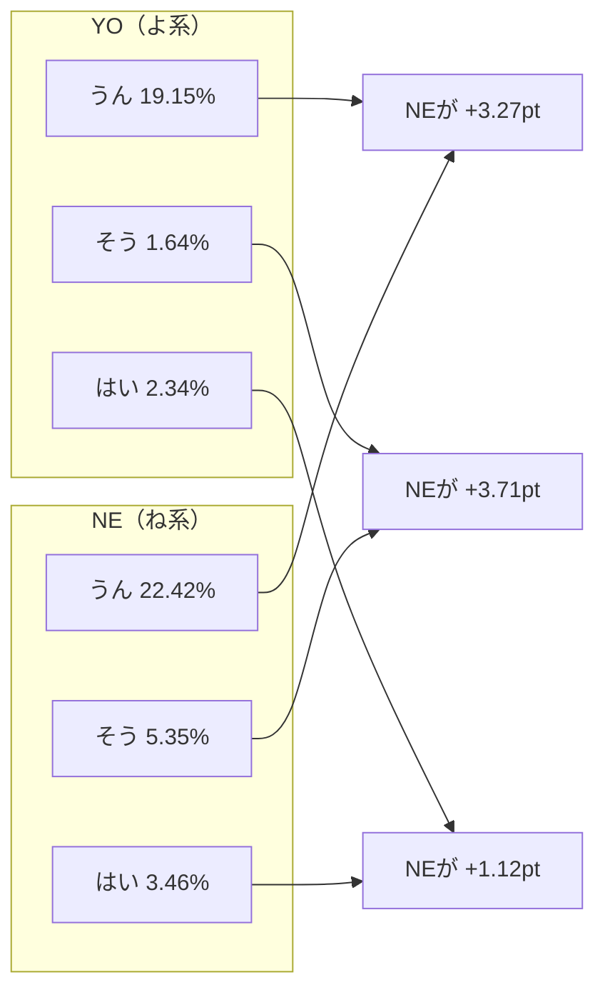

# CSJ/CEJC corpus pipeline（S3格納庫 + curated(v1) → gold(v13) → analysis(v1)）作業サマリー & 再現手順

更新日: 2026-01-02  
対象: CSJ / CEJC コーパスを AWS S3 を「格納庫」として安全に保管し、S3上で **curated(v1) → gold(v13) → analysis(v1)** を生成して語用論指標（終助詞/疑問/相槌）＋会話タイミング指標（Pause/Gap 等）を分析可能な状態に整備する。

---

## 1. 目的（山下先生向け要約）

- CSJ/CEJC の利用許諾・ガイドラインに沿って **第三者アクセスを防止できるS3保管体制** を整備する。  
- コーパスから **発話（utterances）→ 指標付きセグメント（segments）→ 応答ペア（pairs）→ 集計指標（metrics）** の形に変換し、研究で利用可能な「gold」データセットを作る。  
- 「相槌（aizuchi）」・「疑問判定（question）」・「終助詞群（SFP）」の妥当性を検証し、ルールを段階的に改善（v8→v13）。  
- gold(v13) を入力として **analysis/v1/gold=v13**（summary/rank/examples/report）を再生成し、研究用アウトプットを最新化。  
- （今回の追加）TextGrid 由来の **Pause/Gap / overlap / speech ratio** を gold(v13) に `metrics_pausegap` として追加し、analysis(v1) の **summary / rank / examples** に統合した。

---

## 2. 対象バケット（格納庫）

- AWSアカウント: 982534361827
- リージョン: ap-northeast-1 (Tokyo)

### 2.1 原本保管（バックアップ）
- `leadlea-csj-backup-982534361827-20251223-002451`
- `leadlea-cejc-backup-982534361827-20251219`

### 2.2 解析用アウトプット（curated / gold / analysis）
- `leadlea-asd-curated-982534361827-20251230`
  - curated(v1): `s3://leadlea-asd-curated-982534361827-20251230/curated/v1`
  - gold: `s3://leadlea-asd-curated-982534361827-20251230/gold`
  - analysis: `s3://leadlea-asd-curated-982534361827-20251230/analysis/v1`

---

## 3. 適用レギュレーション（根拠）

### CSJ 利用許諾契約
- 無断アクセス防止、利用者以外アクセス不可、ID/パスワード等でアクセス制限  
  → 第10条（話し言葉コーパスの管理）
- 契約終了時の返却/破棄/削除、要求時の証明  
  → 第18条（契約終了時の措置）

### CEJC 利用許諾契約
- 無断アクセス防止、利用者以外アクセス不可、ID/パスワード等でアクセス制限  
  → 第10条（日常会話コーパスの管理）
- 契約終了時の返却/破棄/削除、要求時の証明  
  → 第18条（契約終了時の措置）

### CEJC 利用ガイドライン
- ネットワーク環境（ファイルサーバ等）に複製する場合、権利者以外がアクセスできない環境整備  
  → 「② データの管理」

---

## 4. S3 格納庫のセキュリティ実装（監査可能な状態）

両バケット共通で以下を確認・設定済み。

### 4.1 Block Public Access（公開遮断）
- BlockPublicAcls: true  
- IgnorePublicAcls: true  
- BlockPublicPolicy: true  
- RestrictPublicBuckets: true  

### 4.2 Object Ownership（ACL無効化）
- ObjectOwnership: `BucketOwnerEnforced`

### 4.3 Versioning（バージョニング）
- Status: `Enabled`

### 4.4 Default Encryption（SSE-KMS）
- SSEAlgorithm: `aws:kms`
- KMS key ARN: `arn:aws:kms:ap-northeast-1:982534361827:key/5dc3c3b6-251c-4cbd-b1a4-40f92db8f58c`
- BucketKeyEnabled: true

### 4.5 Bucket Policy（TLS強制）
- `aws:SecureTransport=false` を拒否（DenyInsecureTransport）

---

## 5. パイプライン成果（curated(v1) → gold(v13)）

### 5.1 gold の出力テーブル（v13）
各 corpus ごとに、以下テーブルを S3 に生成。

- segments: 発話に SFP（終助詞群）と疑問フラグを付与
- pairs: 話者交替時のみ prev→resp の応答ペアを生成（resp側に相槌フラグ等）
- metrics_sfp: 会話×話者単位で SFP/疑問の比率などを集計
- metrics_resp: 会話×話者単位で「NE後の相槌率」や「応答語彙エントロピー」などを集計
- metrics_pausegap（Phase4で追加）: 会話×話者単位で pause/gap/overlap/speech の統計量を集計

出力先（例: v13）  
- `s3://leadlea-asd-curated-982534361827-20251230/gold/v13/corpus=cejc/table=...`
- `s3://leadlea-asd-curated-982534361827-20251230/gold/v13/corpus=csj/table=...`

### 5.2 妥当性検証とルール改善（v8 → v13）
相槌の取りこぼし（短応答なのに non-aizuchi）を中心に検証し、段階的にルールを更新。

- v8: 初期 gold 生成（CEJC/CSJ ともに生成可能。CSJはタグ混在の影響あり）
- v9〜v11: CSJタグ（<H>/<FV>/<息> 等）や括弧注記の正規化、相槌検出の頑健化
- v12: 「うんー」等の **長音（ー）を含む相槌** を拾えるよう改善（CEJCで改善が観測）
- v13: 同意系の相槌（**ですよね/だよね/まあね/まぁね**）を追加（微増で副作用小）

---

## 6. 運用ルール（研究運用としての遵守事項）

### 6.1 アクセス主体（Principals）の最小化
- 人が直接触る IAM ユーザ/ロールは最小限
- 解析は Lambda 等の実行ロールに限定（必要権限のみ）
- 追加する場合も「本件利用者の範囲」から逸脱しない（契約/ガイドライン順守）

### 6.2 IAM 権限（例）
- 読み取り: `s3:GetObject`, `s3:ListBucket`
- SSE-KMS: `kms:Decrypt`（必要に応じ `kms:Encrypt`/`kms:GenerateDataKey`）

### 6.3 ローカル削除（借用マシン対応）
- S3 への格納・スモークチェック完了後、ローカルのコーパス実体は削除
- 監査用には「設定確認結果（テキスト）」と「バケットポリシー全文（JSON）」のみ保持  
  （コーパス実体やファイル一覧は残さない）

---

## 7. 再現性（環境変数・検証コマンド・最終コマンド）

### 7.1 必須 env（解析出力先）
```bash
export S3_KMS_KEY_ARN="arn:aws:kms:ap-northeast-1:982534361827:key/5dc3c3b6-251c-4cbd-b1a4-40f92db8f58c"
export OUT_CURATED="s3://leadlea-asd-curated-982534361827-20251230/curated/v1"
export OUT_GOLD="s3://leadlea-asd-curated-982534361827-20251230/gold"
export ANALYSIS_OUT="s3://leadlea-asd-curated-982534361827-20251230/analysis/v1"
export GV=13
````

（任意）envファイル化

```bash
cat > env_asd.sh <<'SH'
export S3_KMS_KEY_ARN="arn:aws:kms:ap-northeast-1:982534361827:key/5dc3c3b6-251c-4cbd-b1a4-40f92db8f58c"
export OUT_CURATED="s3://leadlea-asd-curated-982534361827-20251230/curated/v1"
export OUT_GOLD="s3://leadlea-asd-curated-982534361827-20251230/gold"
export ANALYSIS_OUT="s3://leadlea-asd-curated-982534361827-20251230/analysis/v1"
export GV=13
SH
source env_asd.sh
```

### 7.2 S3セキュリティ設定の監査コマンド（第三者説明用）

```bash
REGION="ap-northeast-1"
BUCKETS=(
  "leadlea-csj-backup-982534361827-20251223-002451"
  "leadlea-cejc-backup-982534361827-20251219"
)

for B in "${BUCKETS[@]}"; do
  echo "===== $B ====="
  aws s3api get-public-access-block --bucket "$B" --region "$REGION"
  aws s3api get-bucket-ownership-controls --bucket "$B" --region "$REGION"
  aws s3api get-bucket-versioning --bucket "$B" --region "$REGION"
  aws s3api get-bucket-encryption --bucket "$B" --region "$REGION"
  aws s3api get-bucket-policy --bucket "$B" --region "$REGION" --query Policy --output text | head -c 500; echo " ..."
done
```

### 7.3 gold(v13) 生成（最終コマンド：再現性担保）

```bash
# CSJ v13
python scripts/build_pragmatics_gold_from_utterances.py \
  --corpus csj \
  --utterances-s3 "$OUT_CURATED/corpus=csj/table=utterances/part-00000.parquet" \
  --out-s3-prefix "$OUT_GOLD" \
  --out-version 13 \
  --loose-aizuchi

# CEJC v13
python scripts/build_pragmatics_gold_from_utterances.py \
  --corpus cejc \
  --utterances-s3 "$OUT_CURATED/corpus=cejc/table=utterances/part-00000.parquet" \
  --out-s3-prefix "$OUT_GOLD" \
  --out-version 13 \
  --loose-aizuchi
```

---

## 8. 付録（推奨）

### 8.1 バケットポリシー全文の保存（推奨）

```bash
REGION="ap-northeast-1"
mkdir -p security_artifacts

for B in \
  "leadlea-csj-backup-982534361827-20251223-002451" \
  "leadlea-cejc-backup-982534361827-20251219"; do
  aws s3api get-bucket-policy --bucket "$B" --region "$REGION" \
    --query Policy --output text > "security_artifacts/${B}_bucket-policy.json"
done
```

### 8.2 追加で実施を検討できる項目（監査強化）

* CloudTrail（S3 data events）で当該バケット Read/Write を監査ログ化
* Access Analyzer / Config で継続監視（意図しない公開やポリシー逸脱の検知）
* 重要度が高ければ Object Lock（要件次第）

---

## 9. analysis/v1（gold=v13）再生成（summary / rank / examples / report）

### 9.1 背景

* gold(v13) を前提に、`analysis/v1/gold=v13/…` を最新化（過去の分析成果物を v13 で置き換え）。
* gold(v13) には `subset=dyad/dialog` のディレクトリが無いため、analysis 側で **segments の話者数（nunique）**から dyad/dialog を推定して集計する。

### 9.2 スモークチェック（gold v13 の存在確認）

```bash
aws s3 ls "$OUT_GOLD/v13/corpus=cejc/" --recursive | head -n 20
aws s3 ls "$OUT_GOLD/v13/corpus=csj/"  --recursive | head -n 20
```

### 9.3 analysis v13：summary + rank の再生成（最終）

* 生成スクリプト: `scripts/analyze_gold_to_analysis_v1.py`
* reliability 判定は `metrics_resp.n_pairs_after_NE` を使用（min_ne_events=20）

```bash
mkdir -p logs
export GOLD_VERSION=13
RUN_TAG="$(date +%Y%m%d_%H%M%S)_goldv${GOLD_VERSION}"

python scripts/analyze_gold_to_analysis_v1.py \
  --gold-s3-prefix "$OUT_GOLD" \
  --gold-version "$GOLD_VERSION" \
  --out-s3-prefix "$ANALYSIS_OUT" \
  --kms-key-arn "$S3_KMS_KEY_ARN" \
  --template-gold-version 8 \
  --min-ne-events 20 \
  2>&1 | tee "logs/${RUN_TAG}_analysis_v13.log"
```

生成物（S3）

* summary:

  * `.../analysis/v1/gold=v13/summary/summary_datasets.csv`
  * `.../analysis/v1/gold=v13/summary/summary_datasets.parquet`
* rank:

  * `.../analysis/v1/gold=v13/rank_ne_aizuchi/{cejc_all,cejc_dyad,csj_all,csj_dialog}/{top50,bottom50,all_reliable}.parquet`

確認コマンド：

```bash
aws s3 ls "$ANALYSIS_OUT/gold=v13/summary/" --recursive
aws s3 ls "$ANALYSIS_OUT/gold=v13/rank_ne_aizuchi/" --recursive | head -n 120
```

### 9.4 summary の空欄修正（分母・集計の整合化）

`summary_datasets.csv` が「列はあるが値が空」になったケースに対し、gold(v13) の `segments/pairs/metrics` から集計値を埋める再生成スクリプトを追加。

* スクリプト: `scripts/rebuild_summary_datasets_v13_counts.py`

実行：

```bash
python scripts/rebuild_summary_datasets_v13_counts.py \
  --gold-s3-prefix "$OUT_GOLD" \
  --gold-version 13 \
  --analysis-s3-prefix "$ANALYSIS_OUT" \
  --kms-key-arn "$S3_KMS_KEY_ARN"
```

確認（例）：

```bash
mkdir -p tmp_v13
aws s3 cp "$ANALYSIS_OUT/gold=v13/summary/summary_datasets.csv" tmp_v13/summary_datasets.csv
column -s, -t tmp_v13/summary_datasets.csv | sed -n '1,12p'
```

### 9.5 examples（top/bottom）再生成（全データセット）

* スクリプト: `scripts/build_examples_ne_aizuchi_v1.py`
* 各 dataset の examples を作成し、`examples_all`（全体 top/bottom）も更新する。

```bash
for ds in cejc_dyad cejc_all csj_all csj_dialog; do
  RUN_TAG="$(date +%Y%m%d_%H%M%S)_goldv${GOLD_VERSION}"
  python scripts/build_examples_ne_aizuchi_v1.py \
    --gold-s3-prefix "$OUT_GOLD" \
    --analysis-s3-prefix "$ANALYSIS_OUT" \
    --gold-version "$GOLD_VERSION" \
    --kms-key-arn "$S3_KMS_KEY_ARN" \
    --dataset "$ds" \
    --min-ne-events 20 \
    --k-per-speaker 3 \
    2>&1 | tee "logs/${RUN_TAG}_examples_${ds}.log"
done
```

生成物（例）

* `.../analysis/v1/gold=v13/examples/ne_aizuchi/{cejc_dyad,cejc_all,csj_all,csj_dialog}/examples_{top,bottom,all}.{csv,parquet}`
* `.../analysis/v1/gold=v13/examples_all/{top,bottom}.{csv,parquet}`

確認：

```bash
aws s3 ls "$ANALYSIS_OUT/gold=v13/examples/ne_aizuchi/" --recursive | head -n 120
aws s3 ls "$ANALYSIS_OUT/gold=v13/examples_all/" --recursive
```

### 9.6 CEJC dyad vs CSJ dialog 比較レポート（A4 PDF）

* A4 HTML を生成し、Chrome headless で PDF 化して S3 へ格納。
* スクリプト: `scripts/make_a4_compare_report_v13.py`

```bash
python scripts/make_a4_compare_report_v13.py \
  --summary-csv tmp_v13/summary_datasets.csv \
  --cejc-top-csv tmp_v13/cejc_dyad_examples_top.csv \
  --cejc-bottom-csv tmp_v13/cejc_dyad_examples_bottom.csv \
  --csj-top-csv tmp_v13/csj_dialog_examples_top.csv \
  --csj-bottom-csv tmp_v13/csj_dialog_examples_bottom.csv \
  --out-html reports/goldv13_cejcdyad_vs_csjdialog_a4_full.html \
  --gold-version 13

"/Applications/Google Chrome.app/Contents/MacOS/Google Chrome" \
  --headless --disable-gpu \
  --print-to-pdf="reports/goldv13_cejcdyad_vs_csjdialog_a4_full.pdf" \
  "file://$(pwd)/reports/goldv13_cejcdyad_vs_csjdialog_a4_full.html"

aws s3 cp reports/goldv13_cejcdyad_vs_csjdialog_a4_full.pdf \
  "$ANALYSIS_OUT/gold=v13/report/goldv13_cejcdyad_vs_csjdialog_a4_full.pdf" \
  --sse aws:kms --sse-kms-key-id "$S3_KMS_KEY_ARN"
```

生成物（S3）

* `.../analysis/v1/gold=v13/report/goldv13_cejcdyad_vs_csjdialog_a4.pdf`
* `.../analysis/v1/gold=v13/report/goldv13_cejcdyad_vs_csjdialog_a4_full.pdf`

（GitHub Pages 配置例）

* `docs/report/` 配下に配置した PDF/HTML は GitHub Pages で閲覧可能（例: `leadlea.github.io/asd/report/...`）

---

## 10. 既存論文との照合（sanity check：B-1_168）

### 10.1 目的（比較は“参考”・計算妥当性の確認）

* 研究目的は「コーパス比較」ではなく、まずは **gold(v13)→analysis(v1) の計算が破綻していないこと**を、先行研究と同方向の結果で確認する（sanity check）。
* 完全再現（対象会話ID集合まで一致）は求めず、論文記載の条件を **できるだけ再現**して「方向一致」を確認する。

### 10.2 参照した論文

* 「B-1_168（応答の多様性・よ/ね文の比較）」

  * [https://www.ls-japan.org/modules/documents/LSJpapers/meeting/168/handouts/b/B-1_168.pdf](https://www.ls-japan.org/modules/documents/LSJpapers/meeting/168/handouts/b/B-1_168.pdf)

### 10.3 論文側の条件（本文記載に基づく）

* CEJC の **2名会話**を対象
* 「よ」文・「ね」文を抽出（**「よね」は除外**）
* 直後の応答（例：「うん」「そう」「はい」）の出現傾向を比較（図1）
* さらに分析段階では AQ データのある話者に限定する等、母集団が変化する記述あり
  ※ 会話ID/話者IDの列挙がなく、完全一致の同定は困難

### 10.4 v13 gold からの“できるだけ再現”手順（最短）

* スクリプト: `scripts/replicate_b1_168_from_gold_v13.py`
* 近似再現条件：

  1. CEJC の 2名会話（segments の `speaker_id` nunique==2）
  2. `sfp_group` が YO / NE（必要に応じ NE_Q を含める）
  3. 「よね」除外（簡易正規化＋末尾判定）
  4. pairs は **話者違い（prev_speaker_id != resp_speaker_id）** のみ
  5. 直後応答の `resp_first_token` を使い、「うん/そう/はい」率を比較（図1の方向性確認）

実行：

```bash
python scripts/replicate_b1_168_from_gold_v13.py \
  --gold-s3-prefix "$OUT_GOLD" \
  --gold-version 13

# 感度分析（NE_Q を NE に含める）
python scripts/replicate_b1_168_from_gold_v13.py \
  --gold-s3-prefix "$OUT_GOLD" \
  --gold-version 13 \
  --include-ne-q
```

### 10.5 結果（方向一致：sanity check 合格）

v13（近似再現）では、NE（ね系）条件の方が YO（よ系）よりも「うん/そう/はい」の後続率が高いという **方向**が再現された。

* YO: うん 19.15% / そう 1.64% / はい 2.34%
* NE: うん 22.42% / そう 5.35% / はい 3.46%



解釈（sanity check の結論）

* 先行研究（B-1_168）の図1が示す「ね文は同意系応答（うん/そう/はい）を引き出しやすい」という傾向と整合的。
* 母集団規模は一致しないため完全再現ではないが、計算ロジックの sanity check としては合格。
* 以降は「特徴拡張 → ML/LLM」へ移行する前提が整った。

---

## 11. 次にやること（ここから本丸：ML/LLM・フィラー・説明）

sanity check を通過したため、以降は「語用論×会話タイミング×フィラー×LLM説明」の統合特徴で攻める。

### 11.1 目的

* **逸脱（atypicality）** を定量化するために、説明可能な特徴セットを作り、誤差分析まで含む反復ループを回す。

### 11.2 追加予定の特徴（ロードマップ）

* 会話タイミング（Phase4で統合済）

  * pause（沈黙）/ response gap（応答遅れ）/ overlap（重なり）/ speech ratio（発話率）
* フィラー（今後）

  * えー / あの / その / まぁ / なんか / ほら / えっと… 等の出現率
  * 言い淀み（引き伸ばし・自己修復のサイン）
* LLM 特徴（今後）

  * 逸脱例（top/bottom）への説明付与（何が“同意/確認要求/同調/転換”か）
  * 誤検出タイプの分類（例: 相槌に見えるが実は語彙応答、笑い、引用、など）

### 11.3 進め方（実装の筋）

* 既存 gold(v13) → analysis(v1) の枠組みに「新テーブル（metrics_***）」を足し、summary/rank/examples が自動で追従する形を維持。
* 追加特徴は「生成→検証HTML→promote」の運用で壊れにくくする（Phase4と同様の流れ）。

---

## 12. Phase4: Pause/Gap（TextGrid）→ gold(v13) / analysis(v1) 統合（2026-01-02 実施内容）

### 12.1 統合のゴール

* gold(v13) に `metrics_pausegap` を追加し、
* analysis(v1) の

  * summary に `PG_*`（13列）が入り
  * rank（`rank_ne_aizuchi/*/top50` 等）に pausegap 列が入り
  * examples は従来通り生成できる
* これらが HTML ダッシュボードで “統合成功” と確認できる状態にする

### 12.2 PG（Pause/Gap）カラム仕様（統合時の実際）

* summary 側（prefix 付き）: `PG_*` が 13列

  * `PG_total_time_mean`
  * `PG_speech_time_mean`
  * `PG_speech_ratio_mean`
  * `PG_n_segments_mean`
  * `PG_pause_mean_mean`
  * `PG_pause_p50_mean`
  * `PG_pause_p90_mean`
  * `PG_overlap_rate_mean`
  * `PG_resp_gap_mean_mean`
  * `PG_resp_gap_p50_mean`
  * `PG_resp_gap_p90_mean`
  * `PG_resp_overlap_rate_mean`
  * `PG_n_resp_events_mean`
* rank 側（prefix無し）: pausegap 統合列

  * `speech_extract_mode`
  * `total_time`
  * `speech_time`
  * `speech_ratio`
  * `n_segments`
  * `pause_mean`
  * `pause_p50`
  * `pause_p90`
  * `overlap_rate`
  * `resp_gap_mean`
  * `resp_gap_p50`
  * `resp_gap_p90`
  * `resp_overlap_rate`
  * `n_resp_events`

### 12.3 初回統合で発生した問題（NaN大量）

症状（観測）

* verify HTML で csj の rank 側 `total_time` 等が NaN だらけ
* 検証ログで以下が確認された：

  * `[pausegap csj] speaker_id samples: ['A01F0055:L', ...]`
  * `[rank csj] speaker_id samples: ['L','L',...]`
  * `[pausegap csj] has_colon rate: 1.0`
  * `[rank csj] has_colon rate: 0.0`
  * `[rank csj] total_time non-null rate: 0.0`

原因

* CSJ の `metrics_pausegap` の `speaker_id` が `conversation_id:side`（例: `A01F0055:L`）形式で、
  rank の `speaker_id`（`L`/`R`）と join key が一致していなかった。

一次対応（analysis 側の join 修正）

* `scripts/analyze_gold_to_analysis_v1.py` で pausegap を attach する merge を修正し、キーを正規化して結合可能にした。
* さらに reliability の計算は `metrics_resp.n_pairs_after_NE` を採用し、rank と整合するように統一した。

### 12.4 S3 write 権限のスモーク（analysis/v1 に書けるか）

```bash
printf test > /tmp/_s3_write_test.txt
aws s3 cp /tmp/_s3_write_test.txt \
  "$ANALYSIS_OUT/gold=v13/summary/_write_test.txt" \
  --sse aws:kms --sse-kms-key-id "$S3_KMS_KEY_ARN"
```

### 12.5 CSJ: metrics_pausegap の再構築（TextGrid loader 問題 → 解決）

問題（2回目の壁）

* `rebuild_metrics_pausegap_csj_v1.py` 実行で全件失敗（201 conv）
* エラーメッセージは「praatio or textgrid を入れて」と出るが、実際には import は成功していた

原因（実態）

* praatio の parser が CSJ の一部 TextGrid を `ParsingError('Expected field in Textgrid missing.')` で読めない
* `textgrid` パッケージの `TextGrid.fromFile()` だと読める TextGrid が存在した

切り分け（サンプル TextGrid で確認）

```bash
python - <<'PY'
from pathlib import Path
p = Path("artifacts/phase4/textgrid/csj/A01F0055.TextGrid")
print("exists:", p.exists(), "size:", p.stat().st_size)
print("---- head ----")
print("\n".join(p.read_text(errors="replace").splitlines()[:8]))
print("-------------")

# praatio(textgrid)
try:
    from praatio import textgrid as p_tg
    tg = p_tg.openTextgrid(str(p), includeEmptyIntervals=True)
    print("[OK] praatio.textgrid openTextgrid:", type(tg))
except Exception as e:
    print("[NG] praatio.textgrid openTextgrid:", repr(e))

# textgrid
try:
    from textgrid import TextGrid
    tg = TextGrid.fromFile(str(p))
    print("[OK] textgrid TextGrid.fromFile:", type(tg))
except Exception as e:
    print("[NG] textgrid TextGrid.fromFile:", repr(e))
PY
```

対策（loader を textgrid 優先に変更）

* `scripts/phase4/rebuild_metrics_pausegap_csj_v1.py` の loader を `TextGrid.fromFile()` 優先にして、失敗時のみ praatio にフォールバック
* ただし `textgrid.TextGrid` は、既存の下流ロジックが期待する属性名と異なるため、軽量ラッパ `_TG` を用意して IF を合わせた

追加で起きた IF 不一致と修正

* `'tiers' が無い` → `_TG.tiers` を用意して解消
* `'max_t' が無い` / `'min_t' が無い` → `_TG.min_t` / `_TG.max_t` を追加して解消

（修正後の確認：loader が tiers/min_t/max_t を満たす）

```bash
python - <<'PY'
import importlib.util, sys
name="rebuild_pg_csj_v1"
path="scripts/phase4/rebuild_metrics_pausegap_csj_v1.py"
spec=importlib.util.spec_from_file_location(name, path)
mod=importlib.util.module_from_spec(spec)
sys.modules[spec.name]=mod
spec.loader.exec_module(mod)

p="artifacts/phase4/textgrid/csj/A01F0055.TextGrid"
tg = mod._load_textgrid_from_path(p)
print("type:", type(tg))
print("has tiers:", hasattr(tg,"tiers"), "n_tiers:", len(getattr(tg,"tiers",[])))
print("has min_t:", hasattr(tg,"min_t"), "has max_t:", hasattr(tg,"max_t"))
print("min_t:", tg.min_t, "max_t:", tg.max_t, "dur:", tg.max_t - tg.min_t)
PY
```

CSJ metrics_pausegap 再構築（最終成功コマンド）

```bash
python -m py_compile scripts/phase4/rebuild_metrics_pausegap_csj_v1.py

python scripts/phase4/rebuild_metrics_pausegap_csj_v1.py \
  --gold-s3-prefix "$OUT_GOLD" \
  --gold-version "$GV" \
  --kms-key-arn "$S3_KMS_KEY_ARN" \
  --fallback-textgrid-root artifacts/phase4
```

成功ログの期待

* `[INFO] rebuilt rows: 402 unique_conv: 201`
* `speaker_id` の side counts が L=201, R=201
* `resp_gap_* / resp_overlap_rate / n_resp_events` が non-null（=1.0）

出力先（S3）

* `.../gold/v13/corpus=csj/table=metrics_pausegap/part-00000.parquet`

検証（例）

```bash
aws s3 cp \
  "$OUT_GOLD/v13/corpus=csj/table=metrics_pausegap/part-00000.parquet" \
  /tmp/csj_metrics_pausegap.parquet

python - <<'PY'
import pyarrow.parquet as pq
df=pq.read_table("/tmp/csj_metrics_pausegap.parquet").to_pandas()
print("rows:", len(df), "unique_conv:", df["conversation_id"].nunique())
print("side counts head:\n", df["speaker_id"].value_counts().head())
for c in ["resp_gap_mean","resp_gap_p50","resp_gap_p90","resp_overlap_rate","n_resp_events"]:
    print(c, "non-null rate:", df[c].notna().mean(), "n_resp_events>0 rate:" if c=="n_resp_events" else "")
if "n_resp_events" in df.columns:
    print("n_resp_events>0 rate:", (df["n_resp_events"]>0).mean())
PY
```

### 12.6 analysis 側の再生成（tmp → verify → promote）

tmp を作って検証し、OKなら `analysis/v1` に反映する。

(A) tmp prefix で再生成（summary + rank）

```bash
export ANA_TMP_FIX="s3://leadlea-asd-curated-982534361827-20251230/analysis/v1_tmp_pausegap_joinfix_$(date +%Y%m%d_%H%M%S)"
echo "ANA_TMP_FIX=$ANA_TMP_FIX"

python scripts/analyze_gold_to_analysis_v1.py \
  --gold-s3-prefix "$OUT_GOLD" \
  --gold-version "$GV" \
  --out-s3-prefix "$ANA_TMP_FIX" \
  --kms-key-arn "$S3_KMS_KEY_ARN"
```

(B) examples 再生成（csj_all / cejc_all を最低限更新）

```bash
python scripts/build_examples_ne_aizuchi_v1.py \
  --gold-s3-prefix "$OUT_GOLD" \
  --analysis-s3-prefix "$ANA_TMP_FIX" \
  --gold-version "$GV" \
  --dataset csj_all \
  --kms-key-arn "$S3_KMS_KEY_ARN"

python scripts/build_examples_ne_aizuchi_v1.py \
  --gold-s3-prefix "$OUT_GOLD" \
  --analysis-s3-prefix "$ANA_TMP_FIX" \
  --gold-version "$GV" \
  --dataset cejc_all \
  --kms-key-arn "$S3_KMS_KEY_ARN"
```

(C) tmp の検証（rank の non-null 率 / summary の PG_*）

```bash
mkdir -p artifacts/phase4/verify/joinfix

aws s3 cp \
  "$ANA_TMP_FIX/gold=v13/rank_ne_aizuchi/csj_all/top50.parquet" \
  artifacts/phase4/verify/joinfix/csj_top50.parquet

python - <<'PY'
import pyarrow.parquet as pq
rk = pq.read_table("artifacts/phase4/verify/joinfix/csj_top50.parquet").to_pandas()
print("cols:", rk.columns.tolist())
print("total_time non-null rate:", rk["total_time"].notna().mean())
print("pause_mean non-null rate:", rk["pause_mean"].notna().mean())
print("resp_gap_mean non-null rate:", rk["resp_gap_mean"].notna().mean())
print(rk[["conversation_id","speaker_id","speech_extract_mode","total_time","pause_mean","resp_gap_mean","n_resp_events"]].head(12))
PY

aws s3 cp \
  "$ANA_TMP_FIX/gold=v13/summary/summary_datasets.parquet" \
  artifacts/phase4/verify/joinfix/summary.parquet

python - <<'PY'
import pyarrow.parquet as pq
df = pq.read_table("artifacts/phase4/verify/joinfix/summary.parquet").to_pandas()
pg=[c for c in df.columns if c.startswith("PG_")]
print("PG cols:", len(pg))
print(df[df["dataset"].isin(["csj_all","csj_dialog","cejc_all","cejc_dyad"])][["dataset"]+pg])
PY
```

(D) promote（analysis/v1 に同期）

```bash
export ANA_BAK_OK="s3://leadlea-asd-curated-982534361827-20251230/analysis/v1_tmp_backup_pre_pausegap_$(date +%Y%m%d_%H%M%S)"
echo "ANA_BAK_OK=$ANA_BAK_OK"

# backup（OKなprefixへ）
aws s3 sync "$ANALYSIS_OUT/gold=v13/" "$ANA_BAK_OK/gold=v13/" \
  --only-show-errors \
  --sse aws:kms --sse-kms-key-id "$S3_KMS_KEY_ARN"

# promote
aws s3 sync "$ANA_TMP_FIX/gold=v13/summary/" \
  "$ANALYSIS_OUT/gold=v13/summary/" \
  --delete --only-show-errors --sse aws:kms --sse-kms-key-id "$S3_KMS_KEY_ARN"

aws s3 sync "$ANA_TMP_FIX/gold=v13/rank_ne_aizuchi/" \
  "$ANALYSIS_OUT/gold=v13/rank_ne_aizuchi/" \
  --delete --only-show-errors --sse aws:kms --sse-kms-key-id "$S3_KMS_KEY_ARN"

aws s3 sync "$ANA_TMP_FIX/gold=v13/examples/" \
  "$ANALYSIS_OUT/gold=v13/examples/" \
  --delete --only-show-errors --sse aws:kms --sse-kms-key-id "$S3_KMS_KEY_ARN"

aws s3 sync "$ANA_TMP_FIX/gold=v13/examples_all/" \
  "$ANALYSIS_OUT/gold=v13/examples_all/" \
  --delete --only-show-errors --sse aws:kms --sse-kms-key-id "$S3_KMS_KEY_ARN"

echo "[OK] promoted -> $ANALYSIS_OUT"
```

### 12.7 統合チェック（HTML）

* “Pause/Gap integration check (v2)” を HTML で作成し、以下が満たされることを確認した：

  * summary: `PG_*` が 4 dataset（csj_all/csj_dialog/cejc_all/cejc_dyad）に入り、NaN が消える
  * rank: `csj_all/top50` の `total_time/pause_mean/resp_gap_mean/...` が non-null（NaN率 0.0）
  * rank のサンプル行で `speech_extract_mode=TRN_non_sil` が入り、`n_resp_events` が正値

（確認結果の例）

* `PG cols: 13`
* `total_time non-null rate: 1.0`
* `resp_gap_mean non-null rate: 1.0`
* `n_resp_events non-null rate: 1.0`

---

## 13. リポジトリ運用メモ（ローカル生成物の扱い）

* `docs/` や `artifacts/` はローカル生成物が大量に出るため、`.gitignore` で除外する運用に変更。
* 研究に必要な “再現性の核” は `scripts/`（生成スクリプト）と `config/`（カタログ等）を基本として管理する。
* GitHub Pages で見せたい HTML/PDF のみ `docs/report/` に選別して配置する。

（例：.gitignore 追記）

```bash
cat >> .gitignore <<'EOF'

# ---- generated artifacts (local) ----
docs/
scripts/**/__pycache__/
**/__pycache__/
*.pyc
artifacts/
EOF
```

## Phase3-2: LLMラベリング v0（Bedrock Claude Opus 4.5）— 実装内容まとめ

### 目的
- Phase3で抽出した「外れ値（outlier）例」を、LLM（Bedrock Claude Opus 4.5）で **人間が読める説明ラベル**に変換し、
  - 研究者レビューの省力化（理由・根拠付き）
  - ダッシュボード（HTML）での共有・議論を可能にする

### 使ったモデル / リージョン
- Bedrock Model ID: `global.anthropic.claude-opus-4-5-20251101-v1:0`
- Region: `ap-northeast-1`

### 入出力（S3/ローカル）
- 入力（analysis/v1/gold=v13 の outlier/examples を参照）
  - `AN_V13=s3://leadlea-asd-curated-982534361827-20251230/analysis/v1/gold=v13`
  - 例（few-shot/参考例）parquet（任意でローカルにsync）
    - `analysis/v1/gold=v13/examples/<metric>/<dataset>/{examples_top,examples_bottom,examples_all}.parquet`
- 出力（LLMラベル）
  - S3: `s3://leadlea-asd-curated-982534361827-20251230/analysis/v1/gold=v13/labels/labels_v0.parquet`
  - Local: `artifacts/phase3/labels_v0.parquet`
- 出力（共有用レポート）
  - HTML: `docs/report/labels_v0.html`（GitHub Pages で共有想定）
  - ※当初PDFも検討したが、フォント/太字の互換問題が出てHTMLに方針転換

### パイプライン構成
- シェル:
  - `scripts/phase3/run_labeling_v0.sh`
- Python:
  - `scripts/phase3/label_outliers_with_bedrock_v0.py`  
    - outlier行を読み、Bedrockへ投げるプロンプトを生成
    - 応答をパースし、ラベル/理由/根拠/メタ情報（model_id/created_at 等）を行に付与
    - parquet に保存 → S3へアップロード（SSE-KMS必須）
  - `scripts/phase3/make_labels_v0_report_html.py`
    - `labels_v0.parquet` を読み込み、HTMLダッシュボードを生成
    - （任意）examples parquet を突合して、右カラムで example（根拠例）を表示できる形に整形

### 実行手順（要点）
1) （任意）examples parquet の同期  
   - outlier説明に「具体例」を添付したい場合のみ sync（12ファイルなど）
2) LLMラベリング（S3へ書き込み）
3) labelsをDLして HTMLレポート生成（ローカルに出力）

### セキュリティ/権限（重要）
- `leadlea-asd-curated-...` 側は **SSE-KMS強制**のため、S3へのPutObjectで暗号化指定がないと失敗しうる。
- 途中で `AccessDenied ... explicit deny in a resource-based policy` が発生したため、
  - aws s3 cp / sync は **SSE-KMS 指定付き**で統一
  - `S3_KMS_KEY_ARN` を環境変数で渡してアップロード
  - これにより `labels_v0.parquet` のアップロード成功を確認

### 発生した主な問題と修正
- `run_labeling_v0.sh` 実行時に `need env OUT_GOLD` など環境変数不足で停止
  - → 必須envをスクリプト先頭でチェック・明示
- Python側で f-string / quoting の SyntaxError
  - → 文字列生成部（SQL/リスト生成など）を安全に再記述して解消
- PDF出力で日本語フォント警告 & 太字互換（macStyle）問題
  - → PDFは保留し、**HTMLレポートに切替**（GitHub Pages共有を優先）
- `docs/report/labels_v0.html` が `.gitignore` の例外ルール外で `git add` できない問題
  - → `.gitignore` に `!docs/report/*.html`（または `!docs/**/*.html`）を追加するか、
    `git add -f docs/report/labels_v0.html` で強制追加

### 成果物（確認済み）
- labels（S3）:
  - `s3://leadlea-asd-curated-982534361827-20251230/analysis/v1/gold=v13/labels/labels_v0.parquet`
- labels（local）:
  - `artifacts/phase3/labels_v0.parquet`
- report（local）:
  - `docs/report/labels_v0.html`

---

## ✅ 1発更新パッチ（mdにセクション14を追記/更新）

````bash
python - <<'PY'
from pathlib import Path
import re, datetime

MD = Path("docs/s3-corpus-bucket-compliance.md")
if not MD.exists():
    raise SystemExit(f"[ERROR] not found: {MD}")

old = MD.read_text(encoding="utf-8")

bak = MD.with_suffix(MD.suffix + f".bak_{datetime.datetime.now():%Y%m%d_%H%M%S}")
bak.write_text(old, encoding="utf-8")
print("[OK] backup:", bak)

section14 = r"""
## 14. Phase4-2: labels_v0.html への Pause/Gap 統合（pg 60/60 達成）

### 14.1 結論（今回の到達点）

- `docs/report/labels_v0.html` の全 60 行（CEJC 50 + CSJ 10）に対して、**Pause/Gap 指標（PG）が 60/60 で attach** された。
  - `pg_has_source: 60 / 60`
  - `pg_has_value : 60 / 60`
- “全話者にpgを保証するために pg_summary で埋める” 方式は採用していない（研究趣旨と反するため）。
  - **必要なCEJC TextGridをS3バックアップから取得し、実データから `metrics_pausegap_cejc_for_labels_v4.parquet` を再計算**して揃えた。
  - `--pg_summary_parquet` は「右上の Pause/Gap summary 表示用（集計）」であり、**行データの穴埋め用途ではない**。

---

### 14.2 使用した入力・出力（再現性の核）

#### 入力
- labels:
  - `artifacts/phase3/labels_v0.parquet`
- examples（右カラム evidence を出す場合）:
  - `artifacts/phase3/examples_v13/`（任意）
- PG（Pause/Gap）指標のソース（“正”）
  - CEJC（labels用 v4）:
    - `artifacts/phase4/out/metrics_pausegap_cejc_for_labels_v4.parquet`（rows=50, coverage=50/50）
  - CSJ（gold由来の確定版）:
    - `artifacts/phase4/verify/pg_gold/csj_metrics_pausegap.parquet`（rows=402, conv=201）
  - （任意）PG summary（右上summary用）:
    - `artifacts/phase4/verify/pg_refresh/summary.parquet`

#### 出力
- HTMLダッシュボード:
  - `docs/report/labels_v0.html`

---

### 14.3 CEJC TextGrid をS3バックアップから取得（labelsで必要な会話のみ）

CEJCの TextGrid はバックアップバケットに存在する。
- `CEJC_RAW="s3://leadlea-cejc-backup-982534361827-20251219"`
- 例：
  - `CEJC/data/T007/T007_007/T007_007-transUnit.TextGrid`
  - `CEJC/data/C002/C002_014/C002_014b-transUnit.TextGrid`（※ディレクトリは末尾 a/b を落とした `C002_014`）

取得先（ローカル）:
- `artifacts/phase4/textgrid/cejc/`

以下で **labels_v0.parquet から必要なCEJC会話ID集合を抽出**し、TextGrid（transUnit）をまとめてDLする。

```bash
export CEJC_RAW="s3://leadlea-cejc-backup-982534361827-20251219"
export CEJC_TG_DIR="artifacts/phase4/textgrid/cejc"
mkdir -p "$CEJC_TG_DIR"

python - <<'PY'
import pandas as pd, re, subprocess, os
from pathlib import Path

CEJC_RAW = os.environ["CEJC_RAW"]
OUTDIR = Path(os.environ["CEJC_TG_DIR"])
OUTDIR.mkdir(parents=True, exist_ok=True)

labels = pd.read_parquet("artifacts/phase3/labels_v0.parquet")
labels["dataset"] = labels["dataset"].astype(str).str.lower()

# CEJC speaker_id は "conversation_id:ICxx" 形式が基本
cejc = labels.loc[labels["dataset"]=="cejc", "speaker_id"].astype(str)
conv = sorted({x.split(":",1)[0] for x in cejc if ":" in x})

def base_dir(cid: str) -> str:
    # 末尾 a/b 等の英字があれば落とす（C002_014b -> C002_014）
    return cid[:-1] if re.search(r"[a-zA-Z]$", cid) else cid

for cid in conv:
    bd = base_dir(cid)
    head = bd.split("_",1)[0]  # C002 / T007 / K010 / W010 ...
    s3_key = f"{CEJC_RAW}/CEJC/data/{head}/{bd}/{cid}-transUnit.TextGrid"
    dst = OUTDIR / f"{cid}-transUnit.TextGrid"
    if dst.exists():
        continue
    # 失敗しても次へ（存在しない場合があるので）
    subprocess.run(["aws","s3","cp",s3_key,str(dst)], check=False)

print("[OK] conv_needed:", len(conv), "local_files:", len(list(OUTDIR.glob("*.TextGrid"))))
PY
````

---

### 14.4 CEJC Pause/Gap 指標（labels用 v4）をローカルTextGridから生成

TextGridの tier 名は `"IC01_玲子"` のように suffix が付くため、`IC\d{2}` を抽出して speaker_id（ICxx）に正規化する。
Pause は `text="pz"` を沈黙として扱い、Turn列から response gap / overlap を算出する（負値は被りを意味する）。

```bash
python - <<'PY'
from __future__ import annotations
from pathlib import Path
import re
import numpy as np
import pandas as pd

TG_DIR = Path("artifacts/phase4/textgrid/cejc")
OUT_PQ = Path("artifacts/phase4/out/metrics_pausegap_cejc_for_labels_v4.parquet")
OUT_PQ.parent.mkdir(parents=True, exist_ok=True)

labels = pd.read_parquet("artifacts/phase3/labels_v0.parquet")
labels["dataset"] = labels["dataset"].astype(str).str.lower()
need = labels.loc[labels["dataset"]=="cejc","speaker_id"].astype(str)
need_keys = sorted({x for x in need if ":" in x})
need_conv = sorted({x.split(":",1)[0] for x in need_keys})
need_spk = sorted({x.split(":",1)[1] for x in need_keys})

re_ic = re.compile(r"IC\d{2}")
def tier_to_spk(name: str) -> str:
    m = re_ic.search(name or "")
    return m.group(0) if m else (name or "").strip()

def parse_textgrid(path: Path):
    """Minimal Praat TextGrid(ooTextFile) IntervalTier parser."""
    lines = path.read_text(encoding="utf-8", errors="ignore").splitlines()
    xmin = xmax = None
    tiers = []
    i=0
    while i < len(lines):
        s = lines[i].strip()
        if s.startswith("xmin =") and xmin is None:
            try: xmin=float(s.split("=",1)[1].strip())
            except: pass
        if s.startswith("xmax =") and xmax is None:
            try: xmax=float(s.split("=",1)[1].strip())
            except: pass
        if s == 'class = "IntervalTier"':
            name = ""
            txmin = txmax = None
            intervals = []
            # scan forward for name/xmin/xmax/intervals
            j = i+1
            while j < len(lines):
                t = lines[j].strip()
                if t.startswith('name = "'):
                    name = t.split('"',2)[1]
                elif t.startswith("xmin =") and txmin is None:
                    try: txmin=float(t.split("=",1)[1].strip())
                    except: pass
                elif t.startswith("xmax =") and txmax is None:
                    try: txmax=float(t.split("=",1)[1].strip())
                    except: pass
                elif t.startswith("intervals ["):
                    # parse one interval block
                    kxmin=kxmax=None
                    ktxt=""
                    # next lines should contain xmin/xmax/text
                    jj=j+1
                    while jj < len(lines):
                        u = lines[jj].strip()
                        if u.startswith("xmin ="):
                            try: kxmin=float(u.split("=",1)[1].strip())
                            except: pass
                        elif u.startswith("xmax ="):
                            try: kxmax=float(u.split("=",1)[1].strip())
                            except: pass
                        elif u.startswith('text = "'):
                            ktxt = u.split('"',2)[1]
                        elif u.startswith("intervals [") and (kxmin is not None and kxmax is not None):
                            # next interval starts; rewind 1 line
                            break
                        elif u.startswith("item [") and (kxmin is not None and kxmax is not None):
                            break
                        jj += 1
                    if kxmin is not None and kxmax is not None:
                        intervals.append((kxmin, kxmax, ktxt))
                    j = jj-1  # continue from here
                elif t.startswith("item [") and j>i+1:
                    break
                j += 1
            tiers.append((name, intervals))
            i = j
            continue
        i += 1
    if xmin is None: xmin = 0.0
    if xmax is None:
        # fallback: last interval end
        mx = 0.0
        for _, itv in tiers:
            for a,b,_ in itv:
                mx = max(mx, b)
        xmax = mx
    return float(xmin), float(xmax), tiers

def intervals_to_segments(intervals):
    # speech intervals: not empty, not "pz"
    seg=[]
    for a,b,txt in intervals:
        t=(txt or "").strip()
        if not t: 
            continue
        if t.lower()=="pz": 
            continue
        seg.append((float(a), float(b)))
    seg.sort()
    return seg

def merge(segs, gap=0.0):
    if not segs: return []
    out=[list(segs[0])]
    for a,b in segs[1:]:
        if a <= out[-1][1] + gap:
            out[-1][1]=max(out[-1][1], b)
        else:
            out.append([a,b])
    return [(a,b) for a,b in out]

def overlap_duration(segs_a, segs_b):
    i=j=0
    total=0.0
    while i<len(segs_a) and j<len(segs_b):
        a1,a2=segs_a[i]; b1,b2=segs_b[j]
        lo=max(a1,b1); hi=min(a2,b2)
        if hi>lo: total += (hi-lo)
        if a2<b2: i+=1
        else: j+=1
    return total

rows=[]
missing=[]
for cid in need_conv:
    fp = TG_DIR / f"{cid}-transUnit.TextGrid"
    if not fp.exists():
        missing.append(cid)
        continue
    xmin,xmax,tiers = parse_textgrid(fp)
    total_time = max(0.0, xmax-xmin)

    # build speaker -> segments
    spk_to_seg={}
    for tname, itv in tiers:
        spk=tier_to_spk(tname)
        seg=merge(intervals_to_segments(itv), gap=0.0)
        if seg:
            spk_to_seg[spk]=seg

    # turn list
    turns=[]
    for spk, segs in spk_to_seg.items():
        for a,b in segs:
            turns.append((a,b,spk))
    turns.sort(key=lambda x:(x[0],x[1]))
    n_speakers = len({spk for *_,spk in turns})

    # per speaker metrics
    for spk in set(spk_to_seg.keys()):
        key = f"{cid}:{spk}"
        if key not in need_keys:
            continue

        segs = spk_to_seg.get(spk, [])
        speech_time = sum(b-a for a,b in segs)
        speech_ratio = (speech_time/total_time) if total_time>0 else np.nan
        n_segments = float(len(segs))

        # pause durations from original intervals
        # (pause = "pz")
        # re-parse tier intervals for that speaker
        pause_durs=[]
        for tname,itv in tiers:
            if tier_to_spk(tname)!=spk:
                continue
            for a,b,txt in itv:
                if (txt or "").strip().lower()=="pz":
                    pause_durs.append(float(b-a))
        pause_mean = float(np.mean(pause_durs)) if pause_durs else np.nan
        pause_p50  = float(np.percentile(pause_durs, 50)) if pause_durs else np.nan
        pause_p90  = float(np.percentile(pause_durs, 90)) if pause_durs else np.nan

        # overlap_rate: overlap with any other speaker / own speech_time
        other_union=[]
        for ospk, osegs in spk_to_seg.items():
            if ospk==spk: 
                continue
            other_union.extend(osegs)
        other_union = merge(sorted(other_union), gap=0.0)
        ov = overlap_duration(segs, other_union)
        overlap_rate = (ov/speech_time) if speech_time>0 else np.nan

        # response gaps: for each turn of this speaker, gap to immediately previous turn by other speaker
        gaps=[]
        for idx,(a,b,s) in enumerate(turns):
            if s!=spk:
                continue
            if idx==0:
                continue
            pa,pb,ps = turns[idx-1]
            if ps==spk:
                continue
            gaps.append(float(a - pb))
        resp_gap_mean = float(np.mean(gaps)) if gaps else np.nan
        resp_gap_p50  = float(np.percentile(gaps, 50)) if gaps else np.nan
        resp_gap_p90  = float(np.percentile(gaps, 90)) if gaps else np.nan
        resp_overlap_rate = float(np.mean([g<0 for g in gaps])) if gaps else np.nan
        n_resp_events = float(len(gaps))

        rows.append(dict(
            dataset="cejc",
            conversation_id=cid,
            speaker_id=spk,
            src_textgrid=str(fp),
            speech_extract_mode="labels_v4_transUnit_pz",
            total_time=float(total_time),
            speech_time=float(speech_time),
            speech_ratio=float(speech_ratio) if speech_ratio==speech_ratio else np.nan,
            n_segments=float(n_segments),
            pause_mean=pause_mean,
            pause_p50=pause_p50,
            pause_p90=pause_p90,
            overlap_rate=overlap_rate,
            resp_gap_mean=resp_gap_mean,
            resp_gap_p50=resp_gap_p50,
            resp_gap_p90=resp_gap_p90,
            resp_overlap_rate=resp_overlap_rate,
            n_resp_events=n_resp_events,
            n_speakers=float(n_speakers),
        ))

df = pd.DataFrame(rows)
df.to_parquet(OUT_PQ, index=False)

have = set(df["conversation_id"].astype(str)+":"+df["speaker_id"].astype(str))
need_set = set(need_keys)

print("[INFO] need CEJC keys:", len(need_set), "need conv:", len(need_conv))
print("[OK] wrote:", OUT_PQ, "rows=", len(df))
print("[CEJC] coverage:", len(need_set & have), "/", len(need_set))
miss = sorted(list(need_set - have))
print("[CEJC] missing keys:", len(miss))
print("missing sample:", miss[:20])
if missing:
    print("[WARN] missing TextGrid conv:", len(missing), "sample:", missing[:20])
PY
```

---

### 14.5 labels_v0.html をPG付きで再生成（最終コマンド）

```bash
python scripts/phase3/make_labels_v0_report_html.py \
  --labels_parquet artifacts/phase3/labels_v0.parquet \
  --examples_dir artifacts/phase3/examples_v13 \
  --pg_metrics_parquet "artifacts/phase4/out/metrics_pausegap_cejc_for_labels_v4.parquet,artifacts/phase4/verify/pg_gold/csj_metrics_pausegap.parquet" \
  --pg_summary_parquet artifacts/phase4/verify/pg_refresh/summary.parquet \
  --out_html docs/report/labels_v0.html
```

---

### 14.6 統合チェック（pg 60/60）

```bash
python - <<'PY'
import re, json
txt=open("docs/report/labels_v0.html",encoding="utf-8").read()
rows=json.loads(re.search(r'<script id="DATA" type="application/json">(.*?)</script>',txt,re.S).group(1))
n_src=sum(1 for r in rows if (r.get("pg") or {}).get("source_file"))
n_val=sum(1 for r in rows if (r.get("pg") or {}).get("PG_pause_mean") is not None)
print("pg_has_source:", n_src, "pg_has_value:", n_val, "/", len(rows))
PY
```

期待値:

* `pg_has_source: 60 pg_has_value: 60 / 60`
  """

# replace or append Section 14

pat = r"\n## 14. Phase4-2: labels_v0.html.*?(?=\n## |\Z)"
if re.search(pat, old, flags=re.S):
new = re.sub(pat, "\n" + section14.strip() + "\n", old, flags=re.S)
else:
new = old.rstrip() + "\n\n" + section14.strip() + "\n"

MD.write_text(new, encoding="utf-8")
print("[OK] updated:", MD)
PY

```